# 0 Hadoop

## 0.1 Hadoop 1.x 和 2.x 的区别
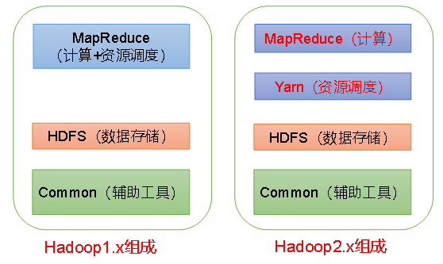

资源调度方式的改变

在1.x, 使用Jobtracker负责任务调度和资源管理,单点负担过重,在2.x中,新增了yarn作为集群的调度工具.在yarn中,使用ResourceManager进行 资源管理, 单独开启一个Container作为ApplicationMaster来进行任务管理.

HA模式

在1.x中没有HA模式,集群中只有一个NameNode,而在2.x中可以启用HA模式,存在一个Active NameNode 和Standby NameNode.

HDFS Federation

Hadoop 2.0中对HDFS进行了改进，使NameNode可以横向扩展成多个，每个NameNode分管一部分目录，进而产生了HDFS Federation，该机制的引入不仅增强了HDFS的扩展性，也使HDFS具备了隔离性

## 0.2 大数据技术生态圈
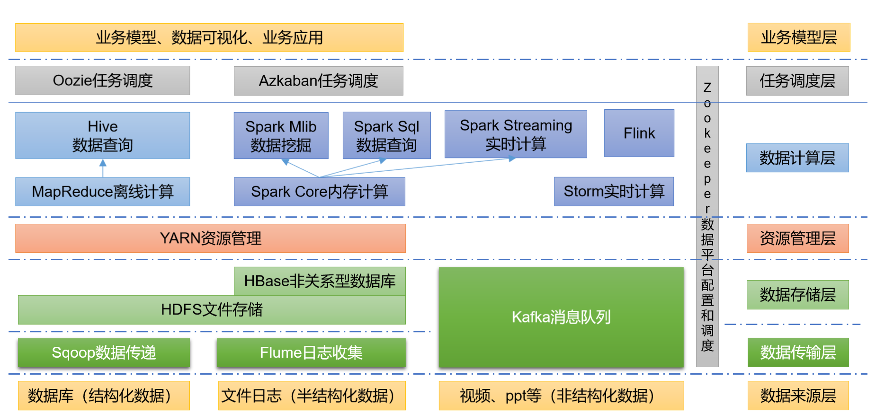
负责的就是数据计算层、数据库可视化、业务应用

## 0.3 hadoop HA介绍
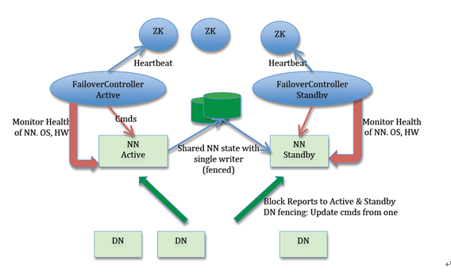
Active NameNode 和 Standby NameNode：两台 NameNode 形成互备，一台处于 Active 状态，为主 NameNode，另外一台处于 Standby 状态，为备 NameNode，只有主 NameNode 才能对外提供读写服务；
ZKFailoverController（主备切换控制器，FC）：ZKFailoverController 作为独立的进程运行，对 NameNode 的主备切换进行总体控制。ZKFailoverController 能及时检测到 NameNode 的健康状况，在主 NameNode 故障时借助 Zookeeper 实现自动的主备选举和切换（当然 NameNode 目前也支持不依赖于 Zookeeper 的手动主备切换）；
Zookeeper 集群：为主备切换控制器提供主备选举支持；
共享存储系统：共享存储系统是实现 NameNode 的高可用最为关键的部分，共享存储系统保存了 NameNode 在运行过程中所产生的 HDFS 的元数据。主 NameNode 和备 NameNode 通过共享存储系统实现元数据同步。在进行主备切换的时候，新的主 NameNode 在确认元数据完全同步之后才能继续对外提供服务。
DataNode 节点：因为主 NameNode 和备 NameNode 需要共享 HDFS 的数据块和 DataNode 之间的映射关系，为了使故障切换能够快速进行，DataNode 会同时向主 NameNode 和备 NameNode 上报数据块的位置信息。

## 0.4 小文件过多会有什么危害,如何避免?
Hadoop上大量HDFS元数据信息存储在NameNode内存中,因此过多的小文件必定会压垮NameNode的内存.

每个元数据对象约占150byte，所以如果有1千万个小文件，每个文件占用一个block，则NameNode大约需要2G空间。如果存储1亿个文件，则NameNode需要20G空间.

显而易见的解决这个问题的方法就是合并小文件,可以选择在客户端上传时执行一定的策略先合并,或者是使用Hadoop的CombineFileInputFormat<K,V>实现小文件的合并


# 1 HDFS架构

HDFS是Hadoop分布式文件系统。

## 1.1 HDFS 2.0 架构

Active NameNode 和 Standby NameNode：两台 NameNode 形成互备，一台处于 Active 状态，为主 NameNode，另外一台处于 Standby 状态，为备 NameNode，只有主 NameNode 才能对外提供读写服务；

ZKFailoverController（主备切换控制器，FC）：ZKFailoverController 作为独立的进程运行，对 NameNode 的主备切换进行总体控制。ZKFailoverController 能及时检测到 NameNode 的健康状况，在主 NameNode 故障时借助 Zookeeper 实现自动的主备选举和切换（当然 NameNode 目前也支持不依赖于 Zookeeper 的手动主备切换）；

Zookeeper 集群：为主备切换控制器提供主备选举支持；

共享存储系统：共享存储系统是实现 NameNode 的高可用最为关键的部分，共享存储系统保存了 NameNode 在运行过程中所产生的 HDFS 的元数据。主 NameNode 和备 NameNode 通过共享存储系统实现元数据同步。在进行主备切换的时候，新的主 NameNode 在确认元数据完全同步之后才能继续对外提供服务。

DataNode 节点：因为主 NameNode 和备 NameNode 需要共享 HDFS 的数据块和 DataNode 之间的映射关系，为了使故障切换能够快速进行，DataNode 会同时向主 NameNode 和备 NameNode 上报数据块的位置信息。

## 1.2 HDFS 基本架构
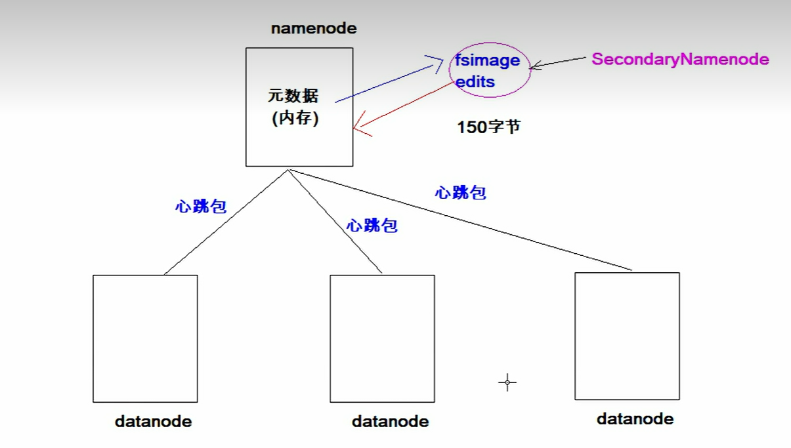
- NameNode: 管理许多元数据（内存中），会定期持久化到磁盘（文件名称fsimage（内存命名空间元数据在外存的镜像文件） edits（追加：内存数据变化前首先会将操作记入 editlog）：可以用作回复任务）。

- SecondaryNameNode: 辅助NameNode元数据（一条150字节）管理，对fsimage edits进行操作，形成新的 fsimage 文件并传回 NameNode，减轻NameNode的压力。

- DataNode: 与NameNode维持心跳发送，负责数据块的存储和读写。Block默认大小为64M，每个Block默认存储 3个副本（HDFS2.0改为128）。

## 1.3 存储副本应该放入那一台DataNode? 机架感知?   

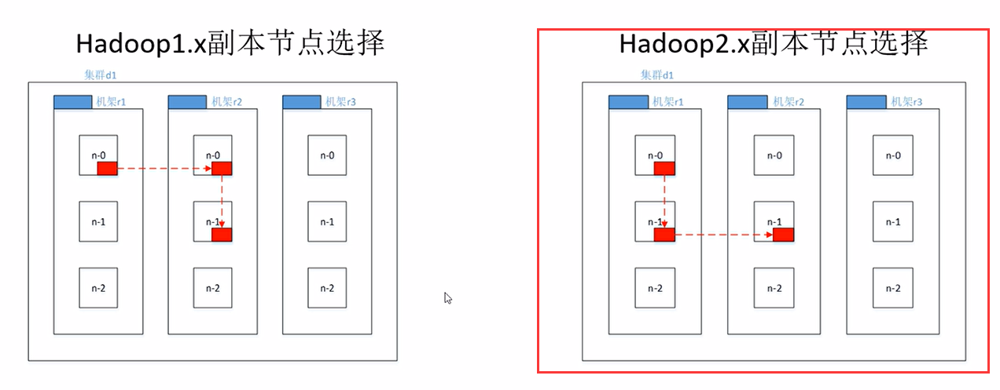 

- 机架：机架是一种物理结构，机架中有多个节点，节点之间通过交换机连接。

- 机架感知：在同一个机架内的DataNode之间进行数据块的复制，减少网络IO，提高效率。


## 1.4 HDFS 读写流程
<h1>Write</h1>

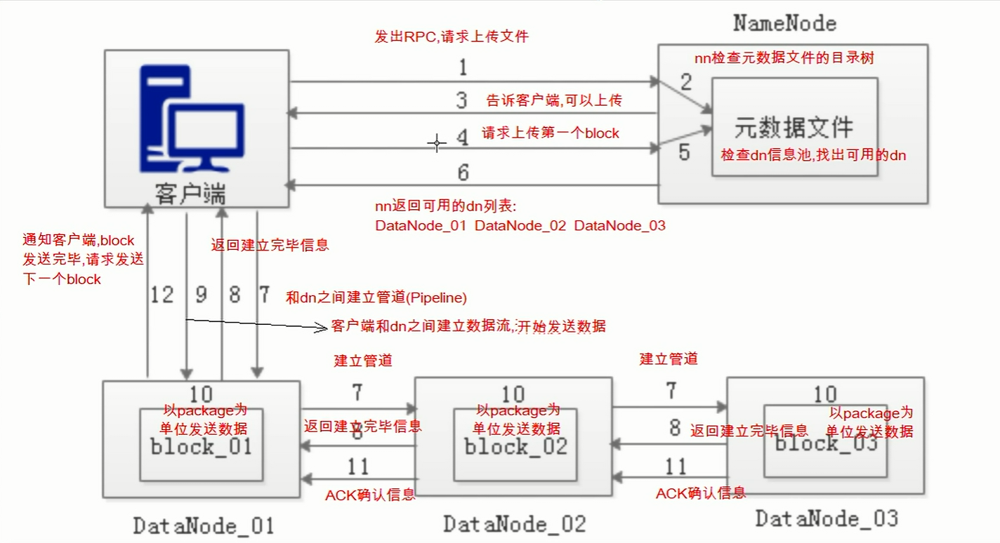

1. Client向NameNode发送请求，请求上传文件
2. NameNode检查元数据文件目录树
3. 告诉Client，可以上传
4. Client向NameNode发送请求，请求上传第一个block
5. NameNode检查DateNode，就近原则
6. 告诉Client可用的DateNode列表
7. 建立管道pipeline，从近到远连接所有DateNode
8. 告诉Client，管道pipeline建立完成
9. Client向DateNode建立数据传输流
10. Client以package（64k）不断的发送数据
11. 告诉返回Client，ACK确认信息
12. 通知客户端block发送完毕，发送下一个block，直至完毕。

<h1>Read</h1>

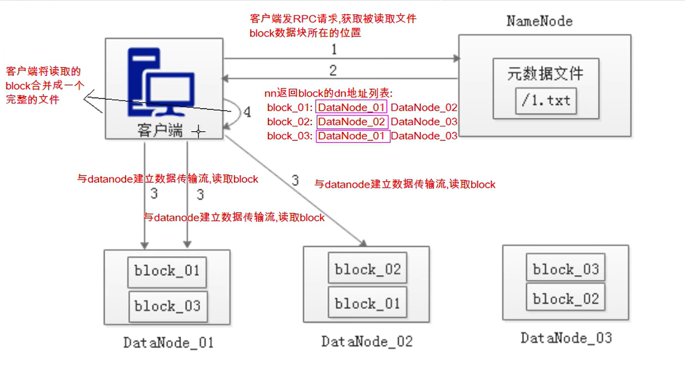

1. Client向NameNode发送RPC请求，请求下载文件
2. 告诉Client，block地址列表
   block01: datanode01, datanode02, datanode03
   block02: datanode02, datanode01, datanode03
   block03: datanode03, datanode01, datanode02
Client就近原则，选择datanode01下载block01，选择datanode01下载block02，选择datanode01下载block03
3. Client向DateNode建立数据流，读取block，考虑2个问题: 
   1. 节点距离
      <br>**拓扑结构，网络拓扑**
      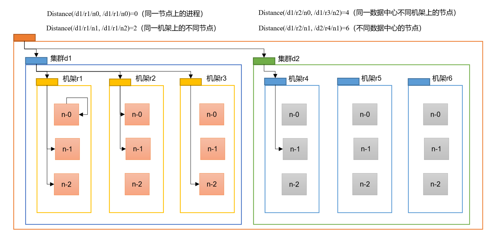
      n-0：服务器
      机架1：机架（交换机）
      集群d1：机房（比如上海虹桥集群机房）
   2. 节点负载
4. Client合并block，形成文件


# 2. Yarn架构

Yarn是Hadoop的资源调度平台，负责集群资源的管理和调度。

## 2.1 基础架构

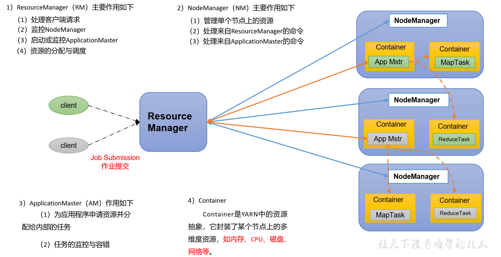
1. ResourceManager（RM）
   RM 是一个全局的资源管理器，负责整个系统的资源管理和分配，它主要有两个组件构成：

调度器：Scheduler；
应用程序管理器：Applications Manager，ASM。
调度器
调度器根据容量、队列等限制条件（如某个队列分配一定的资源，最多执行一定数量的作业等），将系统中的资源分配给各个正在运行的应用程序。要注意的是，该调度器是一个纯调度器，它不再从事任何与应用程序有关的工作，比如不负责重新启动（因应用程序失败或者硬件故障导致的失败），这些均交由应用程序相关的 ApplicationMaster 完成。调度器仅根据各个应用程序的资源需求进行资源分配，而资源分配单位用一个抽象概念 资源容器(Resource Container，也即 Container)，Container 是一个动态资源分配单位，它将内存、CPU、磁盘、网络等资源封装在一起，从而限定每个任务使用的资源量。此外，该调度器是一个可插拔的组件，用户可根据自己的需求设计新的调度器，YARN 提供了多种直接可用的调度器，比如 Fair Scheduler 和 Capacity Schedule 等。

应用程序管理器
应用程序管理器负责管理整个系统中所有应用程序，包括应用程序提交、与调度器协商资源以 AM、监控 AM 运行状态并在失败时重新启动它等。

2. NodeManager（NM）
   NM 是每个节点上运行的资源和任务管理器，一方面，它会定时向 RM 汇报本节点上的资源使用情况和各个 Container 的运行状态；另一方面，它接收并处理来自 AM 的 Container 启动/停止等各种请求。

3. ApplicationMaster（AM）
   提交的每个作业都会包含一个 AM，主要功能包括：

与 RM 协商以获取资源（用 container 表示）；
将得到的任务进一步分配给内部的任务；
与 NM 通信以启动/停止任务；
监控所有任务的运行状态，当任务有失败时，重新为任务申请资源并重启任务。
MapReduce 就是原生支持 ON YARN 的一种框架，可以在 YARN 上运行 MapReduce 作业。有很多分布式应用都开发了对应的应用程序框架，用于在 YARN 上运行任务，例如 Spark，Storm、Flink 等。

4. Container
   Container 是 YARN 中的资源抽象，它封装了某个节点上的多维度资源，如内存、CPU、磁盘、网络等，当 AM 向 RM 申请资源时，RM 为 AM 返回的资源便是用 Container 表示的。 YARN 会为每个任务分配一个 Container 且该任务只能使用该 Container 中描述的资源。

## 2.2 ResourceManager和NodeManager比例?
（也叫做 Master 和 worker的比例）
RM:NM = 1:n (n>=1)
比如我的经历：16个服务器节点，RM2个（一主一从），NM14个

1：2

## 2.3 简单命令（了解一下）
    
    ```shell
    # 查看任务
    yarn application -list
    # 查看任务详情
    yarn application -status application_1616588888888_0001

    # 杀死任务
    yarn application -kill application_1616588888888_0001

    # 查看任务日志
    yarn logs -applicationId application_1616588888888_0001
    ```

# 2.4 Yarn的工作流程
？
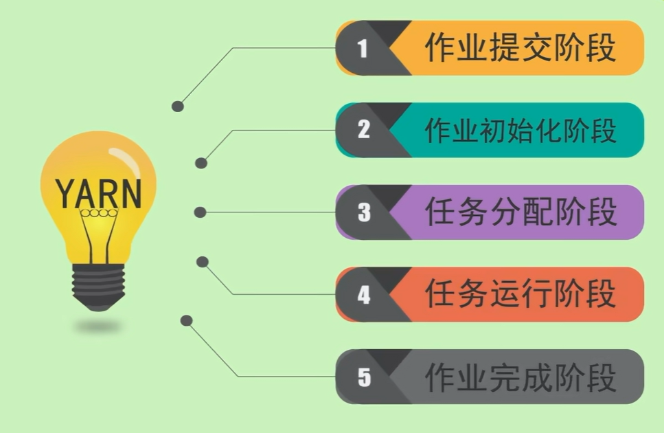

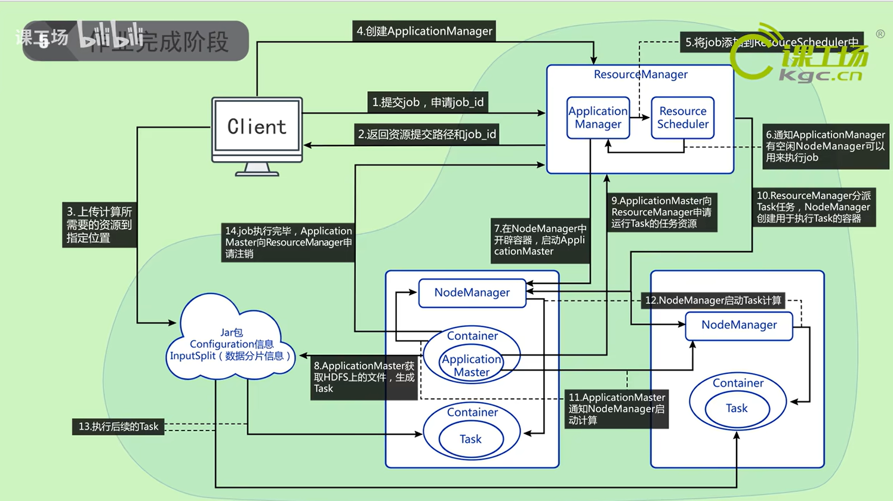

1. Client 和 ResourceManager 交互进行任务提交。
2. ResourceManager 预备提供开辟容器。
3. ResourceManager 为 任务分配 容器。
4. NodeManager 为任务启动容器和计算。
5. 任务完毕，将开辟的容器资源释放。框架更新计算的进度和状态


# 3. MapReduce架构

分而治之

MapReduce是Hadoop的分布式计算框架，用于大数据的离线计算。

## 3.1 基础架构

Map：将数据切分成一个个小的数据块，然后由多个MapTask并行处理。
Shuffle：将MapTask的输出结果按照key进行排序，然后分区，最后将数据发送给ReduceTask。
Reduce：将Shuffle的结果进行合并，最终得到最终结果。

MrappMaster：负责整个MapReduce的工作流程，包括任务的提交、监控、容错等。
MapTask：负责数据的切分、处理、输出。
ReduceTask：负责数据的合并、处理、输出。


## 3.2 MapReduce 核心工作流程

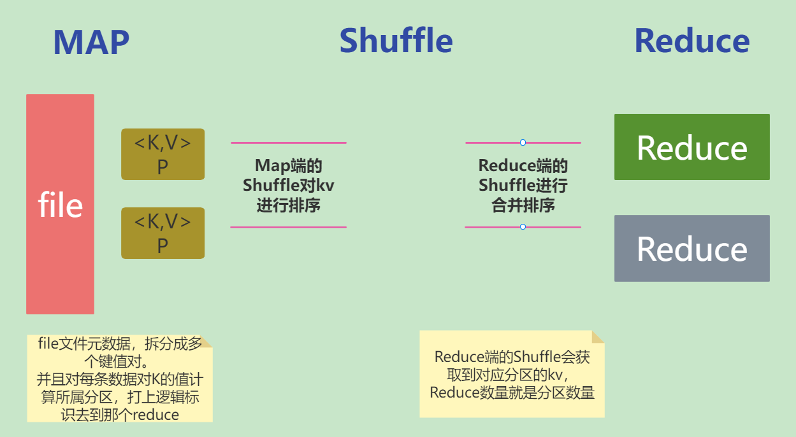

1. InputFormat、TextInputFormat 重写Mapper的map方法，将数据切分成一个个小的数据块，然后由多个MapTask并行处理。
2. 自定义排序，将MapTask的输出结果按照key进行排序，然后分区，最后将数据发送给ReduceTask。
3. OutputFormat、TextOutputFormat 将Shuffle的结果进行合并、排序、归约、分组，最终得到最终结果。
4. 自定义Reduce重写Reducer的reduce方法,将Shuffle的结果进行合并、处理、输出。


