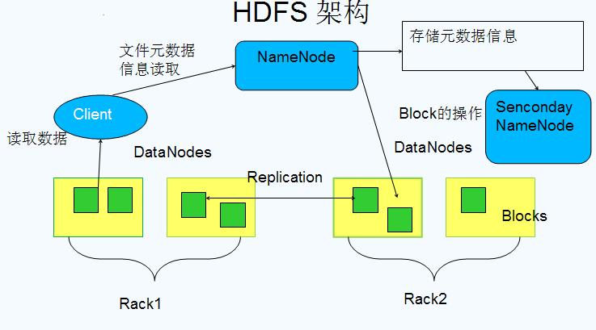

# 1 HDFS架构

## 1.1 HDFS 1.0 架构

NameNode 负责管理整个分布式系统的元数据，主要包括：
- 目录树结构；
- 文件到数据库 Block 的映射关系；
- Block 副本及其存储位置等管理数据；
- DataNode 的状态监控，两者通过段时间间隔的心跳来传递管理信息和数据信息，通过这种方式的信息传递，NameNode 可以获知每个 DataNode 保存的 Block 信息、DataNode 的健康状况、命令 DataNode 启动停止等（如果发现某个 DataNode 节点故障，NameNode 会将其负责的 block 在其他 DataNode 上进行备份）。

这些数据保存在内存中，同时在磁盘保存两个元数据管理文件：fsimage 和 editlog。
- fsimage：是内存命名空间元数据在外存的镜像文件；
- editlog：则是各种元数据操作的 write-ahead-log 文件，在体现到内存数据变化前首先会将操作记入 editlog 中，以防止数据丢失。
这两个文件相结合可以构造完整的内存数据。

Secondary NameNode
Secondary NameNode 并不是 NameNode 的热备机，而是定期从 NameNode 拉取 fsimage 和 editlog 文件，并对两个文件进行合并，形成新的 fsimage 文件并传回 NameNode，这样做的目的是减轻 NameNod 的工作压力，本质上 SNN 是一个提供检查点功能服务的服务点。

DataNode
负责数据块的实际存储和读写工作，Block 默认是64MB（HDFS2.0改成了128MB），当客户端上传一个大文件时，HDFS 会自动将其切割成固定大小的 Block，为了保证数据可用性，每个 Block 会以多备份的形式存储，默认是3份。

## 1.2 HDFS 2.0 架构

Active NameNode 和 Standby NameNode：两台 NameNode 形成互备，一台处于 Active 状态，为主 NameNode，另外一台处于 Standby 状态，为备 NameNode，只有主 NameNode 才能对外提供读写服务；

ZKFailoverController（主备切换控制器，FC）：ZKFailoverController 作为独立的进程运行，对 NameNode 的主备切换进行总体控制。ZKFailoverController 能及时检测到 NameNode 的健康状况，在主 NameNode 故障时借助 Zookeeper 实现自动的主备选举和切换（当然 NameNode 目前也支持不依赖于 Zookeeper 的手动主备切换）；

Zookeeper 集群：为主备切换控制器提供主备选举支持；

共享存储系统：共享存储系统是实现 NameNode 的高可用最为关键的部分，共享存储系统保存了 NameNode 在运行过程中所产生的 HDFS 的元数据。主 NameNode 和备 NameNode 通过共享存储系统实现元数据同步。在进行主备切换的时候，新的主 NameNode 在确认元数据完全同步之后才能继续对外提供服务。

DataNode 节点：因为主 NameNode 和备 NameNode 需要共享 HDFS 的数据块和 DataNode 之间的映射关系，为了使故障切换能够快速进行，DataNode 会同时向主 NameNode 和备 NameNode 上报数据块的位置信息。

# 2. Yarn架构

1. ResourceManager（RM）
   RM 是一个全局的资源管理器，负责整个系统的资源管理和分配，它主要有两个组件构成：

调度器：Scheduler；
应用程序管理器：Applications Manager，ASM。
调度器
调度器根据容量、队列等限制条件（如某个队列分配一定的资源，最多执行一定数量的作业等），将系统中的资源分配给各个正在运行的应用程序。要注意的是，该调度器是一个纯调度器，它不再从事任何与应用程序有关的工作，比如不负责重新启动（因应用程序失败或者硬件故障导致的失败），这些均交由应用程序相关的 ApplicationMaster 完成。调度器仅根据各个应用程序的资源需求进行资源分配，而资源分配单位用一个抽象概念 资源容器(Resource Container，也即 Container)，Container 是一个动态资源分配单位，它将内存、CPU、磁盘、网络等资源封装在一起，从而限定每个任务使用的资源量。此外，该调度器是一个可插拔的组件，用户可根据自己的需求设计新的调度器，YARN 提供了多种直接可用的调度器，比如 Fair Scheduler 和 Capacity Schedule 等。

应用程序管理器
应用程序管理器负责管理整个系统中所有应用程序，包括应用程序提交、与调度器协商资源以 AM、监控 AM 运行状态并在失败时重新启动它等。

2. NodeManager（NM）
   NM 是每个节点上运行的资源和任务管理器，一方面，它会定时向 RM 汇报本节点上的资源使用情况和各个 Container 的运行状态；另一方面，它接收并处理来自 AM 的 Container 启动/停止等各种请求。

3. ApplicationMaster（AM）
   提交的每个作业都会包含一个 AM，主要功能包括：

与 RM 协商以获取资源（用 container 表示）；
将得到的任务进一步分配给内部的任务；
与 NM 通信以启动/停止任务；
监控所有任务的运行状态，当任务有失败时，重新为任务申请资源并重启任务。
MapReduce 就是原生支持 ON YARN 的一种框架，可以在 YARN 上运行 MapReduce 作业。有很多分布式应用都开发了对应的应用程序框架，用于在 YARN 上运行任务，例如 Spark，Storm、Flink 等。

4. Container
   Container 是 YARN 中的资源抽象，它封装了某个节点上的多维度资源，如内存、CPU、磁盘、网络等，当 AM 向 RM 申请资源时，RM 为 AM 返回的资源便是用 Container 表示的。 YARN 会为每个任务分配一个 Container 且该任务只能使用该 Container 中描述的资源。

