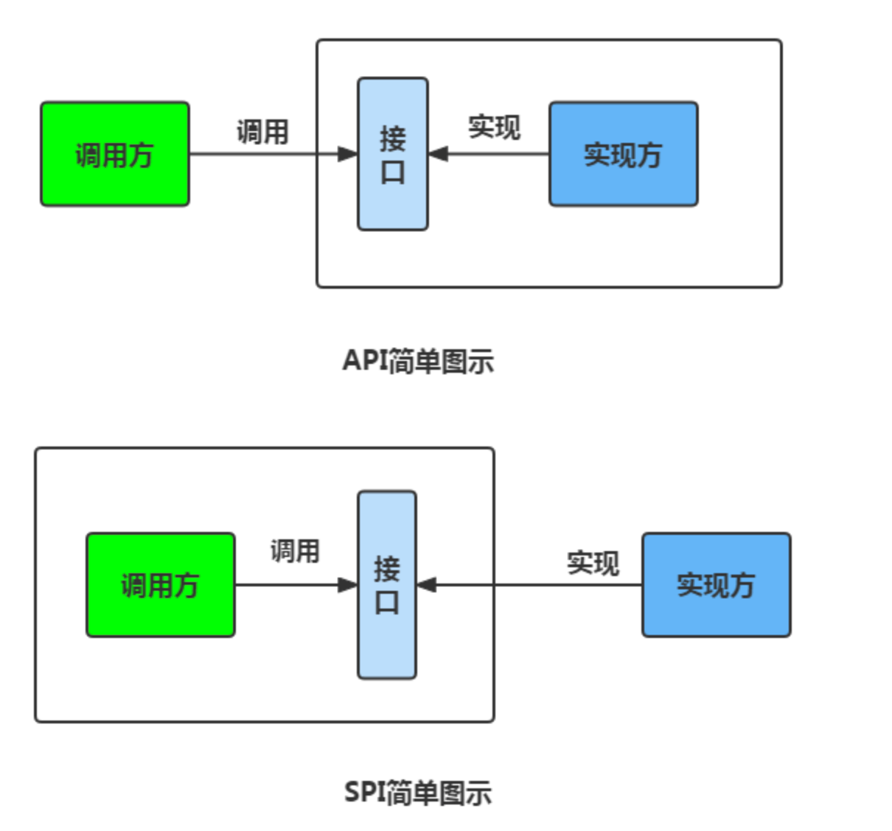

# 1. 什么是 `SPI` (为什么使用SPI)

`SPI` 即 `Service Provider Interface` “服务提供者的接口”，
专门提供给服务提供者或者扩展框架功能的开发者去使用的一个接口。
SPI 将服务接口和服务实现分离开来，将服务调用方和服务实现者解耦，提升扩展性、可维护性。修改或者替换服务实现并不需要修改调用方。

# 2. SPI 和 API 的区别？

`API` 是应用程序编程接口，是一提供程序调用的。

`SPI` 是服务提供者接口，是一种服务发现机制。

# 3. SPI 机制的缺点

1. 遍历加载所有的实现类，这样效率还是相对较低的；
2. 当多个 `ServiceLoader` 同时 `load` 时，会有并发问题。

