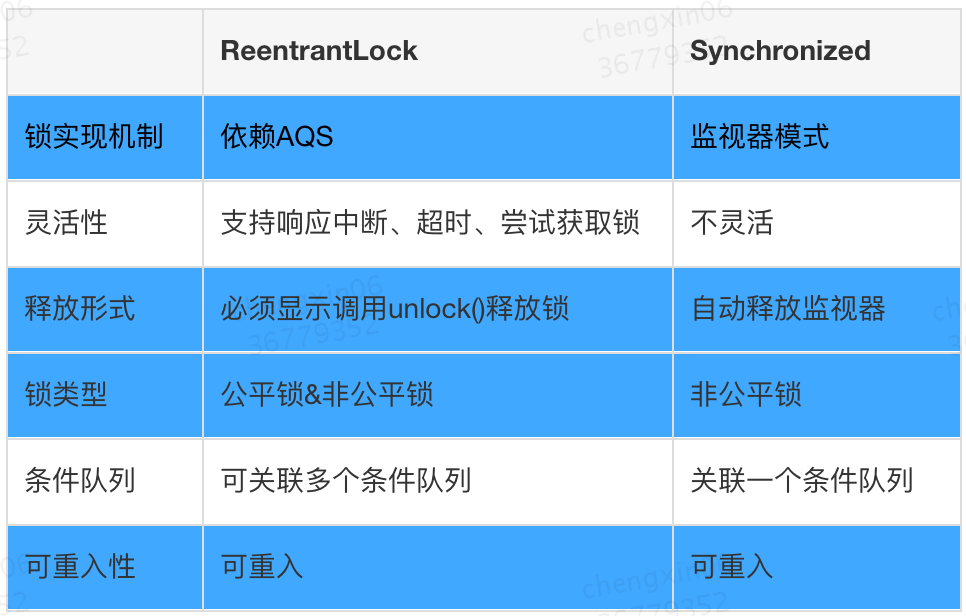
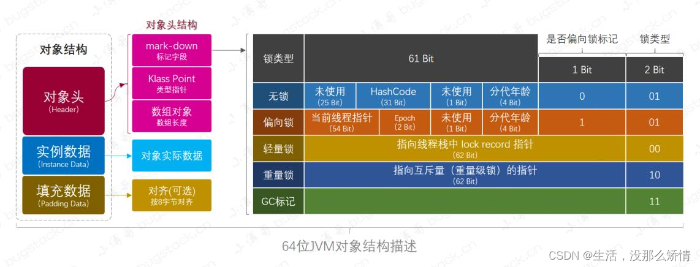

# 1. 说说你常用的锁？ （你知道的锁都有哪些？ 你工作中使用过什么锁？）

1. synchronized锁：synchronized是Java中的关键字，是JVM中的底层机制，通过monitor对象实现的。
2. ReentrantLock锁：是互斥锁，优势在于可以手动获取和释放，通过AQS实现的。
3. ReentrantReadWriteLock锁：既有互斥锁又有共享锁，优势在于可以手动获取和释放，可以通过AQS实现的。

# 1. 锁

常用锁：synchronized、ReentrantLock

# 1.1 synchronized和ReentrantLock是什么？
synchronized和ReentrantLock都是可重入锁，可以实现线程之间的同步。

# 1.2 synchronized和ReentrantLock的区别
功能和灵活性：ReentrantLock 提供了更多的功能和灵活性，例如可以实现公平锁和非公平锁、可以中断等待锁的线程、可以尝试获取锁而不阻塞等。而 synchronized 关键字的功能相对较少，只能实现基本的锁定和解锁操作。

性能：在低并发的情况下，synchronized 的性能比 ReentrantLock 好，因为 synchronized 是 JVM 内置的关键字，不需要额外的开销。但是在高并发的情况下，ReentrantLock 的性能比 synchronized 好，因为 ReentrantLock 可以实现公平锁和非公平锁，可以避免线程饥饿问题，从而提高系统的吞吐量。

可中断性：ReentrantLock 支持中断等待锁的线程，而 synchronized 不支持中断等待锁的线程。

条件变量：ReentrantLock 支持多个条件变量，可以更加灵活地控制线程的等待和唤醒，而 synchronized 不支持条件变量。

可重入性：synchronized 关键字是可重入的，同一个线程可以多次获取同一个锁，而 ReentrantLock 也是可重入的，但是需要手动释放锁

# 2. ReentrantLock

## 2.1 ReentrantLock 的实现原理

ReentrantLock 是基于 AQS（AbstractQueuedSynchronizer）实现的，AQS 是一个用于构建锁和同步器的框架，使用 AQS 能简单且高效地构造出应用广泛的大量的同步器，比如常用的 ReentrantLock、CountDownLatch、ReentrantReadWriteLock、ThreadPoolExecutor 等。

## 2.2 AQS 是什么？
AQS 是一种同步机制。

## 2.3 CAS 是什么？
CAS（Compare And Swap）是一种无锁算法、一种乐观锁的实现方式，当多个线程尝试使用 CAS 同时更新同一个变量时，只有其中一个线程能更新变量的值，而其它线程都失败，失败的线程并不会被挂起，而是被告知这次竞争中失败，并可以再次尝试。

# 3. synchronized

# 3.1 synchronized 的实现原理
Java 中的对象监视器（monitor）实现的。每个对象都有一个 monitor，monitor 可以和任意个线程关联，线程可以通过调用对象的 wait() 和 notify() 方法来与 monitor 进行交互。

## 3.2 synchronized 的锁升级过程

### 3.2.1 无锁
无锁状态下，线程可以随意进入临界区，不需要进行任何同步操作。

↓

### 3.2.2 偏向锁
偏向锁是对单线程访问同步代码块的优化处理。
1. 比如当前一个线程访问了同步代码块，并将对象头中的 Mark down 设置为偏向锁，下次该线程再次访问，无需再次获取锁。

↓

### 3.2.3 轻量级锁
当一个线程尝试获取锁
1. 如果锁是空闲的，那么会在栈帧中建立一个锁记录（表示锁已经被当前线程获取），同事使用CAS将对象头中的Mark down指向当前线程的锁记录。
2. 如果发生竞争，该线程会进入自旋等待状态，当自旋超过一定次数或持有锁的线程被阻塞，轻量级锁会膨胀为重量级锁。

↓

### 3.2.4 重量级锁
当一个线程尝试获取锁
1. 如果锁是空闲的，JVM会将对象头中的Mark down指向一个互斥量，从而实现线程的阻塞和唤醒。
2. 如果发生竞争，该线程会进入阻塞状态，知道锁被释放。

### 3.2.5 自旋锁
自旋锁是指当一个线程尝试获取某个锁时，如果该锁已被其他线程占用，就一直循环等待，直到该锁被释放为止，线程不会被挂起，而是处于忙等状态。

## 3.2 synchronized 和 volatile 的区别
synchronized 用于保证同一时间只有一个线程可以访问被 synchronized 修饰的代码，而 volatile 用于保证多个线程之间对变量的可见性。

## 4.1 什么是可重入锁？
可重入锁是指同一个线程可以多次获得同一把锁，而不会被阻塞。ReentrantLock和synchronized都是可重入锁。

## 4.2 什么是乐观锁和悲观锁？
概念，具体实现方式有很多种。
乐观锁认为数据一般不会造成冲突，所以不会上锁，而悲观锁认为数据一般会造成冲突，所以会上锁。

## 4.3 什么是自旋锁？
自旋锁是指尝试获取锁的线程不会立即阻塞，而是采用循环的方式去尝试获取锁，这样的好处是减少线程上下文切换的消耗，缺点是循环会消耗CPU。

## 4.4 什么是公平锁和非公平锁？
公平锁是指多个线程按照申请锁的顺序来获取锁，非公平锁是非顺序的，非公平锁的优点在于吞吐量比公平锁大。

## 4.5 什么是死锁？如何避免？
死锁是指两个或者两个以上的线程在执行过程中，因争夺资源而造成的一种互相等待的现象，若无外力作用，这些线程都将无法推进下去。
避免死锁的方法：
1. 设置超时时间
2. 死锁检测tryLock

