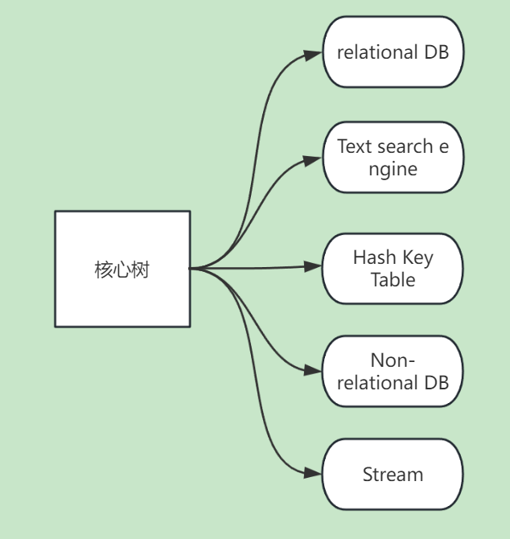
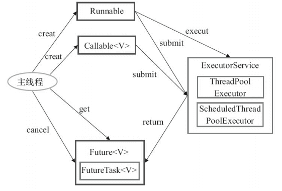

# 0. Java线程的生命周期有那些？
1. **`NEW`** : 新建状态，线程被创建，但是还没有调用`start()`方法。
2. **`RUNNABLE`** : 运行/就绪状态，线程调用`start()`方法后。
3. **`BLOCKED`** : 阻塞状态，synchronized没有拿到资源锁。
4. **`WAITING`** : 等待状态，调用`wait()`方法。
5. **`TIME_WAITING`** : 超时等待状态，调用`sleep()`方法。
6. **`TERMINATED`** :结束状态。

# 0.1 线程的几种实现

1. 继承`Thread`类
2. 实现`Runnable`接口（底层就是因为实现了Runnable接口）
3. 实现`Callable`接口

# 0.2 如何停止线程？

1. 使用`stop()`方法，废弃了，因为会线程的死锁。（不用）
2. 使用`volatile`关键字，设置标志位的共享变量。（基本不用）
3. 使用`interrupt()`方法，底层是设置中断标志位来停止线程的。（常用）可以停止WAITING或TIME_WAITING状态的线程。

# 1. 你能聊聊线程池么？（简单介绍一下线程池！ 你使用过线程池么？）
一般我们认为线程池就是所谓的自定义**`ThreadPoolExecutor`**。

当需要大量异步任务的时候，如果为每个任务都创建一个新线程，会导致资源浪费。

因此线程池是一种常见的解决方案：
1. 它可以使得线程的复用，防止线程在创建和销毁上的资源浪费。
2. 还可以控制线程的数量，防止线程等待时间过长，从而回收等。

# 2.线程池的几种实现？（线程池的实现方式有哪些？它们有什么区别？）

1. **`FixedThreadPool`** : 固定大小的线程池，只有核心线程。
2. **`CachedThreadPool`** : 缓存线程池，只有非核心线程，线程数量不限制。
3. **`ScheduledThreadPool`** : 定时任务线程池，使用延迟工作队列。
4. **`SingleThreadExecutor`** : 单线程的线程池，只有一个核心线程。

# 3.线程池的参数有哪些？它们的含义是什么？

1. **`corePoolSize`** : 核心线程数。
2. **`maximumPoolSize`** : 最大线程数。
3. **`keepAliveTime`** : 线程空闲时间。
4. **`unit`** : 时间单位。
5. **`workQueue`** : 工作队列。
6. **`threadFactory`** : 线程工厂。
7. **`handler`** : 拒绝策略。

# 3.1 拒绝策略常用有那些？分别是什么?

- **`ThreadPoolExecutor.AbortPolicy`**：直接抛出异常。
- **`ThreadPoolExecutor.CallerRunsPolicy`**：用调用者所在的线程来执行任务。
- **`ThreadPoolExecutor.DiscardPolicy`**：不处理，丢弃掉。
- **`ThreadPoolExecutor.DiscardOldestPolicy`**：此策略将丢弃最早的未处理的任务请求，并且添加当前任务进入队列。

## 3.2 最大线程池数量多会发挥作用？
我们在代码中模拟了10个任务，我们配置的核心线程数为5，最大线程数为10，任务队列的容量为100，所以当有10个任务提交的时候，前5个任务会被立即执行，而后面5个任务会被放入任务队列中等待执行，当任务队列满了以后，还有任务提交的话，就会创建新的线程执行任务，直到线程数达到最大线程数10，如果还有任务提交的话，就会根据我们配置的饱和策略来处理。

**转折点1**
当前任务超过了核心线程数，但是队列未满，其中5个任务会被立即执行，而后面5个任务会被放入任务队列中等待执行。

**转折点2**
当前任务超过了核心线程数，而且队列也满了，其中5个任务会被立即执行，而后面5个任务会被创建新的线程执行，直到线程数达到最大线程数10，如果还有任务提交的话，就会根据我们配置的饱和策略来处理。

# 4. 你在实际项目中是如何使用线程池的？
<h1>model one</h1>
实体识别树中加载模块（服务初始化时）为了快速加载不同的数据源，此时此刻明显需要多个异步任务完成，此时使用。

**此时数据源配置和线程池配置都配置在yml文件：**
1. 比如我配置了10个数据源（流处理），那么我会配置核心线程1，最大线程10，队列长度1。以达到最大加载速度。最后剩余一个核心线程用于正常的算法树增删。

<h1>model two</h1>
数据源提供者服务中，可能会出现多个异步查询任务，并且通过IO进行持久化Or返回给前端，此时使用IO密集型的线程池。

1. 由于检索数据源需要快速返回结果（批处理），所以不能使得队列无界，线程数量设置为核心CPU的2到4倍。

# 5. 线程池的最佳实践有哪些？你在使用线程池时有哪些注意事项？
**主要围绕这四点：**
1. 为线程池中的异步任务创建一个异常处理机制。
2. 监控线程池的运行状态。
3. 设置合适的队列长度和线程数。(CPU密集型还是IO密集型)
4. 线程安全问题

# 6. `Executor`框架三大组成部分(了解简答)
**1、任务(`Runnable` /`Callable`)**

执行任务需要实现的接口，**`Runnable` 接口** 或 **`Callable`接口**。

**2、任务的执行(`Executor`接口)**

执行任务的服务，**`Executor`接口**，**`ExecutorService`接口**，**`ScheduledExecutorService`接口**，**`AbstractExecutorService`抽象类**，**`ThreadPoolExecutor`线程池**，**`ScheduledThreadPoolExecutor`线程池**。

**3、异步计算的结果(`Future`接口)**

`Future`接口，`FutureTask`类都可以代表异步计算的结果。

## 6.1 `Runnable` 和 `Callable` 的区别
`Runnable`接口和`Callable`接口都是用来定义任务的，但是`Runnable`接口不会返回结果，而`Callable`接口可以返回结果。

## 6.2 `execute()` 和 `submit()` 的区别
`execute()`方法用来提交不需要返回值的任务，所以无法判断任务是否被线程池执行成功与否；
`submit()`方法用来提交需要返回值的任务。线程池会返回一个`Future`类型的对象，通过这个`Future`对象可以判断任务是否执行成功，并且可以通过`Future`的`get()`方法来获取返回值，`get()`方法会阻塞当前线程直到任务完成，而使用`get(long timeout, TimeUnit unit)`方法则会阻塞当前线程一段时间后立即返回，这时候有可能任务没有执行完。
