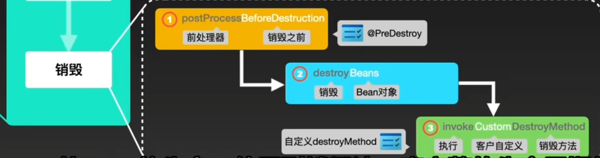

# **Spring Bean的生命周期** (面试)

# 1. 三大阶段：
1. 生产
2. 使用
3. 销毁

## 1.1 生产
1. **IOC容器（容器初始化、启动流程） (面试) **
   1. Resource定位
   2. BeanDefinition载入
   3. BeanDefinition注册
2. 读取bean配置文件 LoadBeanDefinitions 加载自定义的bean 
3. 创建bean实例 createBean
   1. 构造对象 通过构造器，获取到对应对象，通过反射创建对象
   2. 填充属性 populateBean,通过三级缓存获取到bean的属性，通过反射设置属性
   3. 初始化实例 调用Aware接口，调用BeanPostProcessor的前置方法，调用初始化方法，调用BeanPostProcessor的后置方法(bean初始化前后处理器) ，AbstractAutoProxyCreator进行AOP代理
   4. 注册销毁
4. 放入单例池中 addSingleton

## 1.2 使用
从单例池中获取bean实例 getSingleton

## 1.3 销毁
1.处理器销毁前的方法 @PreDestroy
2.销毁实例 destroyBeans
3.处理器销毁后的方法 destroyMethod

# 2. Spring的Bean的生命周期 (非面试)

Spring的Bean的生命周期包括以下阶段：

- （1）实例化Bean,反射生成对象。
- （2）填充属性Populate properties
- （3）处理Aware接口的回调处理,
- （4）BeanPostProcessor的前置处理
- （5）InitializingBean的afterPropertiesSet()方法
- （6）init-method属性指定的初始化方法
- （7）BeanPostProcessor的后置处理
- （8）DisposableBean的destroy()方法
- （9）destroy-method属性指定的初始化方法

bean四个阶段: 实例化、属性填充、初始化、销毁

1. [ ] 实例化Bean：

对于BeanFactory容器，当客户向容器请求一个尚未初始化的bean时，或初始化bean的时候需要注入另一个尚未初始化的依赖时，容器就会调用createBean进行实例化。

对于ApplicationContext容器，当容器启动结束后，通过获取BeanDefinition对象中的信息，实例化所有的bean。

2. [ ] 设置对象属性（依赖注入）：

实例化后的对象被封装在BeanWrapper对象中，紧接着，Spring根据BeanDefinition中的信息 以及 通过BeanWrapper提供的设置属性的接口完成属性设置与依赖注入。

3. [ ] 处理Aware接口：

Spring会检测该对象是否实现了xxxAware接口，通过Aware类型的接口，可以让我们拿到Spring容器的一些资源：

①如果这个Bean实现了BeanNameAware接口，会调用它实现的setBeanName(String beanId)方法，传入Bean的名字；
②如果这个Bean实现了BeanClassLoaderAware接口，调用setBeanClassLoader()方法，传入ClassLoader对象的实例。
②如果这个Bean实现了BeanFactoryAware接口，会调用它实现的setBeanFactory()方法，传递的是Spring工厂自身。
③如果这个Bean实现了ApplicationContextAware接口，会调用setApplicationContext(ApplicationContext)方法，传入Spring上下文；

4. [ ] BeanPostProcessor前置处理：
   如果想对Bean进行一些自定义的前置处理，那么可以让Bean实现了BeanPostProcessor接口，那将会调用postProcessBeforeInitialization(
   Object obj, String s)方法。
5. [ ] InitializingBean的afterPropertiesSet()方法：
   如果Bean实现了InitializingBean接口，执行afeterPropertiesSet()方法。
6. [ ] init-method属性指定的初始化方法：
   如果Bean在Spring配置文件中配置了 init-method 属性，则会自动调用其配置的初始化方法。
7. [ ] BeanPostProcessor后置处理：
   如果这个Bean实现了BeanPostProcessor接口，将会调用postProcessAfterInitialization(Object obj, String s)
   方法；由于这个方法是在Bean初始化结束时调用的，所以可以被应用于内存或缓存技术；

以上几个步骤完成后，Bean就已经被正确创建了，之后就可以使用这个Bean了。

8. [ ] DisposableBean的destroy()方法：
   当Bean不再需要时，会经过清理阶段，如果Bean实现了DisposableBean这个接口，会调用其实现的destroy()方法；
9. [ ] destroy-method属性指定的初始化方法：
   最后，如果这个Bean的Spring配置中配置了destroy-method属性，会自动调用其配置的销毁方法。