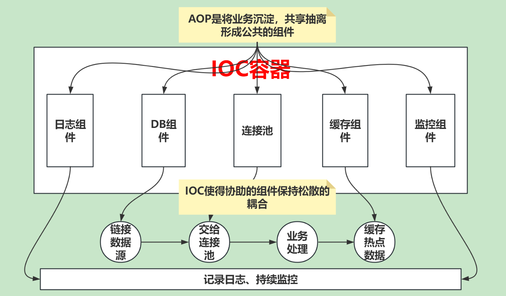
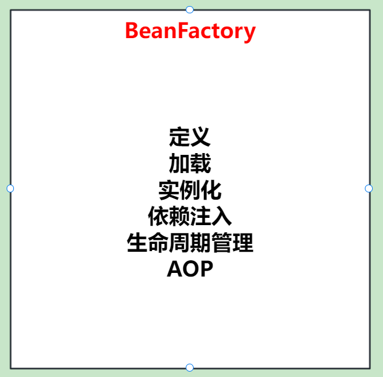
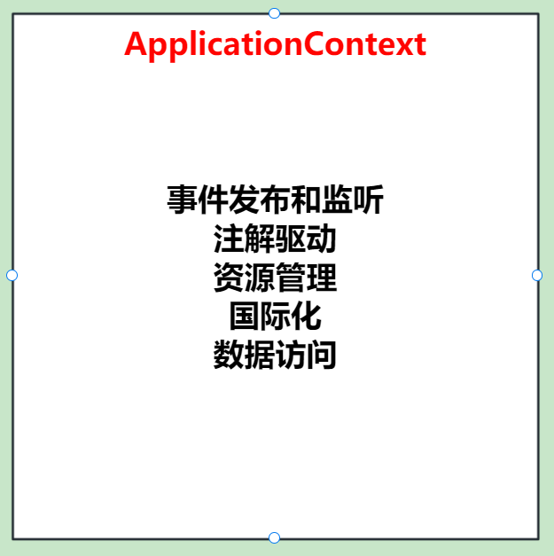

# 1. IOC 和 AOP 的联系和区别 

IoC让相互协作的组件保持松散的耦合，而AOP编程允许你把遍布于应用各层的功能分离出来形成可重用的功能组件。



# 2. Spring-IOC是什么   （面试）

Spring-IOC是Spring框架的核心，是一个容器，它负责实例化、定位、配置应用程序中的对象及建立这些对象间的依赖。

1. 思想，控制反转（从我对象创建，到程序控制对象创建）
2. DI依赖注入,依赖注入是IOC的一种实现方式,IOC是一种思想,而DI是这种思想的一种实现方式,populateBean
3. 容器，使用map结构来存储，在spring中存在三级缓存，整个bean的生命周期，从创建到使用到销毁的过程全部都是由容器来管理的(bean的生命周期)

## 2.1 IOC是什么    （面试）

- 控制反转，指的是将对象的控制权交给Spring容器，由Spring来控制对象的生命周期和对象间的关系，而不是由对象自己控制。

## 2.2 DI是什么

依赖注入，指的是由Spring容器在运行期间，动态地将某种依赖关系注入到对象之中。

### 2.2.1 依赖注入 DI的三种方式 （面试）

1. 构造器注入:通过构造器传入依赖对象。
2. Setter方法注入:通过Setter方法传入依赖对象。
3. 接口注入:通过接口的Setter方法传入依赖对象。

## 2.3 Spring-AOP是什么 （面试）

Spring-AOP是Spring框架的一个重要组成部分，它提供了面向切面的编程，通过预编译方式和运行期动态代理实现程序功能的统一维护的技术。

### 2.3.1 OOP （面试）

面向对象编程，允许开发者定义纵向关系，但并不适用于定义横向的关系，会导致大量代码的重复，而不利于各个模块的重用。

### 2.3.2 AOP （面试）

面向切面编程，是对OOP的补充，它允许开发者定义横向关系，将系统中的关注点分离出来形成一个独立的模块，这个模块被称为切面，它的作用是与业务逻辑无关的，但是又为业务逻辑模块所共同调用。
“切面”（Aspect）可用于权限认证、日志、事务处理。

aop是ioc的一个扩展功能，只是在ioc整个流程中的一个扩展点：BeanPostProcessor

## 2.4 AOP实现方式 （面试）

AOP实现的关键在于 代理模式，AOP代理主要分为静态代理和动态代理。静态代理的代表为AspectJ；动态代理则以Spring AOP为代表。
一般安卓开发中会使用到AspectJ，而在JavaWeb开发中会使用到Spring AOP。

（1）AspectJ是静态代理，也称为编译时增强，AOP框架会在编译阶段生成AOP代理类。

（2）Spring AOP使用的动态代理，所谓的动态代理就是说AOP框架不会去修改字节码，而是每次运行时在内存中临时为方法生成一个AOP对象，这个AOP对象包含了目标对象的全部方法，并且在特定的切点做了增强处理，并回调原对象的方法。

（3）静态代理与动态代理区别在于生成AOP代理对象的时机不同，相对来说AspectJ的静态代理方式具有更好的性能，但是AspectJ需要特定的编译器进行处理，而SpringAOP则无需特定的编译器处理。


# 3. BeanFactory和ApplicationContext有什么区别？

| \      | BeanFactory（容器）           | ApplicationContext                |
|--------|---------------------------|-----------------------------------|
| 功能     |  |          |
| 关系     | IOC容器最顶级父类                | 是BeanFactory的子类，继承了BeanFactory的功能 |
| 加载Bean | 懒加载                       | 预加载，启动时就加载所有的单实例Bean，速度快          |
| 注册Bean | 手动注册，编程式创建                | 自动注册，声明式创建                        |

```java
class A {
    void a() {
        // 创建BeanFactory容器
        BeanFactory factory = new XmlBeanFactory(new ClassPathResource("bean.xml"));

        // 从BeanFactory获取Bean实例
        UserService userService = factory.getBean("userService", UserService.class);
        userService.save();

        // 手动销毁Bean
        ((ConfigurableBeanFactory) factory).destroyBean("userService", userService);

        // 或者在bean.xml中配置destroy-method,在关闭容器时自动调用
        factory.close();
    }
}
```

# 4. Spring框架中的Bean是线程安全的么？如果线程不安全，那么如何处理？

1. 对于prototype作用域的Bean，每次都创建一个新对象，也就是线程之间不存在Bean共享，因此不会有线程安全问题。
2. 对于singleton作用域的Bean，所有的线程都共享一个单例实例的Bean，因此是存在线程安全问题的。但是如果单例Bean是一个无状态Bean，也就是线程中的操作不会对Bean的成员执行查询以外的操作，那么这个单例Bean是线程安全的。比如Controller类、Service类和Dao等，这些Bean大多是无状态的，只关注于方法本身。

```
    无状态Bean(Stateless Bean)：就是没有实例变量的对象，不能保存数据，是不变类，是线程安全的。
    有状态Bean(Stateful Bean) ：就是有实例变量的对象，可以保存数据，是非线程安全的。
```

# 5. 单例bean有状态，采用ThreadLocal解决线程安全问题

ThreadLocal和线程同步机制都是为了解决多线程中相同变量的访问冲突问题。同步机制采用了“时间换空间”的方式，仅提供一份变量，不同的线程在访问前需要获取锁，没获得锁的线程则需要排队。而ThreadLocal采用了“空间换时间”的方式。ThreadLocal会为每一个线程提供一个独立的变量副本，从而隔离了多个线程对数据的访问冲突。因为每一个线程都拥有自己的变量副本，从而也就没有必要对该变量进行同步了。


# 6. Spring的Bean的作用域 （面试）

Spring的Bean的作用域包括以下几种：

- （1）singleton：单例模式，一个BeanFactory有且仅有一个实例。 **（面试）**
- （2）prototype：原型模式，每次从BeanFactory获取Bean时，都会创建一个新的实例。(多例，原型的原理克隆拷贝) **（面试）**

- （3）request：每次request请求都会创建一个新的Bean，该作用域仅在基于web的Spring ApplicationContext情形下有效。
- （4）session：每次session请求都会创建一个新的Bean，该作用域仅在基于web的Spring ApplicationContext情形下有效。
- （5）application：所有会话共享一个Bean，该作用域仅在基于web的Spring ApplicationContext情形下有效。
  在编写代码时通常使用ApplicationContext容器，以便能够享受更多的功能和便利性。

# 7. Spring如何解决循环依赖问题

Spring设计了三级缓存来解决循环依赖问题，把Bean的实例化和Bean的属性依赖注入进行分离。
一级缓存用于存放完全初始化好的单例Bean。
二级缓存用于存放完成实例化，但未初始化的Bean。
三级缓存用于存放已经被实例化的Bean的工厂对象。

二级缓存作为突破口解决循环依赖问题。三级缓存解决代理对象循环依赖问题。

# 8.1 Spring循环依赖的几种情况

1. 多实例的Setter注入循环依赖，需要改成单例Bean。
2. 构造器注入的循环依赖，需要加入@Lazy注解。
3. DependsOn注解的循环依赖，需要手动解决。
4. 单例Bean的Setter注入导致循环依赖，可以通过@Lazy或者@DependsON解决。

# 9. Spring事务的实现方式

Spring事务是和数据库事务保持一致

Spring事务的实现方式主要有两种：编程式事务管理和声明式事务管理。

- ①编程式事务管理使用TransactionTemplate。
- ②声明式事务管理建立在AOP之上的。其本质是通过AOP功能，对方法前后进行拦截，将事务处理的功能编织到拦截的方法中，也就是在目标方法开始之前启动一个事务，在执行完目标方法之后根据执行情况提交或者回滚事务。

```
声明式事务管理的优点：
   不需要掺杂业务逻辑代码，@Transactional注解可以被添加到类级别和方法级别上。
声明式事务管理的缺点：
   无法做到细粒度的事务控制，无法做到像编程式事务那样可以作用到代码块级别。比如一个事务方法调用了多个DAO方法，希望其中某个DAO方法独立成为一个事务，这时候就办不到了。
```

# 10. Spring 框架中都用到了哪些设计模式

1. 工厂模式：Spring使用工厂模式通过BeanFactory、ApplicationContext创建bean对象。
2. 代理模式：Spring AOP功能的实现。
3. 单例模式：Spring中的Bean默认都是单例的。
4. 模板方法模式：Spring中JdbcTemplate、HibernateTemplate等以Template结尾的对数据库操作的类，它们就使用到了模板模式。
5. 包装器模式：Spring中对Bean的装饰就使用到了装饰器模式，如各个ApplicationContext实现类中对Bean的装饰。


# 11. Spring支持哪些Aware接口?
Spring 所管理的对象或者信息，都可以通过实现相应的Aware接口来获取。

- ApplicationContextAware:获取ApplicationContext对象
- BeanFactoryAware:获取BeanFactory对象
- BeanNameAware:获取Bean的名称
- EnvironmentAware:获取Environment对象
- ResourceLoaderAware:获取ResourceLoader对象
- ServletContextAware:在Web应用中获取ServletContext对象
- BeanClassLoaderAware:获取加载当前Bean的ClassLoader对象
  

# 12. Aware接口

- 可以取得Spring容器中的各种对象和资源,如其他Bean、文件资源、环境变量等。
- 可以管理项目中的共享资源,如数据库连接池、配置属性等。
- 与Spring容器实现深度集成,可以根据运行环境动态调整Bean的行为。
- 简单而有效地扩展Spring Bean的功能。
