# 0. 在InnoDB和Oracle
InnoDB默认隔离界别：可重复读（Repeatable Read）
Oracle默认隔离界别：读已提交（Read Committed）

# 1. Mysql中的锁
基于锁的属性分类：共享锁（读锁）和排他锁（写锁）
基于锁的粒度分类：表锁、行锁、页锁、记录锁、间隙锁、临键锁
基于锁的状态分类：意向共享锁、意向排他锁
基于锁的算法分类：乐观锁、悲观锁

- 共享锁（读锁）：多个事务可以同时加共享锁，互不阻塞。
- 排他锁（写锁）：一个事务加排他锁后，其他事务不能加任何锁，排他锁之间互相阻塞。
- 意向共享锁：当一个事务为数据加上共享锁时，事务会先尝试加意向共享锁，如果加锁成功，再尝试加共享锁，如果加锁失败，事务会回滚。
- 意向排他锁：当一个事务为数据加上排他锁时，事务会先尝试加意向排他锁，如果加锁成功，再尝试加排他锁，如果加锁失败，事务会回滚。
- 乐观锁：它乐观的认为事务之间不会发生冲突，所以不加锁。当事务提交时，会检查事务期间是否修改过数据，如果修改过，事务提交失败。（可以通过CAS和版本号机制实现）
- 悲观锁：它悲观的认为事务之间会发生冲突，所以提前加锁。当事务提交时，会检查事务期间是否修改过数据，如果修改过，事务提交失败。
- 表锁：对整张表加锁。
- 页锁：对页加锁
- 行锁：对某些行加锁
- 记录锁：对某条记录加锁
- 间隙锁：对一个范围加锁，但不包含记录本身，是行锁的一种特例。
- 临键锁：对一个范围加锁，包含记录本身，是行锁的一种特例。

# 2. 事务的四大特性（ACID）
- 原子性（Atomicity）：一个事务中，要么全都执行，要么全都不执行。
- 一致性（Consistency）：事务执行前后，数据保持一致。
- 隔离性（Isolation）：多个事务并发执行时，事务之间是相互隔离的，一个事务不应该影响其他事务。
- 持久性（Durability）：事务执行成功后，对数据的修改是永久的。

# 3. 事务的隔离级别
- 未提交读：事务可以读取未提交的数据（会出现脏读、不可重复读、幻读）。
- 提交读：事务只能读取已提交的数据（会出现不可重复读、幻读）。
- 可重复读：事务可以多次读取同一数据（不会出现脏读、不可重复读，会出现幻读）。
- 串行化：事务串行执行（不会出现脏读、不可重复读、幻读）。

# 4. 事务隔离级别的问题
- 脏读：事务A读取了事务B未提交的数据，事务B回滚，事务A读取到了脏数据。
- 不可重复读：事务A多次读取同一数据，事务B修改了数据并提交，事务A多次读取的数据不一致。
- 幻读：事务A对表中所有数据进行修改，此时事务B插入了一条数据，事务A发现有一条数据没有修改，就像看到了幻觉一样。

# 5. 数据库不使用二叉树、红黑树、B树、Hash表？ 而是使用了B+树
## 5.1 二叉树
在最坏的情况下会退化为链表形态，变成了顺序查找，遍历整个链。

## 5.1 红黑树
红黑树但是一种特殊的平衡二叉树，属于二叉树，一个父节点只能跟着2个子节点。如果存在几千万数据，那么红黑树会非常的深同样需要大量io操作。
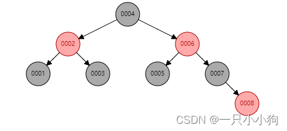

## 5.2 B树
B层数过深导致查询效率低下，每个节点空间过小，所以增大节点空间，将每个叶子节点都存放多个索引元素和对应的多个data。
有效的控制了层数，这样矮胖的树结构，减少了io操作

## 5.3 B+树
B树还有一个问题，由于非叶子节点也存放了data数据,占用了大量的空间。B+树中将非叶子节点中的data数据删除，而是单纯的放置冗余索引和对应的节点地址，使得一个非叶子节点可以存放更多的冗余索引，查找时，对当前非叶子节点使用二分折半查找。
并且叶子节点中使用指针相连，提高了区间访问性能，支持范围查找。每一层都是有序存储的。
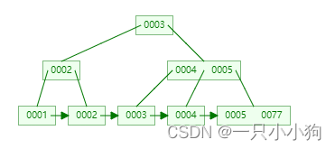

## 5.4 为什么使用B+树（B+树的优点）
- 叶子节点有序链表，支持范围查找
- 所有的查询都是查找最底层到叶子节点，查询稳定
- 非叶子节点可以存储更多的索引元素+地址，使得IO操作减少

3层B+树可以存储百万级别的数据，而且查询效率非常高。

# 7. 数据库为什么不使用Hash表
hash表虽然是O(1)的查询效率，但是大量的数据会有大量的hash冲突，查询效率也会从O（1）退化到O（n）。（虽然即使千万数据 hash表还是效率高于B+tree）
主要原因：hash表没有排序，不支持范围查找。

# 8. Mysql索引
Mysql索引的本质是数据结构。比如B+树索引，B+树索引的本质是B+树数据结构。

## 8.1 什么是聚集索引（主键索引、聚簇索引）
在InnoDB的引擎中，一张表只能有一个聚集索引。而聚集索引本身就是通过B+树来构建的。而叶子节点会存储每一行记录。
并且InnoDB中的表必须有一个聚集索引，如果没有主键会默认一个隐藏的主键。一般建议使用自增主键。
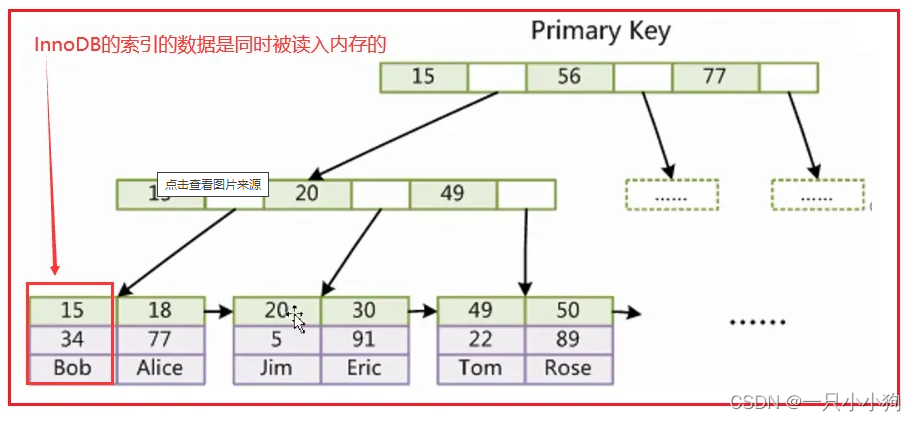

### 8.1.1 为什么建议使用自增主键
连续性磁盘写入和检索性能会提高。
如果使用UUID这种无序Id，频繁插入B+树种会导致频繁的**页分裂**，导致磁盘写入性能下降。

### 8.1.2 为什么需要主键整型
因为整型对于排序更加友好，比如int类型的排序是有序的，而字符串类型的排序是无序的。

### 8.1.3 为什么一个表只能有一个聚集索引
如果有多套聚集索引，那么每次插入数据都需要更新多套聚集索引，导致磁盘写入性能下降。

## 8.2 什么是非聚集索引（辅助索引、非聚簇索引、二级索引）
非聚集索引本身也是通过B+树来构建的，但是叶子节点不会存储实际数据，而是指向实际数据的指针。
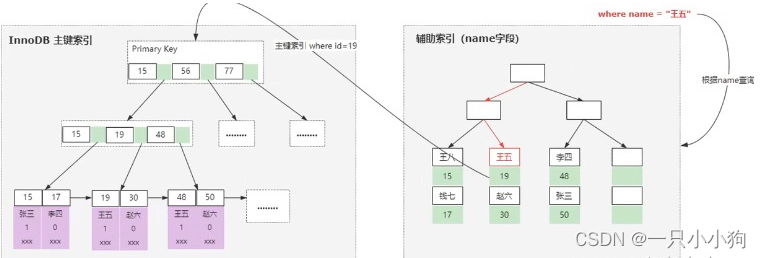
也是我们常会去给表创建的索引。比如增加某些字段的检索性能。

## 8.3 索引对数据库的性能
1. 创建和维护索引会消耗时间和空间。
2. 如果增加过多的二级索引，会导致表增删改的性能下降。

## 8.4 索引失效（慢查询原因）
1. 没有符合最左前缀原则
比如like以%开头、组合索引不使用第一列。
2. 字段进行了隐性数据转换
比如手机号是字符串，但是查询时候使用了int类型。
3. 走索引没有全表扫描的效率高
比如表中数据量很少，走索引的效率反而低。（因为要通过主键id和实际数据指针，进行回表查询）

### 8.4.1 有没有使用过explain？
explain是mysql提供的一个关键字，可以查看sql语句的执行计划。
一般关注的是：检索使用的是那个字段、字段是不是主键

## 8.5 联合索引为什么是最左前缀原则
联合索引也就是二级索引，他的存储叶子节点的结构是（key，rowid）。
比如当前有name age两个字段。那么联合索引的叶子节点存储的结构是（name，age，rowid）。
在B+树 叶子节点的排序中也是通过name排序，在通过age排序。
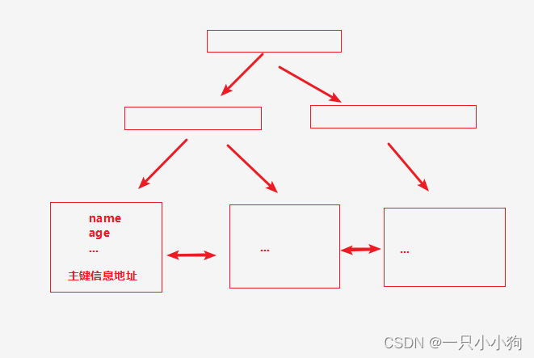

## 8.6 回表查询是什么？
回表查询是指通过二级索引查询到主键id，然后通过主键id查询到实际数据的过程。
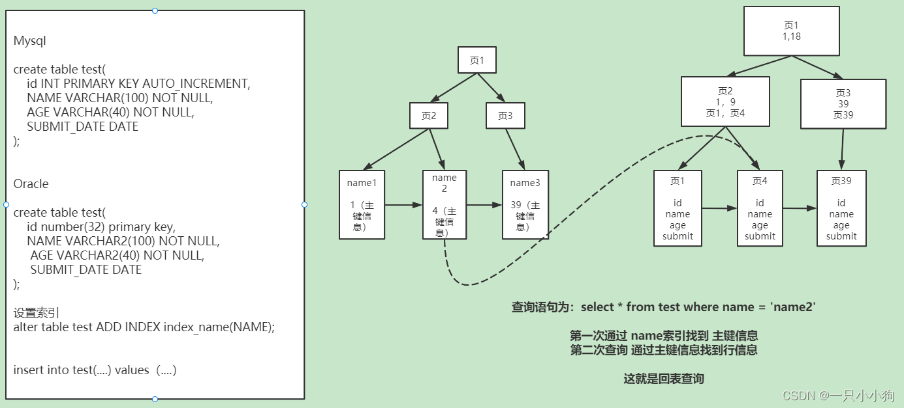

## 8.7 如何避免回表查询
通过组合索引（联合索引）将需要的数据进行覆盖，避免回表查询。
比如现在要查询name age字段，那么可以创建（name，age）组合索引，这样就可以避免回表查询。

# 9. 说一说多版本并发控制（MVCC）
MVCC是一种多版本并发控制器，一般使用于对数据库并发访问。MVCC是不使用锁来控制事务，并且可以解决脏读、不可重复度、幻读。（无法解决更新丢失问题。）

具体操作:
Innodb每行数据都有向上指向的一个版本数据存放在undo log中，形成一个版本链。
如果进行更新记录，则会将最新的数据写入undo log中，并且隐藏指针指向上一个版本。
此时查询就会查询到最后一个undo log版本。

MVCC好处：读不加锁、读写不冲突，增加了并发，保证了事务。

# 10. Mysql 主从复制原理以及流程
保证主服务器（Master）和从（备Slave）的数据一致性，想Master进行数据修改后，（在一定规则下）Slave会将Master中数据同步过来。

## 10.1 MySQL 主从复制解决了什么问题？
1.高可用和稳定性
当Master节点宕机时，可以指定一台Slave充当Master，（当对Master进行数据操作时进行宕机，可能会导致Slave机数据不一致）

2.负载均衡
可以进行读写分离，比如Master主要用作写入操作，而读取操作交给Slave，由于查询的需求更大，使用多个备用服务器进行读取。

3.业务模块化
针对不同的业务场景进行数据库的索引创建和根据业务选择MySQL存储引擎， 不同的slave可以根据不同需求设置不同索引和存储引擎

## 10.2 MySQL 主从复制流程

1. Master主库更新写入，（binlog线程）binlog二进制日志顺序写入，主库会告诉存储引擎可以提交事务。
2. Slave会启动一个IO线程，去读Master中的binlog日志信息，并且存储到relay log中继日志中。
3. Slave节点会启动一个SQL线程去读取中继日志，并且将数据 重放。

## 10.3 主从同步之 异步复制 半同步复制 全同步复制
1. 异步复制：主库执行完事务，异步执行的结果马上返回给客户端，并不关心从库是否真的执行同步。还是会出现主从数据不一致的问题。
2. 半同步复制：主库执行完事务并不马上返回给客户端，而是等待至少一个从库收到并写入relay log，才会返回到客户端。
3. 全同步复制：当主库提交事务返回客户端之前，全部从库必须接受到数据，才可以返回给客户端。

效率：异步 > 半同步 > 全同步

安全性：全同步 > 半同步 > 异步

## 10.4 MySQL数据库主从同步，一致性解决方案
1. 半同步复制:至少保证一个从库同步成功，但是还是会出现主从数据不一致的问题。
2. 中间件：中间件，通过bin log日志进行主从同步，保证主从数据一致性。 会出现额外开销增加系统复杂度。

# 11. 主键唯一性

## 11.1 分库分表拆分后解决主键唯一性问题
1. UUID,但是无法存在业务含义，可能会导致MAC地址泄露。
2. 数据库主键,单调递增可能会导致业务暴露。
3. redis中间件等,唯一性解决很好的方案，但是增加了系统复杂度。
4. 雪花算法，是Twitter公司开发的一种算法，可以解决ID生产问题

# 12.一条Update语句的执行流程(了解)
分为服务器层和存储引擎层。
## 12.1 服务器层
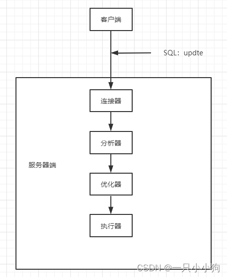
1. 连接器
负责跟客户端建立连接、账号密码验证、获取权限、维持和管理连接。

2. 分析器
在通过验证以后，分析器会对该语句分析，判断是否语法有错误等。

3. 优化器
选择索引，生成执行计划。

4. 执行器
根据优化器生成的执行计划，调用存储引擎 API 执行 SQL。

## 12.2 InnoDB 引擎层

1. 进入InnoDB引擎后，先判断SQL的数据页是否存在于buffer pool（缓冲池）中，如果不存在则通过B+Tree读取到磁盘的数据页，然后加载到buffer pool中。
2. 判断是否存在锁（排他锁），对应行记录的行锁是否被其他事务占用，如果是则进入锁等待（进入锁等待后判断是否会造成死锁），（如果不会造成OR没有检测到锁）则加锁。
3. 将修改前的记录写入到undo log（撤销日志）中，并且使用回滚指针指向undo log中的修改前的行，构建回滚段，用于回滚数据和实现MVCC的多版本。
4. 写入redo log buffer中。
5. 写入到bin log cache。

（6. 写入到 change buffer中如果此次update操作设计到二级索引，则写入到changer buffer page中。）
7. 事务阶段：
   1. 事务提交，分为redo log prepare、bin log write、redo log commit、释放排他锁、刷新脏页。
   2. 事务回滚，分为undo log回滚、释放排他锁、刷新脏页。

# 13. InnoDB引擎架构原理
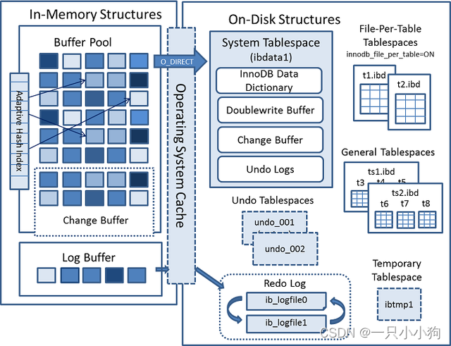
## 13.1 架构分析
主要分为内存结构和磁盘结构。
内存部分有：缓存池（buffer pool）又分为更改缓存区和自适应hash索引（change buffer、Adaptive hash index）、日志缓存区（log buffer）
磁盘部分有：系统表空间（system tablespace）、重做日志文件（redo log）
表空间有：InnoDB数据字典、双写缓存区、更改缓存区、撤销日志（undo log）
重做日志（redo log）：log buffer刷到磁盘上的数据，用于恢复数据。

## 13.2 内存中结构
### 13.2.1 缓存池（buffer pool）
Mysql服务器80%的内存都会分配给Buffer Pool。
InnoDB中数据管理的最小单位为页，默认每页16KB。
通过一个LRU双向链表来管理缓存池中的页，最少放访问的页会通过缓存池的LRU算法淘汰出去。

#### 13.2.1.1 此处的的链表实现
与正常的双向链表不同，分为前八分之五和后八分之三。
前八分之五是热数据，后八分之三是冷数据。

1. 如果链表未满，则插入后八分之三的链表头部。
2. 如果之前的页块再次被访问，则将页块移动到前八分之五的链表头部。
3. 如果链表已满，则将链表尾部的页块淘汰出去。

## 13.3 更改缓存区（Change Buffer）
- 为了减少二级索引，每次修改都直接写入磁盘、有频繁的IO。
- 如果二级索引的页已经在缓存池中，那么就直接修改页中的数据。
- 如果二级索引的页不在缓存池中，那么就将修改的数据放入 更改缓存区。然后定期合并到磁盘。
  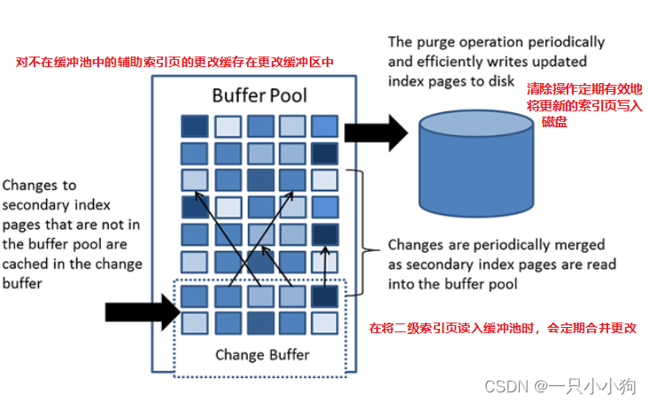

## 13.4 自适应hash索引（Adaptive hash index）
所以InnoDB会在缓存池中维护一个hash索引，用于快速定位到磁盘页。（最近连续被访问超过3次的数据，就会放入自适应hash索引）

自适应hash索引针对的是缓存池中的页，而不是磁盘页。

## 13.5 日志缓存区（log buffer）
log buffer是重做日志（redo log）的缓存区，默认大小是16MB。

### 13.5.1 日志先行策略（Redo log的作用）
InnoDB使用的是日志先行策略，在持久化数据文件前，保证事务记录成Redo log已经写入磁盘。
问题描述： 日志记录到数据库以后，对应的事务就可以返回给用户，表示事务完成。实际上，数据可能只在内存中进行了修改，并没有刷到磁盘上。如果程序异常或者奔溃，内存中的数据就会消失。
解决问题： InnoDB此时通过Redo log来保证数据一致性。显然记录所有的重做日志不太现实。引入了检查点机制，保证日志已经写入磁盘，下次回复从检查点开始。

### 13.5.2 宕机恢复数据(从Redo Log和Log Buffer)
当数据进行修改操作的时候，会先写入内存空间，然后写入Log Buffer，在将log buffer中记录变化的日志写入物理磁盘redo log文件中。
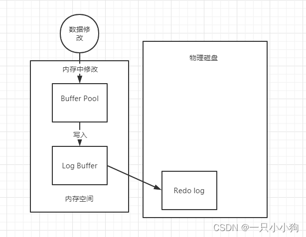
宕机数据虽然写入了内存，但是没有存入物理存储结构中。这时候会使用检查点机制checkPoint，将redo log文件中数据加载到redo log buffer 内存中。再将最新数据写入mysql的磁盘数据文件中，从而更新数据。

## 13.3 物理存储结构
### 13.3.1 系统表空间（system tablespace）
#### 13.3.1.1 数据字典
创建一个数据库和一个表后，可以看到test数据库目录中。
db.opt文件：保存了数据test默认字符集
t.frm文件：保存表的数据字典信息
t.idb文件：表的数据和索引 （初始化96K，默认页为16K）

#### 13.3.1.2 撤销日志（Undo Log）
（实现原子性 事务提交回滚，实现MVCC）
MySQL的MVCC(多版本并发控制)依赖Undo Log实现。每个记录都有一个回滚指针，指向该记录的最近一条Undo记录，而每条Undo记录都会指向它的前一条Undo记录。
形成一个版本链，这样就可以通过回滚指针，找到该记录的历史版本。

事务在Undo log中产生，事务提交后，Undo log中的数据会被删除。

#### 13.3.1.3  双写缓存 （Double-Write Buffer）
当InnoDB记录更新后，由于日志先行策略会先往Log Buffer内存中写入数据，然后再写入磁盘Redo log中。
然后写入物理表磁盘之前会进入双写缓存中，此时如果写入过程发生故障(比如机器掉电或者操作系统崩溃)。

1. 写入双写缓存中出错
   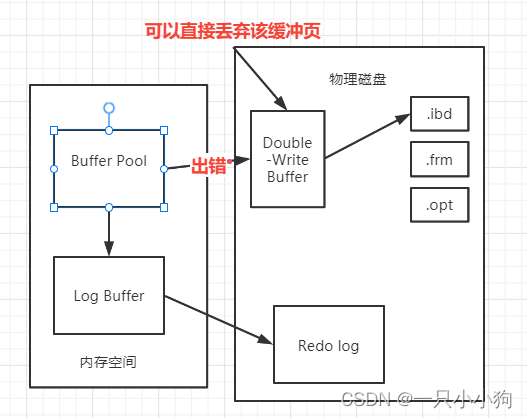
2. 写入物理表文件中出错
   