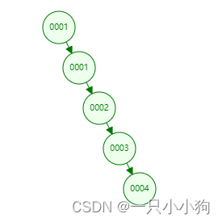
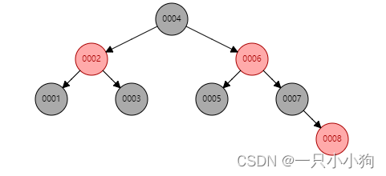
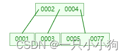
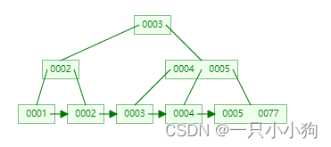
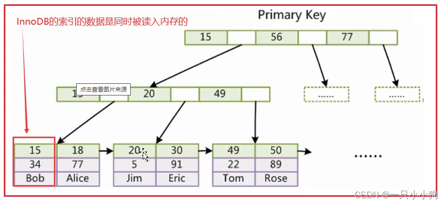
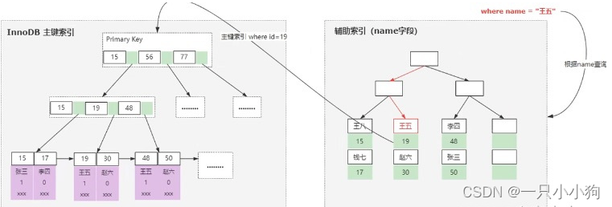
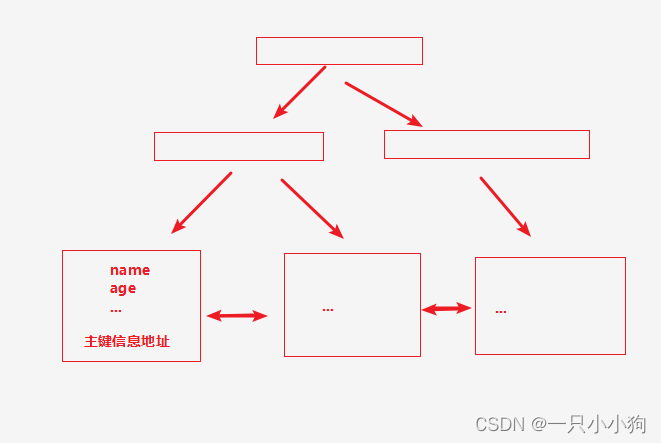

# 1. Mysql中的锁
基于锁的属性分类：共享锁（读锁）和排他锁（写锁）
基于锁的粒度分类：表锁、行锁、页锁、记录锁、间隙锁、临键锁
基于锁的状态分类：意向共享锁、意向排他锁
基于锁的算法分类：乐观锁、悲观锁

## 1.1 共享锁（读锁）
共享锁又称为读锁，当一个事务为数据加上读锁，其他事务不可以加写锁，但可以加读锁。读锁可以共享，多个事务可以同时对一份数据加读锁，互不阻塞。

## 1.2 排他锁（写锁）
排他锁又称为写锁，当一个事务为数据加上写锁，其他事务不可以加读锁和写锁。写锁是独占的，只有一个事务可以对数据加上写锁，其他事务必须等待该事务释放写锁后才能再次加锁。

## 1.3 意向共享锁
意向共享锁是表级锁，当一个事务为数据加上共享锁时，事务会先尝试加意向共享锁，如果加锁成功，再尝试加共享锁，如果加锁失败，事务会回滚。

## 1.4 意向排他锁
意向排他锁是表级锁，当一个事务为数据加上排他锁时，事务会先尝试加意向排他锁，如果加锁成功，再尝试加排他锁，如果加锁失败，事务会回滚。

## 1.5 乐观锁
乐观锁是一种乐观的加锁策略，它乐观的认为事务之间不会发生冲突，所以不加锁。当事务提交时，会检查事务期间是否修改过数据，如果修改过，事务提交失败。（可以通过CAS和版本号机制实现）

## 1.6 悲观锁
悲观锁是一种悲观的加锁策略，它悲观的认为事务之间会发生冲突，所以提前加锁。当事务提交时，会检查事务期间是否修改过数据，如果修改过，事务提交失败。

## 1.7 表锁
对整张表加锁，实现简单，资源消耗小，加锁快，不会出现死锁，锁定粒度大，发生锁冲突的概率最高，并发度最低。

## 1.8 页锁
对表中的一个页加锁，锁定粒度介于表锁和行锁之间，发生锁冲突的概率介于表锁和行锁之间，并发度介于表锁和行锁之间，但是加锁消耗资源介于表锁和行锁之间，加锁速度介于表锁和行锁之间，会出现死锁。

## 1.9 行锁
对表中的一行数据加锁，锁定粒度最小，发生锁冲突的概率最低，并发度最高，但是加锁消耗资源大，加锁慢，会出现死锁。

## 1.10 记录锁
对表中的一条记录加锁，是行锁的一种特例。

## 1.11 间隙锁
对一个范围加锁，但不包含记录本身，是行锁的一种特例。

## 1.12 临键锁
对一个范围加锁，包含记录本身，是行锁的一种特例。

# 2. 事务的四大特性（ACID）
## 2.1 原子性（Atomicity）
事务是一个原子操作单元，其对数据的修改，要么全都执行，要么全都不执行。

## 2.2 一致性（Consistency）
事务执行前后，数据保持一致。

## 2.3 隔离性（Isolation）
多个事务并发执行时，事务之间是相互隔离的，一个事务不应该影响其他事务。

## 2.4 持久性（Durability）
事务执行成功后，对数据的修改是永久的。

# 3. 事务的隔离级别
## 3.1 未提交读（Read Uncommitted）
事务可以读取未提交的数据，会出现脏读、不可重复读、幻读。

## 3.2 提交读（Read Committed）
事务只能读取已提交的数据，会出现不可重复读、幻读。

## 3.3 可重复读（Repeatable Read）
事务可以多次读取同一数据，不会出现脏读、不可重复读，会出现幻读。

## 3.4 串行化（Serializable）
事务串行执行，不会出现脏读、不可重复读、幻读。

# 4. 事务隔离级别的问题
## 4.1 脏读
事务A读取了事务B未提交的数据，事务B回滚，事务A读取到了脏数据。

## 4.2 不可重复读
事务A多次读取同一数据，事务B修改了数据并提交，事务A多次读取的数据不一致。

## 4.3 幻读
事务A多次读取同一数据，事务B插入了数据并提交，事务A多次读取的数据不一致。

# 5. 数据库不使用二叉树、红黑树、B树、Hash表？ 而是使用了B+树
## 5.1 二叉树
在最坏的情况下会退化为链表形态，变成了顺序查找，遍历整个链。

## 5.1 红黑树
红黑树但是一种特殊的平衡二叉树，属于二叉树，一个父节点只能跟着2个子节点。如果存在几千万数据，那么红黑树会非常的深同样需要大量io操作。

## 5.2 B树
B层数过深导致查询效率低下，每个节点空间过小，所以增大节点空间，将每个叶子节点都存放多个索引元素和对应的多个data。
有效的控制了层数，这样矮胖的树结构，减少了io操作

## 5.3 B+树
B树还有一个问题，由于非叶子节点也存放了data数据,占用了大量的空间。B+树中将非叶子节点中的data数据删除，而是单纯的放置冗余索引和对应的节点地址，使得一个非叶子节点可以存放更多的冗余索引，查找时，对当前非叶子节点使用二分折半查找。
并且叶子节点中使用指针相连，提高了区间访问性能，支持范围查找。每一层都是有序存储的。

## 5.4 为什么使用B+树
- 叶子节点有序查询，支持范围查找
- 所有的查询都是查找到叶子节点，查询稳定
- 非叶子节点可以存储更多的索引元素+地址，使得IO操作减少

3层B+树可以存储百万级别的数据，而且查询效率非常高。

# 6. B+树的优点
1. 非叶子节点可以存储跟多的索引元素+地址，使得IO操作减少。
2. 所有查找的都是查找到最底层的叶子节点，查找性能稳定。
3. 并且叶子节点是有序链表，方便范围查找。

# 7. 数据库为什么不使用Hash表
hash表虽然是O(1)的查询效率，但是大量的数据会有大量的hash冲突，查询效率也会从O（1）退化到O（n）。（虽然即使千万数据 hash表还是效率高于B+tree）
主要原因：hash表没有排序，不支持范围查找。

# 8. Mysql索引
Mysql索引的本质是数据结构。比如B+树索引，B+树索引的本质是B+树数据结构。

## 8.1 什么是聚集索引（主键索引、聚簇索引）
在InnoDB的引擎中，一张表只能有一个聚集索引。而聚集索引本身就是通过B+树来构建的。而叶子节点会存储每一行记录。
并且InnoDB中的表必须有一个聚集索引，如果没有主键会默认一个隐藏的主键。一般建议使用自增主键。

### 8.1.1 为什么建议使用自增主键
有连续性在磁盘写入和检索性能上会提高。
如果使用UUID这种无序Id，频繁插入B+树种会导致频繁的页分裂，导致磁盘写入性能下降。

### 8.1.2 为什么需要主键整型
因为整型对于排序更加友好，比如int类型的排序是有序的，而字符串类型的排序是无序的。

### 8.1.3 为什么一个表只能有一个聚集索引
如果有多套聚集索引，那么每次插入数据都需要更新多套聚集索引，导致磁盘写入性能下降。

## 8.2 什么是非聚集索引（辅助索引、非聚簇索引、二级索引）
非聚集索引本身也是通过B+树来构建的，但是叶子节点不会存储实际数据，而是指向实际数据的指针。

也是我们常会去给表创建的索引。比如增加某些字段的检索性能。

## 8.3 索引对数据库的性能
1. 创建和维护索引会消耗时间和空间。
2. 如果增加过多的二级索引，会导致表增删改的性能下降。、

## 8.4 索引失效
1. 没有符合最左前缀原则
比如like以%开头、组合索引不使用第一列。
2. 字段进行了隐性数据转换
比如手机号是字符串，但是查询时候使用了int类型。
3. 走索引没有全表扫描的效率高
比如表中数据量很少，走索引的效率反而低。（因为要通过主键id和实际数据指针，进行回表查询）

## 8.5 联合索引为什么是最左前缀原则
联合索引也就是二级索引，他的存储叶子节点的结构是（key，rowid）。
比如当前有name age两个字段。那么联合索引的叶子节点存储的结构是（name，age，rowid）。
在B+树 叶子节点的排序中也是通过name排序，在通过age排序。

## 8.6 回表查询是什么？
回表查询是指通过二级索引查询到主键id，然后通过主键id查询到实际数据的过程。

## 8.7 如何避免回表查询
通过组合索引将需要的数据进行覆盖，避免回表查询。
比如现在要查询name age字段，那么可以创建（name，age）组合索引，这样就可以避免回表查询。

# 9. InnoDB引擎架构原理
