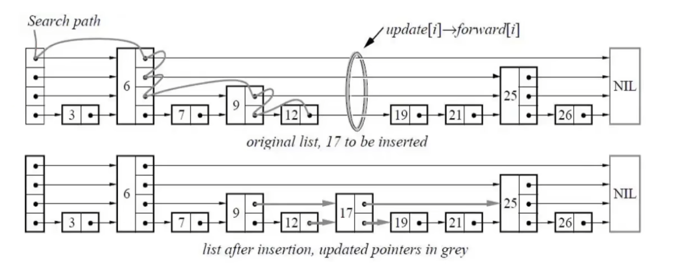
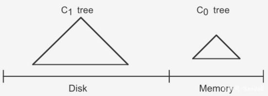
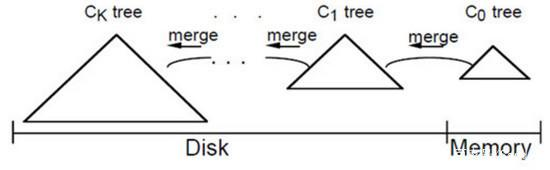

# 有界无界阻塞队列

- 有界: 是指在队列中的元素是有上限的
- 无界: 是指在队列中的元素是无限的（java中的无限上限为Integer.MAX_VALUE）

# 倒排索引
一种特殊的字典数据结构。对一个文档当中的每一个text字段都会建立倒排索引。
正常的查询是通过ID查询到文档，而倒排索引是通过文档查询到ID。

# 跳表
跳表是一种多层次的链表，每一层都是一个有序的链表，最底层的链表包含所有元素。

# LSM-TREE （多用于分布式存储，针对大规模高并发的数据量写入：clickhouse）
数据按照时间顺序存储在磁盘上，以减少磁盘 I/O 操作和提高写入性能。以APPEND的方式写入数据。
LSM-Tree 由内存中的 MemTable 和磁盘中的 SSTable 组成。

日志结构合并树(Log-Structured Merge-Tree)其实它并不属于一个具体的数据结构，是一种思想。

# LSM树对于B+树
LSM树的优势在于写入性能，而B+树的优势在于读取性能。
LSM树的写入性能之所以高，是因为它将数据写入内存中，而不是直接写入磁盘。而B+树的写入性能之所以低，是因为它每次写入都要直接写入磁盘。
LSM树的读取性能之所以低，是因为它需要从内存和磁盘中读取数据，而B+树的读取性能之所以高，是因为它只需要从磁盘中读取数据。

# LSM树架构原理

LSM-TREE 分为连个部分：内存部分和磁盘部分。
第一部分C0 tree：是任何方便键值查找的数据结构：红黑树、B+树、跳表等。
第二部分C1 tree：是一个有序的数据结构类似B+树，因为它每层都是有序的。

写入插入思路：
1. 插入一条新记录，先保存到日志文件中
2. 然后插入到内存中，当内存MemTable满了，会将内存中的数据写入磁盘形成一个新的SSTable文件。
3. 当SSTable文件达到一定数量，多个SSTable会合并成压缩成SSTable文件。并且会删除旧的SSTable文件。（不是立即删除）