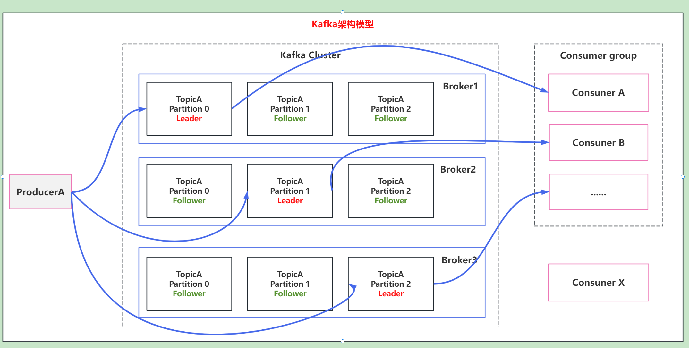
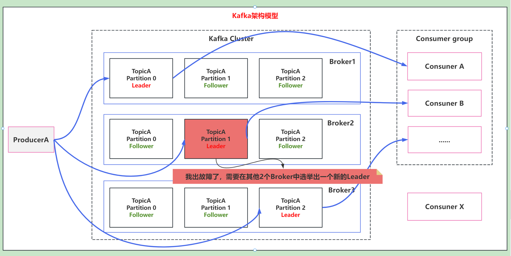
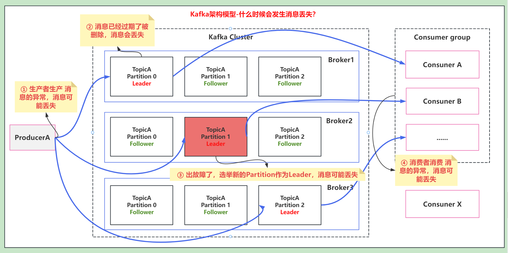
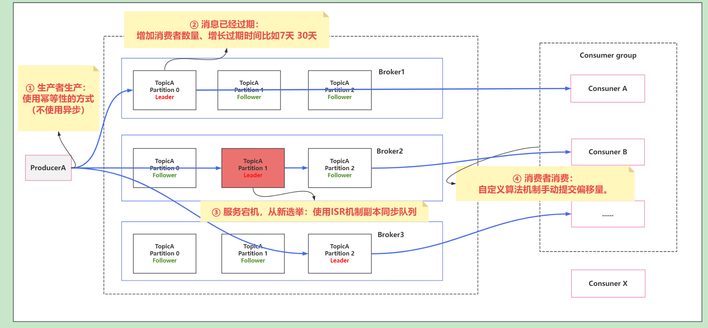
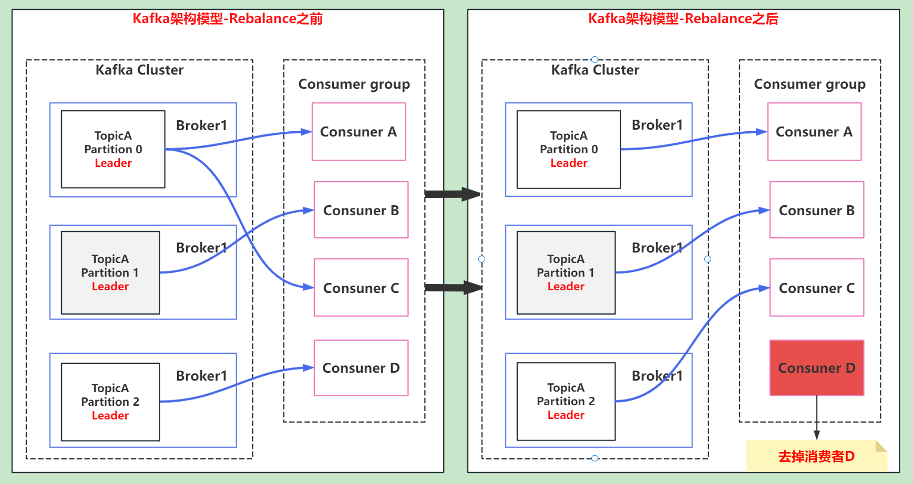
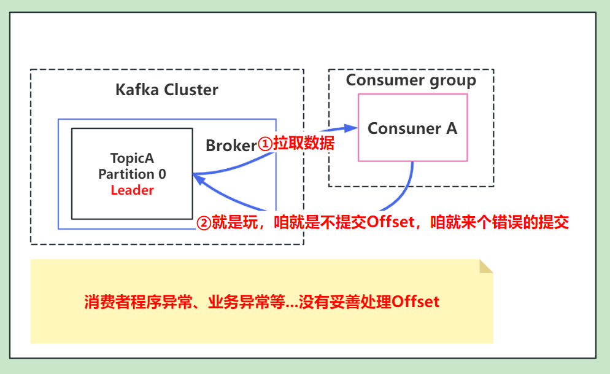
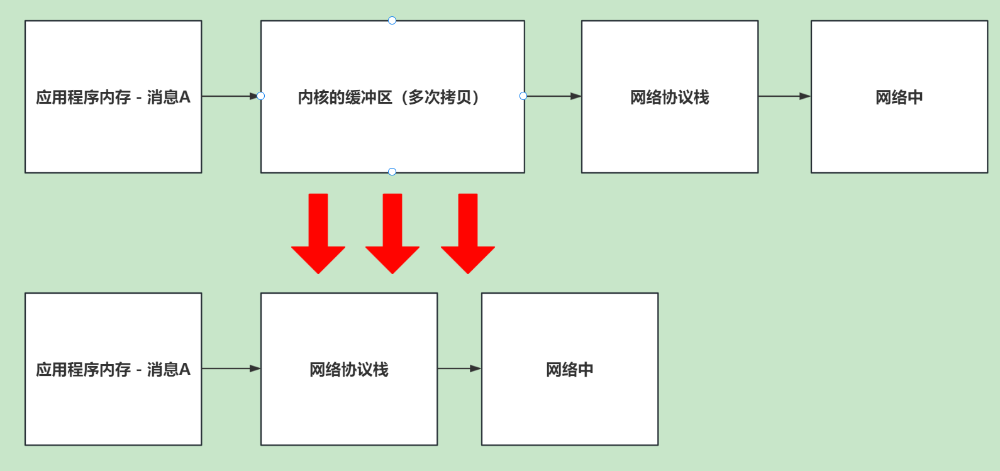

# 1. 说说你在什么场景下使用过Kafka？

- 数据流处理：上上家公司中，数据结构化通过将数据发送到Kafka集群中，主要保证数据不丢失，允许一定性的队列中临时容纳大量数据进行处理。
- 流式处理：上家公司中，使用flink实时任务中讲kafka算子嵌入处理数据。
- 消息队列：比如双11下单的场景下：削峰填谷，使得消息能稳定的处理，不亏冲垮服务。

# 2. Kafka架构模型

- Producer ：消息生产者。
- Consumer ：消息消费者。
- Topic ：可以理解为一个队列，一个 Topic 又分为一个或多个分区、每个分区又有一个或多个备份，
- Consumer Group：一个 topic 可以有多个 Consumer Group。
- Broker ：kafka 服务就是一个 broker。一个集群由多个 broker 组成。一个 broker 可以容纳多个 topic。
- Partition：为了实现扩展性，一个topic一般会分布到多个Partiotion上，每个 partition 是一个有序的队列。partition 中的每条消息都会被分配一个有序的id（offset偏移量）。kafka 只保证按一个 partition 中的消息的顺序，不保证一个 topic 的整体（多个 partition 间）的顺序。
- Offset：kafka 的存储文件都是按照 offset.kafka 来命名，用 offset 做名字的好处是方便查找。

# 3. Kafka如何保证消费顺序性？

**<h3>person：</h3>**
kafka只保证在一个partition下按照offset消费的顺序性，而不保证一个topic多个partition下消费的顺序性。

**<h3>Solution：</h3>**
1. 一个Topic下只有一个分区，这样就不会乱序了。但是这样就失去了Kafka的并行处理能力。
2. 自定义一个消费算法，将指定的key发到同一个partition，指定的消费者消费指定的partition。

## 3.1 Kafka为什么消费顺序会乱？
而生产者生产的消息，按照（轮训、hash key、随机策略）进行分配给多个partition，所以在一个topic下消息会乱。

# 4. Kafka数据一致性怎么保证？ （服务宕机时的数据一致性如何保证？）

**<h3>Kafka数据一致性问题：</h3>** 当leader宕机时，重新选举出的副本数据可能缺失。

使用ISR（In-Sync Replicas 副本同步队列）机制来保证副本之间的数据一致性。
(生产消息到Topic中时，需要将消息加入到所有副本后再进行返回客户端，生产完成)

# 5. Kafka什么时候消息会丢失？

# 5.1 Kafka 如何保证消息不丢失？

# 6. Kafka 怎么避免重复消费？
Kafka中记录消费主要是通过offset来记录的。

1. 由于消费者组中增加或者减少消费者，发生Rebalance，导致offset提交失败

2. 由于消费者消费异常导致提交异常。

# 7. Kafka 是如何实现高吞吐率的？

- 零拷贝
- 数据压缩
- 文件分段
- 批量发送
- 顺序读写

# 7.1 零拷贝
避免了数据的多次拷贝，提高了数据传输的效率。
