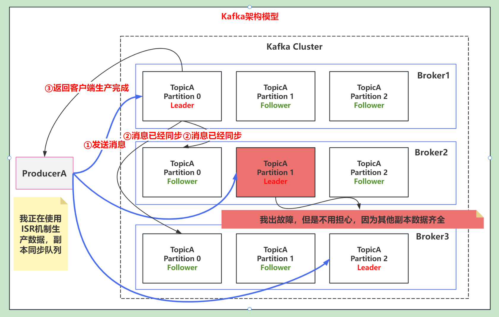

# 1. 说说你在什么场景下使用过Kafka？

- 数据流处理：上上家公司中，数据结构化通过将数据发送到Kafka集群中，主要保证数据不丢失，允许一定性的队列中临时容纳大量数据进行处理。
- 流式处理：上家公司中，使用flink实时任务中讲kafka算子嵌入处理数据。
- 消息队列：比如双11下单的场景下：削峰填谷，使得消息能稳定的处理，不亏冲垮服务。

# 2. Kafka架构模型

- Producer ：消息生产者。
- Consumer ：消息消费者。
- Topic ：可以理解为一个队列，一个 Topic 又分为一个或多个分区、每个分区又有一个或多个备份，
- Consumer Group：一个 topic 可以有多个 Consumer Group。
- Broker ：kafka 服务就是一个 broker。一个集群由多个 broker 组成。一个 broker 可以容纳多个 topic。
- Partition：为了实现扩展性，一个topic一般会分布到多个Partiotion上，每个 partition 是一个有序的队列。partition 中的每条消息都会被分配一个有序的id（offset偏移量）。kafka 只保证按一个 partition 中的消息的顺序，不保证一个 topic 的整体（多个 partition 间）的顺序。
- Offset：kafka 的存储文件都是按照 offset.kafka 来命名，用 offset 做名字的好处是方便查找。

# 3. Kafka如何保证消费顺序性？

**<h3>person：</h3>**
kafka只保证在一个partition下按照offset消费的顺序性，而不保证一个topic多个partition下消费的顺序性。

**<h3>Solution：</h3>**
- 将所有消息都生产到同一个partition。

## 3.1 Kafka为什么消费顺序会乱？
而生产者生产的消息，按照（轮训、hash key、随机策略）进行分配给多个partition，所以在一个topic下消息会乱。

# Kafka 如何保证消息消费的顺序性？
产生乱序的原因：
比如一个Topic下，有多个分区。而生产者产生的消息，被（轮训、随机、hash key的策略）分配给不同的分区。导致消费消息的顺序乱了。

# Kafka 如何保证消息不丢失？
这个就要涉及到Kafka的三者关系：生产者、消费者、Broker，以及Kafka的消息存储机制。

1. Producer默认是异步发送消息的，如果要保证消息不丢失: 
   1. 把异步改为同步发送，会影响性能，因为需要等待Broker的响应。
   2. 在异步中增加回调机制，如果发送失败，允许重试。

# Kafka 怎么避免重复消费？
Kafka中记录消费主要是通过offset来记录的。

可能情况：
1. 也就是如果offset没有提交，kafka就不不会认为这条消息被消费了。（比如宕机和消费者业务代码异常）
2. 还有另一种情况Partition Balance机制触发，发生Rebalance，从而导致Offset提交失败。（比如多个分区交给多个消费者处理，单位时间内无法消费完，就会触发Rebalance）

解决方案：
1. 控制拉取消费数量
2. 延长处理最大时间
3. 优化代码
4. 异步处理业务提前提交offset，但是要通过中间件缓存，可以重新消费。
5. 通过幂等性来解决，比如分布式锁、数据库唯一ID等

解决方案：
1. 一个Topic下只有一个分区，这样就不会乱序了。但是这样就失去了Kafka的并行处理能力。
2. 自定义一个消费算法，将指定的key发到同一个partition，指定的消费者消费指定的partition。

# kafka怎么保证生产有且仅有一次？
通过幂等性来解决，
比如分布式锁、数据库唯一ID、启用幂等性机制

