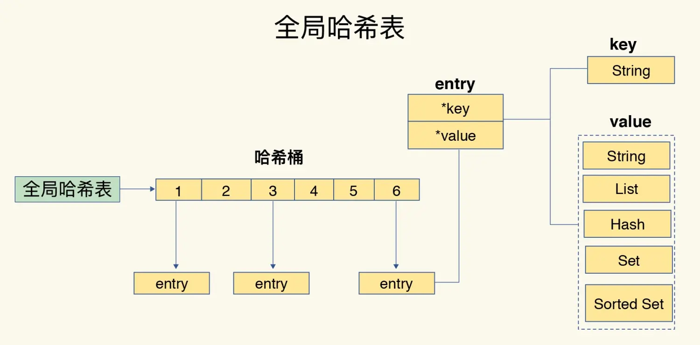

# 1. Redis为什么这么快？
1. Redis采用`内存存储`，内存的读写非常快。
2. Redis采用`单线程`操作数据，单线程不需要进行线程上下文切换的开销。
3. Redis的存储结构和机制，`渐进式Rehash`和`缓存时间戳`。

## 1.1 Redis中的Rehash

这时候就要提到Redis底层的存储结构框架：全局哈希表

- 全局哈希表：类似JDK1.6的hashMap，它维护的一个哈希桶数组，每个桶里面存储的是一个链表，链表里面存储的是一个个的键值对节点元素。
- 节点元素：是以Key-Value的形式存储，key是一个字符串，value是一个Redis数据结构。 

而当全局哈希表达到某一个临界值会发生扩容，当扩容时需要重新分配哈希表的哈希桶数组位。这个过程就是Rehash。

## 1.2 `Rehash`带来的问题? 以及`渐进式Rehash`

当Redis已经有大量数据的时候，此时进行扩容，Rehash的数量会达到一个恐怖的时间，Redis此时会进行卡顿，甚至会造成雪崩。
假如此时Rehash 10W个Key，我们创建一个另一个全局哈希表B，将原来的全局哈希表A的数据通过查询对应桶位进行Rehash一个或者多个key进行拷贝到全局哈希表B上，以达到渐进式Rehash。

## 1.3 缓存时间戳

Redis中的key基本都有过期时间，也就是说需要经常性的获取系统时间戳，Redis的主要操作线程需要经常获取系统时间戳，这个是非常耗时的。
所以Redis另开线程使用定时任务将时间戳缓存起来，主线程可以直接从缓存中获得。

# 2. 基本数据结构：
1. String 字符串：缓存、计数器、分布式Session
1. List 列表：消息队列
1. Hash 哈希表：对象
1. Set 无序集合
1. Sorted Set 有序集合 （ZSet，有权重score）：排行榜
1. Bitmap ：布隆过滤器
1. GeoHash 坐标 （底层使用Zset实现）
1. HyperLogLog 统计不重复数据
1. Streams 内存版 kafka

# 3. 数据持久化问题：持久化：AOF（Append Only File）和RDB（Redis DataBase）
默认开启的是RDB
如果配置同时开启了RDB和AOF ，数据恢复Redis会优先选择AOF恢复。
- AOF
  将所有命令都记录下，追加到文件最后，恢复的时候就把这个文件全部再执行一遍。（并且推荐默认为每秒执行一次，写入AOF文件，故障时也值丢失一秒的数据。）

- RDB
  指定的时间间隔内将内存中的数据集快照写入磁盘,恢复时将快照文件直接读到内存里。

- RDB + AOF 混合策略
  开启AOF，将写操作记录到AOF文件中，然后定期将内存的数据结构写入RDB文件中，Redis启动时，先加载AOF文件，再加载RDB文件。

# 4. Redis关于6.0版本多线程单线程的问题？（Redis会出现线程安全问题么？）

- **Redis 6.0之前** : 指令操作和网络IO操作都是单线程的。（由于CPU不是瓶颈、多线程会出现线程安全问题）
- **Redis 6.0之后** : 网络IO操作成为了瓶颈，所以改成网络IO多线程的。（比如小数据量的包Redis1秒QPS为8-10万，而改为多线程网络IO操作会大大提高了QPS）

# 5. Redis的高级功能

## 5.1 事务

Redis提供了将多个命令打包成一个事务，只对基本的语法错误进行事务回滚。（multi 和 exec）

## 5.2 gossip协议

- 传统的传输主从复制协议：主节点将数据同步到从节点，从节点只能接收数据，不能传输数据。
- gossip协议：主节点将数据同步到从节点，从节点可以将数据同步到其他从节点。

# 6. Redis的过期策略（key过期）

Redis过期策略:

- 定时删除：定时删除一批过期的key。 （一批）
- 惰性删除：每次获取Key都会检查是否过期，过期则删除key。 （一个）

# 7. Redis内存淘汰机制 （当物理内存满了）

- 不允许继续写模式
- LRU-最早使用的key被淘汰
- 淘汰寿命最少的key
- 随机淘汰

# 8. Redis 和 数据库 如何保证数据一致性
在高并发的环境下，比如增删改：Redis和数据库的数据可能会存在不一致的问题，极端情况下这种问题更严重。

1. 延时双删策略: 先删除缓存，再删除数据库，如果删除数据库失败，延时任务会再次删除缓存。
2. 最终一致性: 利用消息队列，先删除数据库，再删除缓存，如果删除缓存失败，那么消息队列会再次删除缓存。
使用组件监控数据库的binlog文件，同步到redis中，保证最终一致性。

# 9. 哨兵模式
用于监控Redis主从节点的状态，当主节点出现故障时，能够自动将从节点切换为主节点，实现Redis的高可用。
而哨兵模式的实现原理主要是哨兵节点之间的消息通信和选举机制。
哨兵模式基于主从复制，是主从复制的升级，从手动变成了自动。

哨兵模式

高可用模式

# 10. bigKey是什么？

Redis中的key是一个字符串，value是一个Redis数据结构，当value的数据结构比较大的时候，就会出现bigKey。

# 10. 场景问题

## 10.1 缓存穿透

用户想要查询一个数据，发现redis内存数据库没有，也就是缓存没有命中，于是向持久层数据库查询。在高并发的场景下可能会导致数据库被压垮。

解决方案：
布隆过滤器，将所有可能存在的数据哈希到一个足够大的bitmap中，一个一定不存在的数据会被这个bitmap拦截掉，从而避免了对底层存储系统的查询压力。

### 10.1.1 布隆过滤器

布隆过滤器：是一种通过hash计算去给数组的位赋值为1的数据结构，当某个值为1，当前数据可能就存在。如果为0就一定不存在。

hash碰撞带来的问题：多个不同的key都可能算出的hash值相同，也就是说，如果此时计算hash为1的key可能并不存在在布隆过滤器中。

优化布隆过滤器的概率：增大数组长度，减少hash碰撞。

## 10.2 缓存击穿
缓存击穿是指，某个热点key被大量访问的时候，突然key过期。这时候大量的请求会直接打到数据库上，导致数据库压力过大。

解决方案：
1. 设置热点数据永不过期。
2. 互斥锁 分布式锁，只允许一个线程去访问数据库，其他线程等待，这个时候会将压力全部转嫁到分布式锁上。

## 10.3 缓存雪崩
在某一时间段内，缓存集中过期失效（比如Redis宕机），全部打到数据库上，导致数据库被压垮。

解决方案：
1. 增加集群部署。
2. 限流降级，限制最大并发数，超过的部分直接降级。
3. 数据预热，提前将热点数据加载到缓存中。