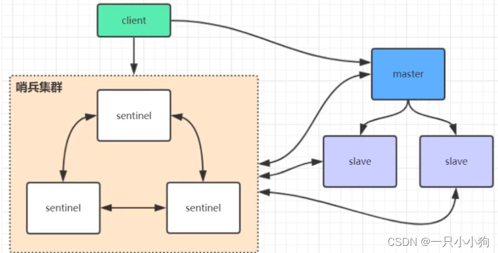
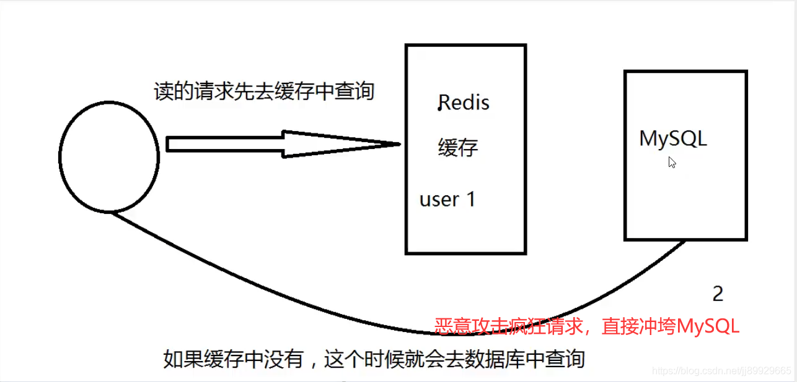
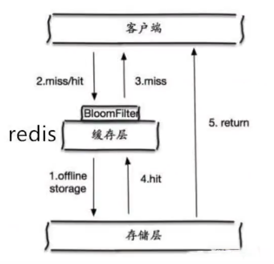
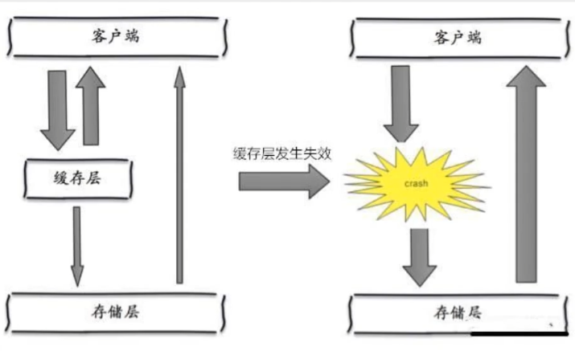

# Redis的基本数据结构
1. String 字符串
1. List 列表
1. Hash 哈希表
1. Set 无序集合
1. Sorted Set 有序集合 （ZSet，有权重score）
1. Bitmap 布隆过滤器
1. GeoHash 坐标 （底层使用Zset实现）
1. HyperLogLog 统计不重复数据
1. Streams 内存版 kafka

# Redis存储数据的方式
1. RDB 持久化
2. AOF 持久化

# Redis 和 Mysql 如何保证数据一致性
在高并发的环境下，比如增删改：Redis和数据库的数据可能会存在不一致的问题，极端情况下这种问题更严重。

不管先操作数据库还是先操作Redis，都会存在数据不一致的问题。

1. 延时双删策略: 先删除缓存，再删除数据库，如果删除数据库失败，延时任务会再次删除缓存。
2. 最终一致性: 利用消息队列，先删除数据库，再删除缓存，如果删除缓存失败，那么消息队列会再次删除缓存。
使用组件监控数据库的binlog文件，同步到redis中，保证最终一致性。

# Redis为什么这么快
Redis 请求效率的因素主要是三个方面，分别是网络、cpu、内存。
Redis6.0 ，在多路复用及层面增加了多线程的处理，数据操作仍然是由主线程来处理的，所以我们可以认为Redis 对于数据IO的处理依然是单线程。
高效的数据存储结构：全局hash表以及多种高效数据结构，跳表、压缩列表、链表。

redis本来就是内存数据库，内存操作本来就快。

# AOF（Append Only File）和RDB（Redis DataBase）
默认开启的是RDB
如果配置同时开启了RDB和AOF ，数据恢复Redis会优先选择AOF恢复。
- AOF
将所有命令都记录下，追加到文件最后，恢复的时候就把这个文件全部再执行一遍。（并且推荐默认为每秒执行一次，写入AOF文件，故障时也值丢失一秒的数据。）

- RDB
指定的时间间隔内将内存中的数据集快照写入磁盘,恢复时将快照文件直接读到内存里。

# Redis线程会出现线程安全问题么？
Redis 在 6.0 支持的多线程，并不是说指令操作的多线程，而是针对网络IO的多线程支持。
也就是说Redis命令任然是单线程操作。

# 哨兵模式
哨兵模式作为Redis高可用的一种解决方案，主要用于监控Redis主从节点的状态，当主节点出现故障时，能够自动将从节点切换为主节点，实现Redis的高可用。
而哨兵模式的实现原理主要是哨兵节点之间的消息通信和选举机制。
哨兵模式基于主从复制，是主从复制的升级，从手动变成了自动。

哨兵模式

高可用模式

# 缓存穿透

用户想要查询一个数据，发现redis内存数据库没有，也就是缓存没有命中，于是向持久层数据库查询。在高并发的场景下可能会导致数据库被压垮。

解决方案：
布隆过滤器，将所有可能存在的数据哈希到一个足够大的bitmap中，一个一定不存在的数据会被这个bitmap拦截掉，从而避免了对底层存储系统的查询压力。

# 缓存击穿
缓存击穿是指，某个热点key被大量访问的时候，突然key过期。这时候大量的请求会直接打到数据库上，导致数据库压力过大。

解决方案：
1. 设置热点数据永不过期。
2. 互斥锁 分布式锁，只允许一个线程去访问数据库，其他线程等待，这个时候会将压力全部转嫁到分布式锁上。

# 缓存雪崩
在某一时间段内，缓存集中过期失效（比如Redis宕机），全部打到数据库上，导致数据库被压垮。

解决方案：
1. 增加集群部署。
2. 限流降级，限制最大并发数，超过的部分直接降级。
3. 数据预热，提前将热点数据加载到缓存中。