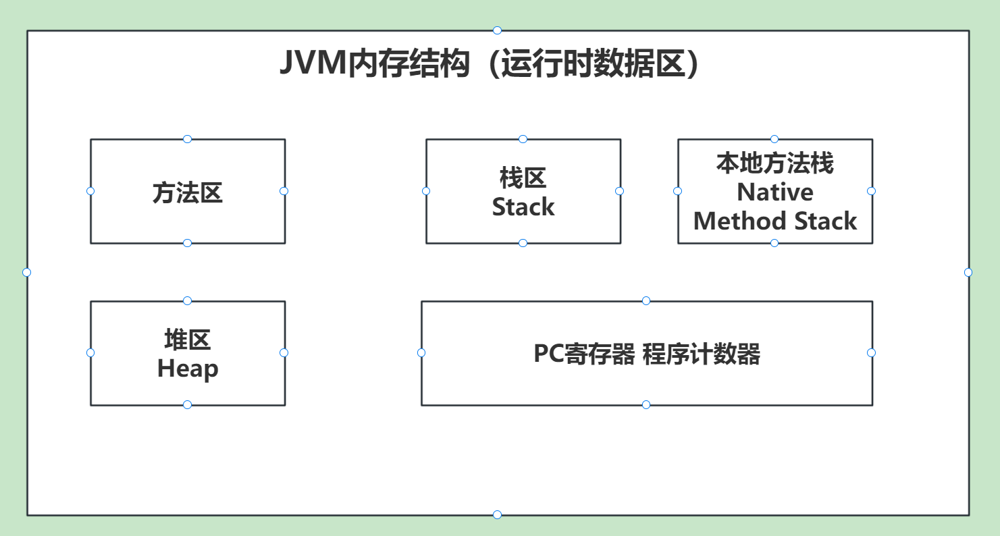
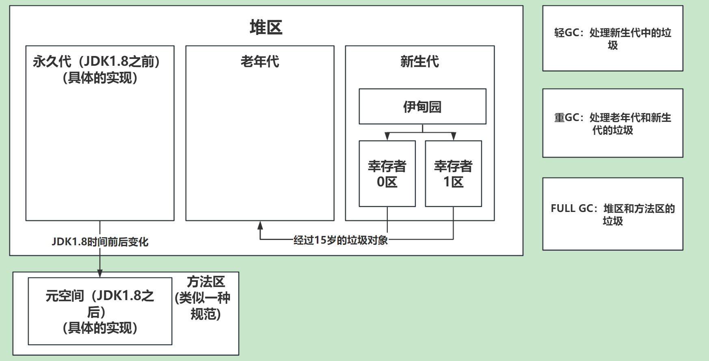
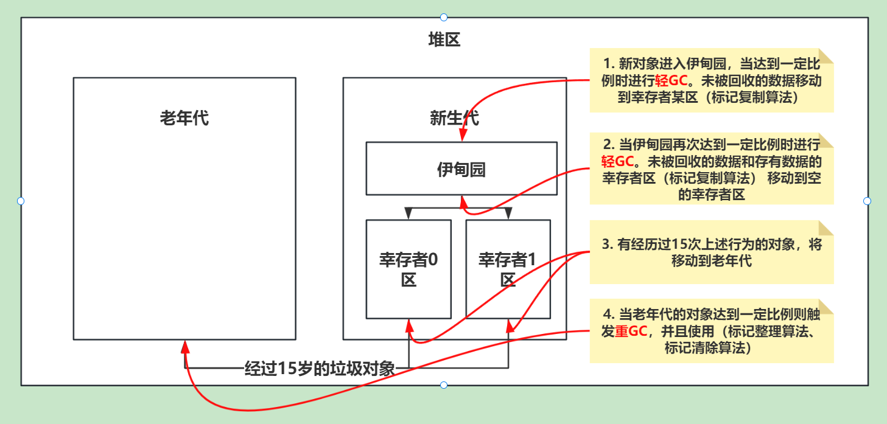
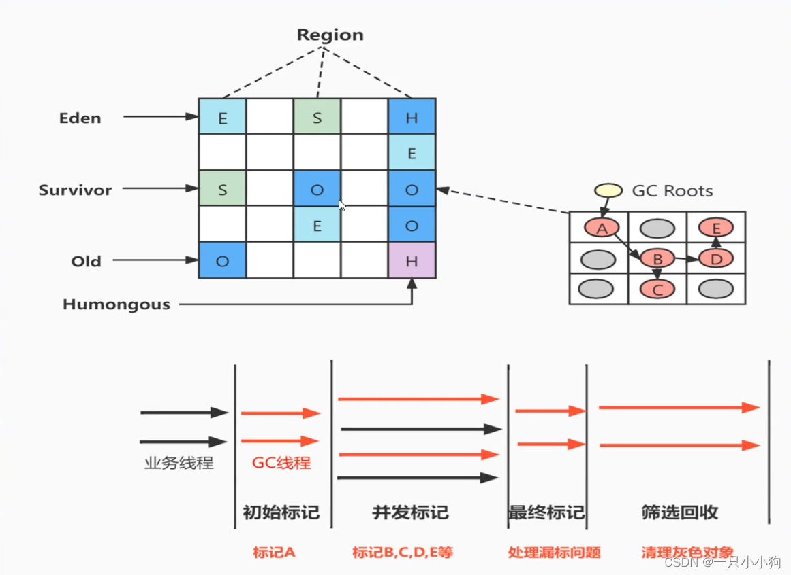
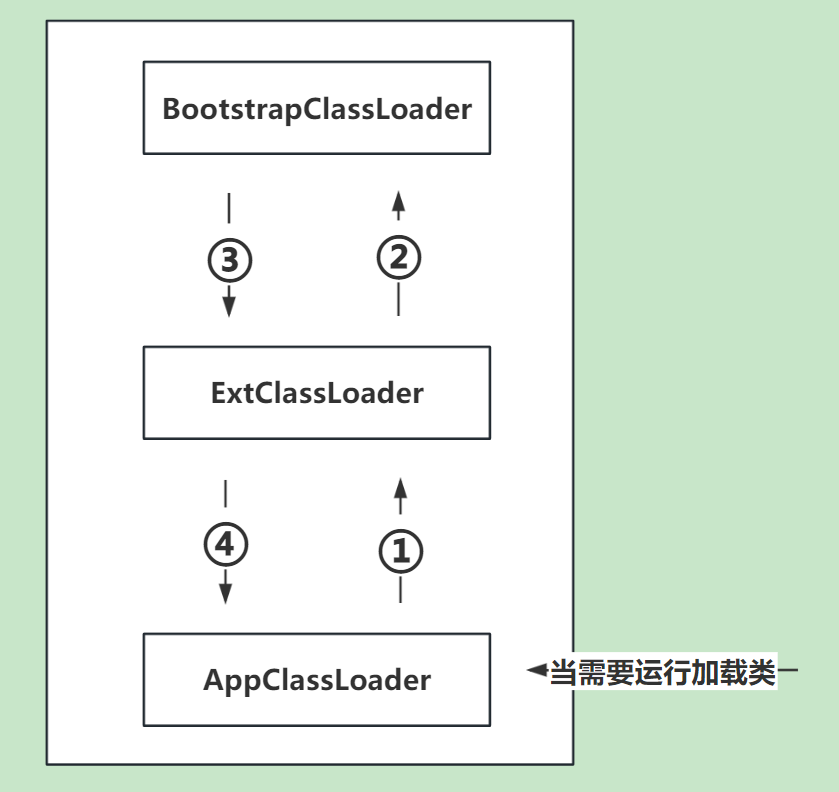

# 1. JVM内存模型

程序计数器：每个线程有一个专属的程序计数器，用来存储指令地址，和执行下一条指令。

栈区：每个线程有一个专属的栈区，用来存储基本类型、方法参数、对象引用（并不是对象本身）。

本地方法栈：每个线程有一个专属的本地方法栈，用来存储本地方法。

堆区：线程共享的，用来存储对象。

方法区：线程共享的，用来存储类信息、常量、静态变量等。

# 2. 堆区内存模型

堆区有 新生代、老年代、永久代（JDK1.8之前）/元空间（JDK1.8之后）。

# 3. 分代垃圾回收器-全GC过程

- 标记复制算法：将存活的对象复制到另一块内存中，然后清除已经使用的内存。
- 标记清除算法：标记出要回收的对象，然后统一回收。
- 标记整理算法：将存活的对象移动到一端，然后清除已经使用的内存。

# 4. 垃圾收集（标记）算法（如何进行标记垃圾？的算法）

- 引用计数算法：给对象添加一个引用计数器，每当有一个地方引用它时，计数器+1；当引用失效时，计数器-1；任何时刻计数器为0的对象就是不可能再被使用的。
- 可达性分析算法：GC Roots的对象作为起始点，向下搜索，当一个对象到GC Roots没有任何引用链相连时，则证明此对象是不可用的。

## 4.1 引用计数器的缺点

- 无法解决对象之间的循环引用问题。（python中使用了引用计数器+标记清除算法）

## 4.2 可以作为CG Roots的对象

- 栈中引用的对象
- 类静态属性引用的对象
- 常量引用的对象
- Native方法引用的对象

# 5. 分区垃圾回收器G1

## 5.1 为什么出现G1垃圾回收器？

传统分代模型中会出现工作线程暂停不可预测的问题。也就是`STOP THE WORLD`。
而分区模型可以预测FULL GC的时间，从而控制STW的时间。

## 5.2 G1垃圾回收器内存模型

G1将堆区划分成多个Region区块，大小都为2的N次幂。
并且G1保留了新生代和老年代的概念。但是他们不是固定，可以动态分配。

比如：伊甸园区块、幸存者区块、老年代区块、H大对象区块。

## 5.3 G1中的垃圾回收算法

简单的来说 在两个区块之间进行标记复制算法。在一个区块内部进行标记整理算法。

# 6. 双亲委派机制？

## 6.1 双亲委派机制的好处

（有价值顺序）防止底层的类库被篡改。

# 7. 内存泄漏 、内存溢出？

- 内存溢出：程序申请的内存超过了JVM的最大内存限制。
- 内存泄漏：程序申请的内存无法被正常释放。

# 8. Java对象的内存模型

- 对象头：锁状态、GC状态、hashcode、对象类型指针。（MarkWord、指向类的指针、数组长度）
- 实例数据：对象的属性。
- 对齐填充：占位符，保证对象的大小为8的倍数。
