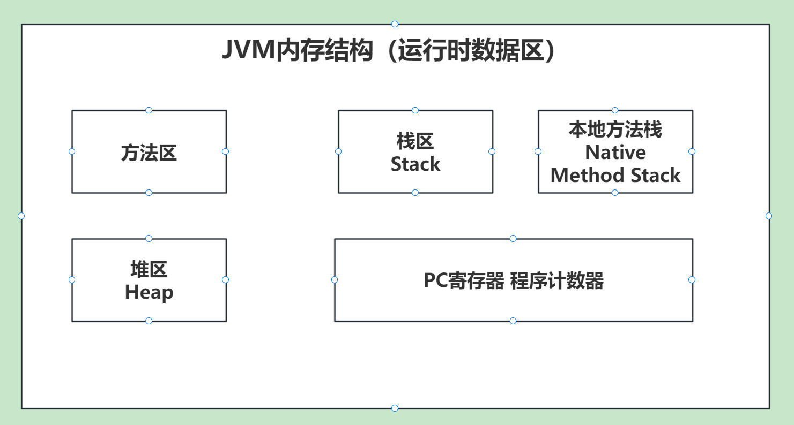

# 1. JVM内存模型

程序计数器：每个线程有一个专属的程序计数器，用来存储指令地址，和执行下一条指令。

栈区：每个线程有一个专属的栈区，用来存储基本类型、方法参数、对象引用（并不是对象本身）。

本地方法栈：每个线程有一个专属的本地方法栈，用来存储本地方法。

堆区：线程共享的，用来存储对象。

方法区：线程共享的，用来存储类信息、常量、静态变量等。

# 2. 堆区内存模型

堆区有 新生代、老年代、永久代（JDK1.8之前）/元空间（JDK1.8之后）。

# 3. 分代垃圾回收器-全GC过程

- 标记复制算法：将存活的对象复制到另一块内存中，然后清除已经使用的内存。
- 标记清除算法：标记出要回收的对象，然后统一回收。
- 标记整理算法：将存活的对象移动到一端，然后清除已经使用的内存。

# 4. 分区垃圾回收器G1

## 4.1 为什么出现G1垃圾回收器？

传统分代模型中会出现工作线程暂停不可预测的问题。也就是`STOP THE WORLD`。
而分区模型可以预测FULL GC的时间，从而控制STW的时间。

## 4.2 G1垃圾回收器内存模型

G1将堆区划分成多个Region区块，大小都为2的N次幂。
并且G1保留了新生代和老年代的概念。但是他们不是固定，可以动态分配。

比如：伊甸园区块、幸存者区块、老年代区块、H大对象区块。

## 4.3 G1中的垃圾回收算法

简单的来说 在两个区块之间进行标记复制算法。在一个区块内部进行标记整理算法。

