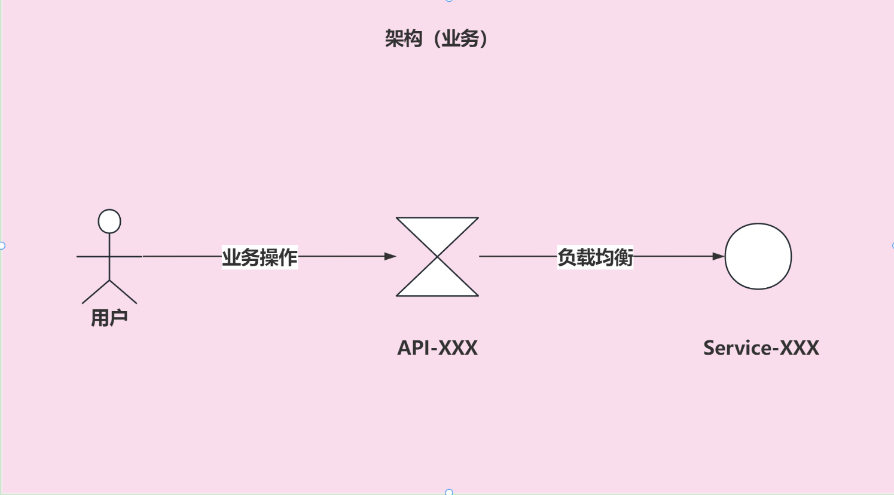
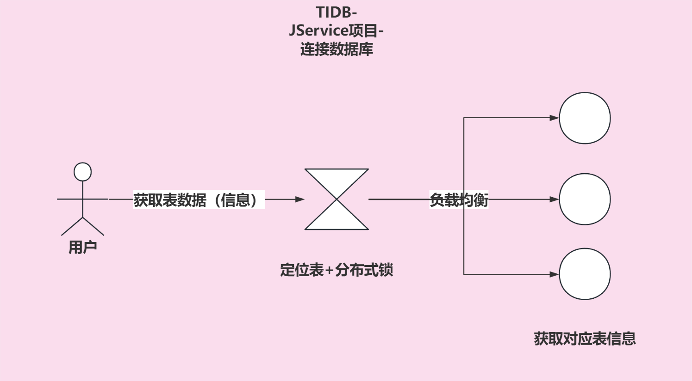
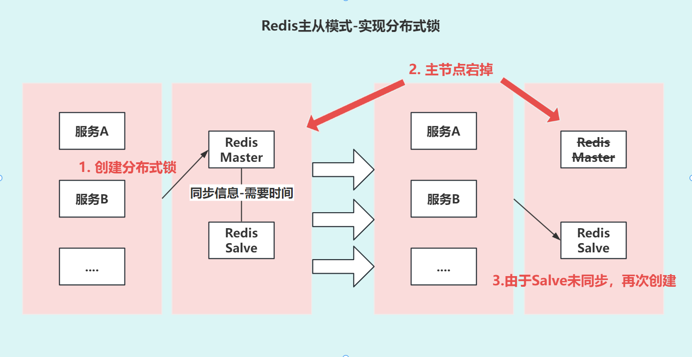
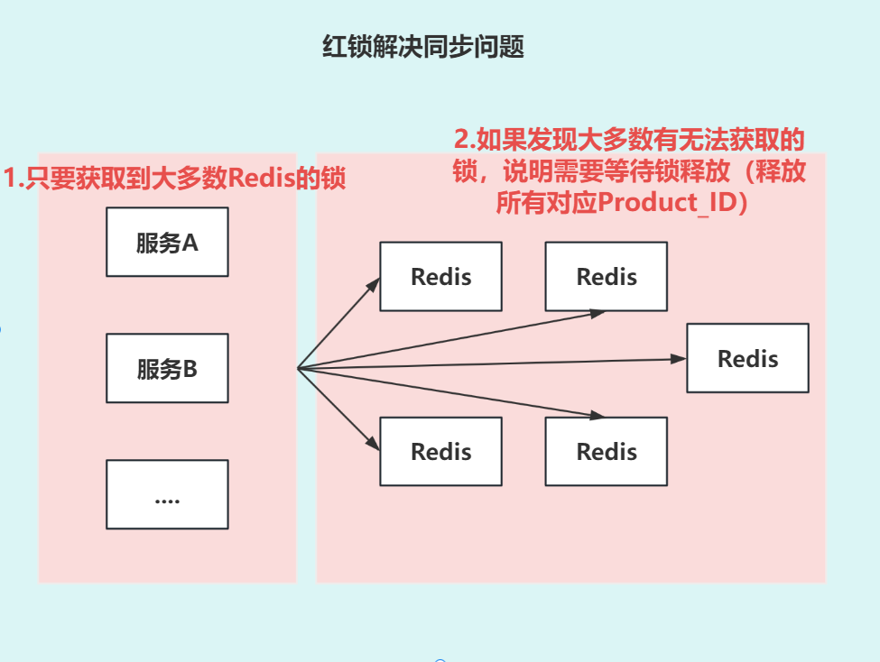
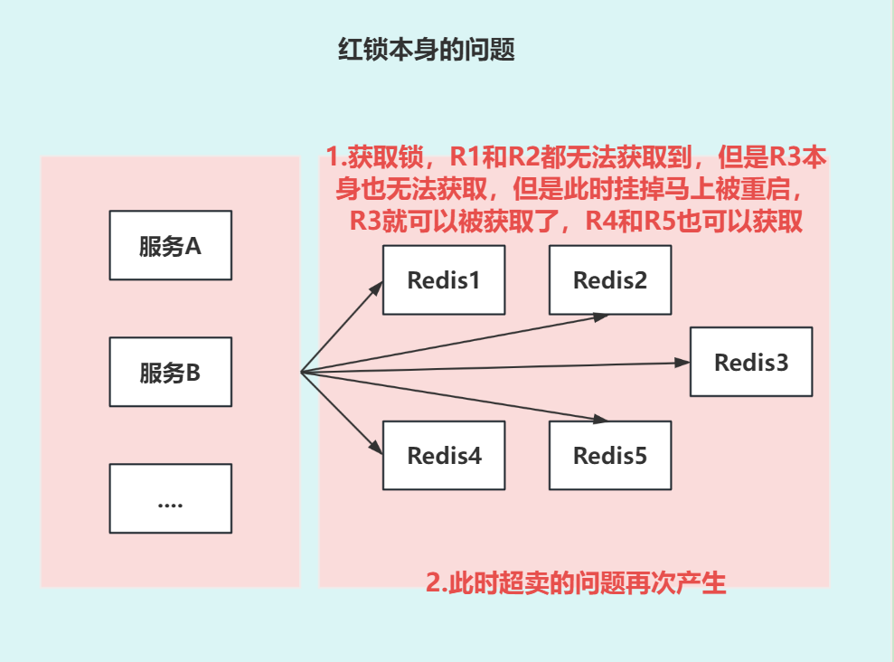
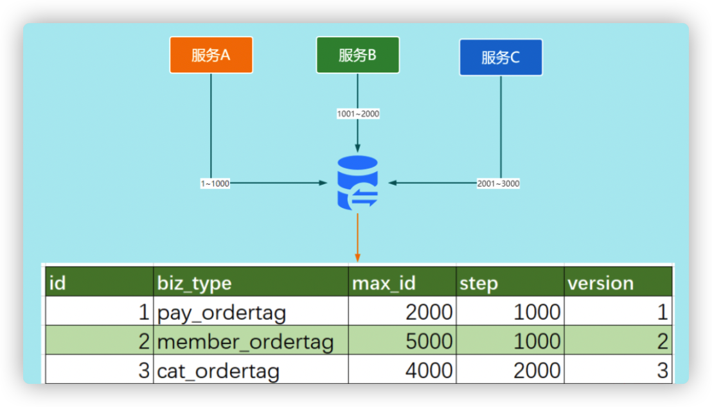

# 1. 分布式业务场景

- 数据一致性: 比如转账操作，A账户减少100元，B账户增加100元，这两个操作必须同时成功或者同时失败。
 在业务结构化中为了保证最终数据一致性，会加分布式锁，不允许多个实例一起操作当前数据。

- 防止重复处理: 比如订单支付，用户点击支付按钮后，可能会出现重复支付的情况。
- 顺序执行: 比如秒杀活动，用户抢购商品，必须保证用户的抢购请求是按照顺序执行的。





# 2. 集群环境下的分布式锁

## 2.1 Mysql实现分布式锁

- 通过数据库的唯一索引和事务的特性来实现分布式锁。

自定义一个表
```sql
-- 创建分布式锁表
CREATE TABLE DistributedLock(
    lock_key VARCHAR(64) NOT NULL,
    lock_value VARCHAR(255),
    PRIMARY KEY (lock_key)
);

-- 尝试获取锁
INSERT INTO DistributedLock(lock_key, lock_value) VALUES ('lock', 'info');

-- 释放锁
DELETE FROM DistributedLock WHERE lock_key = 'lock';
```

- 优点: 实现简单，易于理解。
- 缺点: 性能较差，不适合高并发场景。

## 2.2 Redis实现分布式锁

- 通过Redis的setnx命令来实现分布式锁。

- setnx: 如果key不存在，则设置key的值为value，返回1；如果key已经存在，则返回0。

```redis
# 加锁 setnxlock:service_id(或者ProductId) 唯一性ID
setnx lock:service_id info

# 释放锁
del key
```

### 2.2.1 Redis单节点实现方案

1. 创建对应productId的锁（设置过期时间）
2. 假如其他线程也想要操作对应productId的数据，会先去获取锁，如果获取成功，则可以进行操作，否则等待。
3. 操作完成后，释放锁。

### 2.2.2 Redis分布式锁死锁问题

- 问题：如果加锁始终无法释放，会导致死锁。
- 解决方案：加锁时设置过期时间ttl，保证锁最终能够被释放。

### 2.2.3 Redis分布式锁过期时间的问题

- 问题1：如果业务操作没有执行完，锁过期了，会导致其他线程获取锁，导致数据不一致。
- 解决方案：看门狗机制，每隔一段时间，给锁续期。

```java
import redis.clients.jedis.Jedis;

public class RedisLock {
    private Jedis jedis;
    private String lockKey;
    private String lockValue;
    private Thread renewThread;
    private volatile boolean isLocked = false;

    public RedisLock(Jedis jedis, String lockKey, String lockValue) {
        this.jedis = jedis;
        this.lockKey = lockKey;
        this.lockValue = lockValue;
    }

    public boolean tryLock(long timeout) {
        long start = System.currentTimeMillis();
        while (System.currentTimeMillis() - start < timeout) {
            if (jedis.setnx(lockKey, lockValue) == 1) {
                isLocked = true;
                startRenewThread();
                return true;
            }
        }
        return false;
    }

    public void unlock() {
        if (!isLocked) {
            return;
        }
        isLocked = false;
        renewThread.interrupt();
        if (lockValue.equals(jedis.get(lockKey))) {
            jedis.del(lockKey);
        }
    }

    private void startRenewThread() {
        renewThread = new Thread(() -> {
            while (isLocked) {
                jedis.expire(lockKey, 30);
                try {
                    Thread.sleep(20000);
                } catch (InterruptedException e) {
                    Thread.currentThread().interrupt();
                }
            }
        });
        renewThread.start();
    }
}
```

- 问题2：我误删别人的锁，导致数据不一致。
- 解决方案：我getKey的时候，判断一下是不是自己加的值，是的话再删除。

### 2.2.4 Redis分布式锁的 性能 问题（分段锁）

- 问题1：当有一把把锁因为业务操作时间过长，导致锁的续期线程不断续期，会导致Redis的性能问题。
- 解决方案：将锁分段（类似ConcurrentHashMap），每一段锁对应一个Redis实例，将锁的数量分散到多个Redis实例上。

比如：1000个锁，分成10段，每一段100个锁，每一段对应一个Redis实例。（每个锁的名字都叫Product_id_1......Product_id_n)

## 2.3 Redis 主从模式 实现分布式锁的问题

- 问题：如果主节点宕机，会导致锁丢失。

  

- 解决方案：使用Redlock算法，多个Redis实例之间进行协调。（通常5个独立的Redis实例）当我们需要获取锁的时候，只有在大部分Redis实例上获取到锁的时候，才算获取成功。反之，获取失败。需要释放所有节点上的锁。）

  

```java
import org.redisson.Redisson;
import org.redisson.api.RLock;
import org.redisson.api.RedissonClient;
import org.redisson.config.Config;
import org.redisson.RedissonRedLock;

public class RedLockExample {

    public static void main(String[] args) throws InterruptedException {
        Config config1 = new Config();
        config1.useSingleServer().setAddress("redis://127.0.0.1:6379");
        RedissonClient redissonClient1 = Redisson.create(config1);

        Config config2 = new Config();
        config2.useSingleServer().setAddress("redis://127.0.0.1:6380");
        RedissonClient redissonClient2 = Redisson.create(config2);

        Config config3 = new Config();
        config3.useSingleServer().setAddress("redis://127.0.0.1:6381");
        RedissonClient redissonClient3 = Redisson.create(config3);

        RLock lock1 = redissonClient1.getLock("lock1");
        RLock lock2 = redissonClient2.getLock("lock2");
        RLock lock3 = redissonClient3.getLock("lock3");

        RedissonRedLock redLock = new RedissonRedLock(lock1, lock2, lock3);
        // 同时加锁：lock1 lock2 lock3, 所有的锁都上锁成功才算成功。
        redLock.lock();

        // 执行业务逻辑

        // 同时解锁：lock1 lock2 lock3, 所有的锁都解锁成功才算成功。
        redLock.unlock();

        redissonClient1.shutdown();
        redissonClient2.shutdown();
        redissonClient3.shutdown();
    }
}
```

### 2.3.1 RedLock算法的问题




# 3. 分布式ID

当存在多个分库和分表的时候，我们需要一个全局唯一的ID来标识一条数据。

## 3.1 UUID

UUID是128位的全局唯一标识符，通常由32字节的字符串表示。

## 3.2 数据库自增ID

使用一个独立的数据库自增ID表，每次获取ID的时候，从这个表中获取一个ID。

## 3.3 基于数据库的号段模式

号段模式是当下分布式ID生成器的主流实现方式之一。

在数据库中创建一个专门的表来存储当前的ID值。每次需要生成新的ID时，我们就从这个表中获取一个号段，然后在应用程序中递增这个号段，直到号段用完为止。这样，我们就可以在不访问数据库的情况下生成大量的ID，从而提高性能。



## 3.4 Twitter的Snowflake算法

雪花算法 (Snowflake) 是Twitter开源的分布式ID生成算法。

雪花算法依赖于节点 ID（包括数据中心 ID 和工作机器 ID）来区分不同的节点。


# 4. 分布式锁解决