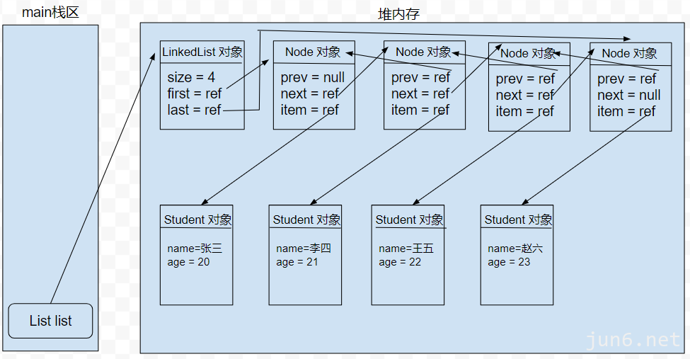

# 1. Java 集合框架有那些接口？ （特点有那些+）
- `List`顺序
- `Set`去重
- `Map`Key-value键值表
- `Queue`队列
- `Deque`双端队列

# 2. 常见对比
## 2.1 ArrayList 和 LinkedList 的区别是什么？
- `ArrayList`：数据结构为数组，支持随机访问，实现了`RandomAccess`接口，线程不安全，效率高
- `LinkedList`：数据结构为链表，不支持随机访问，没有实现`RandomAccess`接口，线程不安全，效率高

### 2.1.1 使用ArrayList而不使用LinkedList的原因
- 插入、删除：ArrayList尾插入效率高，LinkedList头尾插入效率高。但是中加插入效率都很低，因为ArrayList需要移动元素，LinkedList需要移动指针。
- 修改、查询：ArrayList随机访问效率高，LinkedList随机访问效率低。

## 2.2 HashMap 和 Hashtable 、ConcurrentHashMap 、TreeMap的区别是什么？
- `HashMap`：数组+链表+红黑树实现的，不允许重复元素，可以有一个`null`元素，线程不安全，效率高
- `Hashtable`：数组+链表实现的，不允许重复元素，不可以有`null`元素，线程安全，但是由于synchronized关键字加到了每个方法上，效率低
- `ConcurrentHashMap` 数组+链表+红黑树实现的，不允许重复元素，不可以有`null`元素，线程安全，由于使用了分段锁将Map切割开，效率高
- `TreeMap`：红黑树实现的，不允许重复元素，不可以有`null`元素，线程不安全，效率高。SortedMap接口 可以对元素进行排序。

## 2.3 为什么ConcurrentHashMap效率会高?
- 分段锁：当多线程环境下，将对应的ConcurrentHashMap中的Node[]的对应Node操作节点进行加锁，缩小了锁的粒度，只有当在链表和红黑树上Node进行操作的时候才会需要排队。
- CAS 操作：当在写入Node数组上时，使用CAS，可以在不使用锁的情况下实现线程安全，从而提高了并发性能。

# 3. HashMap基础知识
- 当链表长度大于8时，数组长度大于64时，链表转换为红黑树，小于6时，红黑树退化为链表。
- 初始容量为16、负载因子0.75f、扩容为原来的2倍。

## 3.1 为什么扩容是2倍？HashMap的长度为什么是2的幂次方？
- 为了减少哈希冲突，提高查询效率。
- 2 的幂次方，转化为2进制位运算，效率更高。

## 3.2 HashMap如何解决哈希冲突的？
链式寻址法（拉链法）：将链表存储在数组中，当发生哈希冲突时，将冲突的元素存储在链表中。
开放地址法：当发生哈希冲突时，使用某种算法寻找下一个空的散列地址。

## 3.3 hashMap 多线程死循环的问题
当多个线程同时进行扩容操作时，会导致链表成环，形成死循环。
- JDK1.7：头插法会导致链表成环。
- JDK1.8：尾插法不会导致链表成环。

## 3.4 如何确定元素在数组中的位置？
key.hashCode() & (length - 1)  // 去模运算，得到在数组中的位置。

## 3.5 HashMap 如果检查重复？如何判断相等？
通过元素的hashCode来判断是否相等，相等则通过equals来判断是否相等。

## 3.6 HashMap的hash算法 扰动函数，JDK1.8为什么比JDK1.7的hash算法更优？
JDK1.7的hash算法扰动了4次，而JDK1.8的hash算法扰动了1次，减少了运算量。

# 4. ArrarList
- 初始容量为10
- 当ArrayList中元素个数大于等于容量时，扩容为原来的1.5倍。

## 4.1 具体扩容操作

1. 首先创建一个新的数组，长度为原来的1.5倍。
2. （使用浅克隆也就是浅拷贝）将原来数组中的元素复制到新数组中。