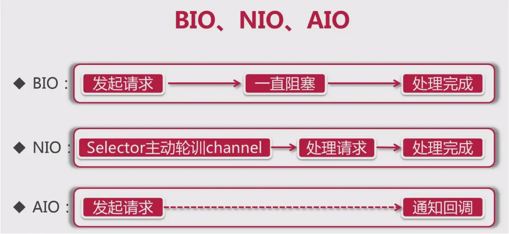

# 1. BIO NIO AIO

## BIO
- 同步阻塞
- 一个连接一个线程（客户端和服务器端），如果当前IO没完成，线程就会阻塞。

## NIO (较短的连接)
- 同步非阻塞
  - 一个请求一个线程,即客户端发送的连接请求都会注册到多路复用器的Channel上，多路复用器轮询这些Channel，有I/O到达就处理。

## AIO (较长的连接)
- 异步非阻塞
  - 一个有效请求一个线程，客户端发送的连接请求都会注册到多路复用器的Channel上，多路复用器轮询这些Channel，有I/O到达就处理，处理完会通知服务端启动线程。

