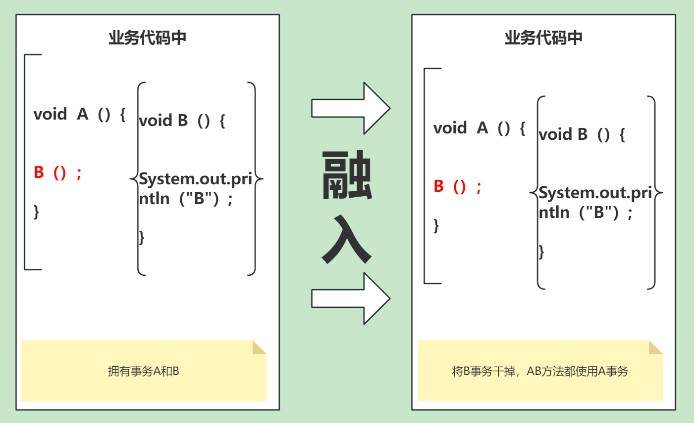
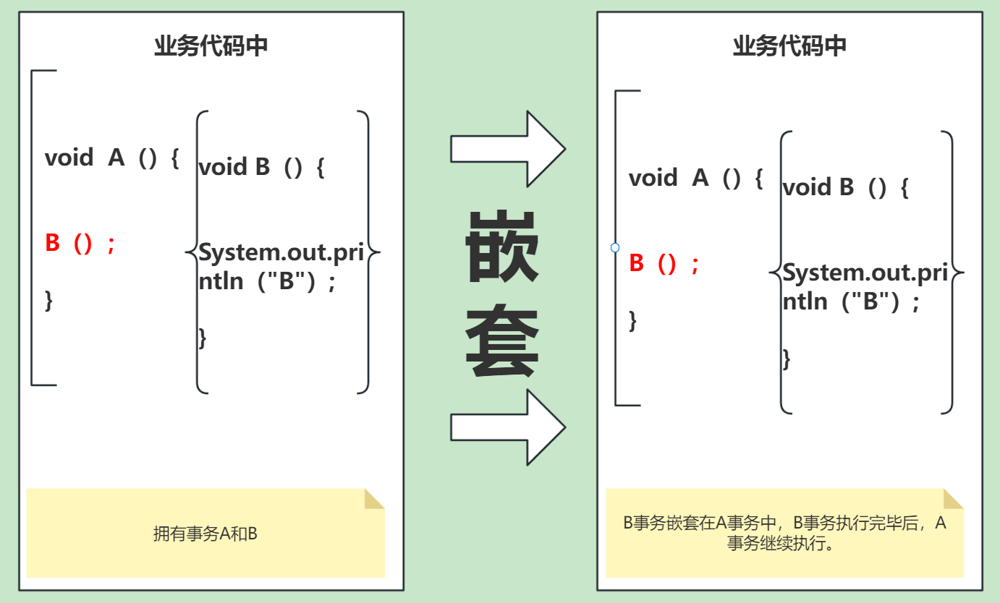

# 1. Spring的事务是如何回滚的？

# 2. Spring常用事务传播行为？

- Required（需要事务，修改性的操作）：如果当前存在事务，则加入该事务；如果当前没有事务，则创建一个新的事务。
- Supports（支持事务，查询性的操作）：如果当前存在事务，则加入该事务；如果当前没有事务，则以非事务的方式继续运行。
- Requireds_new（需要新的事务，修改性的操作）：创建一个新的事务，如果当前存在事务，则把当前事务挂起。
- Not_supported（不支持事务，查询性的操作）：以非事务方式运行，如果当前存在事务，则把当前事务挂起。

# 3. Spring事务失效的原因有哪些？
1. 事务传播属性设置不当
2. 异常处理不当，事务方法中出现try-catch代码块
3. 数据库引擎不支持事务，如MyISAM
4. 在父函数设置了@Transactional，子函数没有设置@Transactional

# 4. 两个事务主要解决的三种模式

