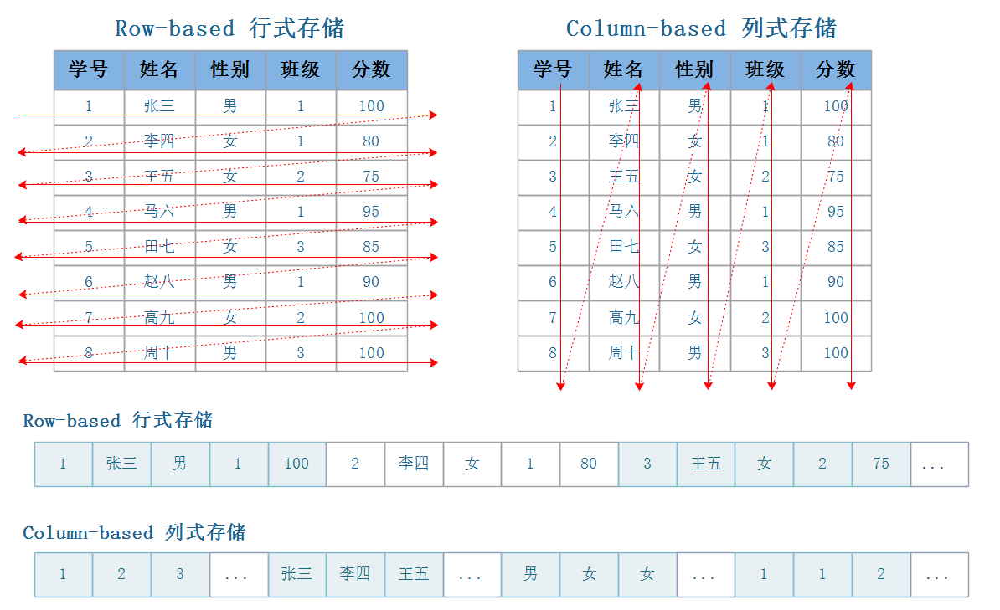

# 1.  说说Clickhouse

Clickhouse列式数据库，可以提供一定的在线计算（OLAP），预处理，俄罗斯人开发的。

1. 列式存储引擎：数据以列的形式存储，提供更高的数据压缩和查询性能。
2. 高性能：相比于传统的关系型数据库，Clickhouse的查询和聚合性能更高。
3. 分布式架构：在建设CK之初就是按照数仓的思想来设计的，可以支持PB级别的数据量。分布式部署，可以构建高可用性、高容错性的集群，实现数据的水平扩展和负载均衡。

# 2. 说说Doris

Doris分布式OLAP（Online Analytical Processing）数据库（数仓），由阿里巴巴集团发起并开源。

1. 列式存储引擎：使用列式存储引擎来优化查询性能和压缩存储空间。
2. 高性能：支持高并发查询，可以在秒级别内完成复杂的多维分析查询。
3. 分布式架构：分布式存储和计算引擎来实现高可用性和高吞吐量。。分布式部署，可以构建高可用性、高容错性的集群，实现数据的水平扩展和负载均衡。

# 3. Clickhouse和Doris的区别

1. 性能:
Clickhouse在查询性能上更优，适合大规模数据的实时查询和分析；
Doris在数据加载和查询性能上稍逊一筹，但是并发查询性能更好，适合多维分析查询。
2压缩算法（持久化方式）:
ClickHouse采用LZ4、Delta、ZSTD等
Doris采用Parquet、ORC
3分布式架构:
Clickhouse是分片和副本。
Doris是Paxos算法来实现数据的一致性和副本的管理，以及Raft协议用于元数据管理

# 4.列式存储引擎

每个列都被存储在单独的文件中，只需要获取对应列，减少IO开销。

# 5.ck有那些存储引擎（表可以选择不同的引擎）

MergeTree引擎：MergeTree引擎是ClickHouse最常用的存储引擎之一，用于存储和管理有序的时间序列数据。它支持高效的数据插入、更新和删除操作，并且能够快速执行范围查询和聚合操作。

ReplacingMergeTree引擎：ReplacingMergeTree引擎是MergeTree引擎的变种，支持在插入数据时自动删除旧数据，并且支持更新操作。这种引擎适用于需要定期替换和更新数据的场景。

SummingMergeTree引擎：SummingMergeTree引擎是MergeTree引擎的变种，支持在插入数据时按指定列对数据进行汇总，并且能够快速执行汇总查询操作。

AggregatingMergeTree引擎：AggregatingMergeTree引擎是MergeTree引擎的变种，支持在插入数据时对数据进行预聚合，并且能够快速执行聚合查询操作。

Distributed引擎：Distributed引擎用于在分布式环境中对数据进行分布式存储和查询处理。它可以将数据分布在多个节点上，并且支持跨节点的数据查询和聚合操作。

MaterializedView引擎：MaterializedView引擎用于创建物化视图，通过预先计算和存储查询结果，提高复杂查询的性能和响应速度。

Buffer引擎：Buffer引擎用于在内存中暂存数据，并且支持将数据定期写入磁盘，适用于对数据进行缓存和预处理的场景。

Merge引擎：Merge引擎用于将多个表的数据合并到一个表中，并且支持对合并后的数据进行排序和去重。