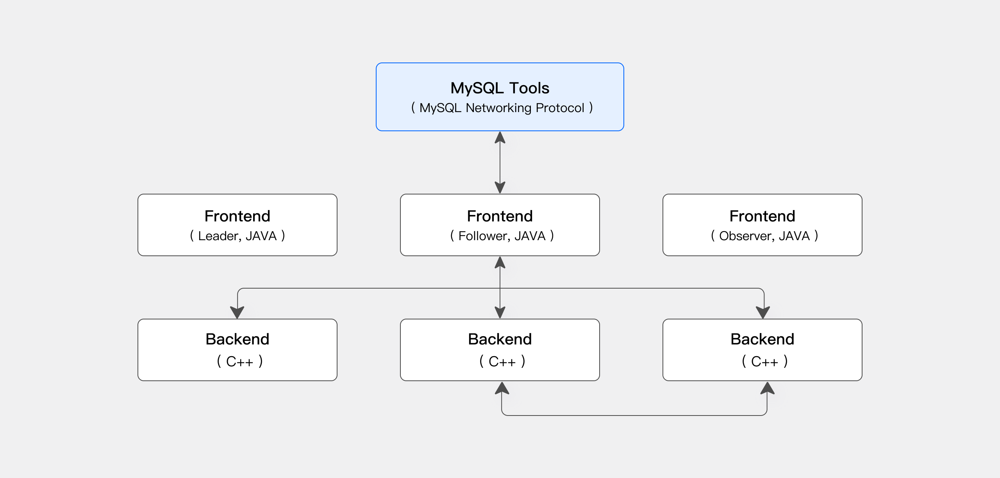

# 1. 谈谈我的对Doris的了解?你使用过doris吗？你对doris了解深吗？

- 列式存储，通过优化的数据压缩和存储格式显著提高了查询效率
- Doris 采用 MySQL 网络连接协议，使用SQL语言
- 支持批量数据导入（例如从Hive、HDFS等）和实时数据写入（如Kafka、Flink）
- 优势：查询速度快，适合高并发、低延迟的场景。在线分析处理OLAP (Online Analytical Processing)
- 局限性：写入频繁的场景可能不如传统事务型数据库高效（大批量可以使用streamLoad）

## 1.1 Doris的基础架构你了解吗？

- Frontend（FE）：主要负责用户请求的接入、查询解析规划、元数据的管理、节点管理相关工作。
- Backend（BE）：主要负责数据存储、查询计划的执行。
  

## 1.2 说说你Doris常用的存储模型？（说1.2个就行）

- 聚合模型（Aggregate Key Model）：相同 Key 的 Value 列合并，通过提前聚合大幅提升性能
- 主键模型（Unique Key Model）：Key 唯一，相同 Key 的数据覆盖，实现行级别数据更新
- 明细模型（Duplicate Key Model）：明细数据模型，满足事实表的明细存储

## 1.3 说说你Doris常用的索引？（说1.2个就行）

| 类型         | 索引                                | 优点                                | 局限                   |
|------------|-----------------------------------|-----------------------------------|----------------------|
| 点查索引（内置索引）       | 前缀索引                              | 内置索引，性能最好                         | 一个表只有一组前缀索引          |
| 点查索引       | 倒排索引                              | 支持分词和关键词匹配，任意列可建索引，多条件组合，持续增加函数加速 | 索引存储空间较大，与原始数据相当     |
| 跳数索引       | ZoneMap索引                         | 内置索引，索引存储空间小                      | 支持的查询类型少，只支持等于、范围    |
| 跳数索引       | BloomFilter 索引                    | 比 ZoneMap 更精细，索引空间中等              | 支持的查询类型少，只支持等于       |
| 跳数索引       | NGram BloomFilter 索引              | 支持 LIKE 加速，索引空间中等                 | 支持的查询类型少，只支持 LIKE 加速 |
| 跳数索引（内置索引） | Sorted Compound Key Index 排序复合键索引 | 最多指定三个列组成复合排序键                    |                      |
| 跳数索引（内置索引）       | Min/Max Index 最小/最大索引             | 有效过滤数值类型的等值和范围查询                  |                      |

## 1.3 常见的数据库处理模式有哪些？如何分类和理解数据库的处理场景？你知道doris属于那种处理模式吗？mysql呢？

OLAP 和 OLTP 解决不同的数据库需求，而 HTAP 则结合两者，ETL 用于数据集成。

- OLAP (Online Analytical Processing) 在线分析处理
- OLTP (Online Transaction Processing) 在线事务处理
- HTAP (Hybrid Transactional/Analytical Processing) 混合事务分析处理
- ETL (Extract, Transform, Load) 抽取，转换，加载

| **特性** | OLAP | OLTP | HTAP | ETL | 
|--------------------------------|---------------------------------|---------------------------------|---------------------------------|--------------------------------|
| **用途** | 数据分析                            | 事务处理                            | 事务 + 实时分析                       | 数据集成                           |
| **存储** | 列式存储                            | 行式存储                            | 行列混合存储                          | 无固定要求                          | 
| **性能** | 读优化，批量分析快                       | 写优化，事务性能强                       | 实时读写都强                          | 依赖处理周期                         | 
| **场景** | 报表生成、历史分析                       | 订单系统、用户登录                       | 实时电商分析、风控                       | 数据仓库构建                         | 

# 2 如果在java中我想从doris中获取3000w数据进行复杂计算，不是一次性需要3000w，是要对3000w数据运算完，应该怎么做？（考察是否使用doris做过流式处理）

解释一下：比如说我现在有一个用户访问日志表，当日有1亿数据，我希望在java中读取这1亿数据，对这些数据提取出可能的资产数据。这个时候就算要对大量数据进行复杂运算。我一共怎么做能获取到1亿数据？

1. 回答JDBC的方式：流批式查询——批量预处理读取。是错误的，因为doris不支持流式查询。JDBC
   批量读取并非流式。设置了流式查询（setFetchSize）也不会生效 **×**
2. 回答ADBC或者Arrow Flight
   SQL：ADBC协议进行流式读取。是正确的，列式数据传输性能上有显著优势，此协议实现真正的流式查询和处理。
   **√**

## 2.1 你说到Arrow Flight SQL可以简单聊聊吗?Arrow Flight SQL你了解吗？(高速数据传输链路) (随便聊到1、2点都OK)

- 支持多种语言使用 SQL 从 Doris 高速读取大批量数据。
- 是基于 gRPC 和 Apache Arrow 的协议，用于高性能的关系数据库查询和数据传输。
- 高效数据传输：使用 Arrow 的列式数据格式，可以大幅减少序列化/反序列化的开销。
- 跨网络优化：通过 gRPC 提供高性能的远程过程调用 (RPC)。
- 支持 SQL 查询：在 Arrow Flight 的基础上扩展了 SQL 支持，用户可以通过 Flight SQL 接口直接执行 SQL 查询。

