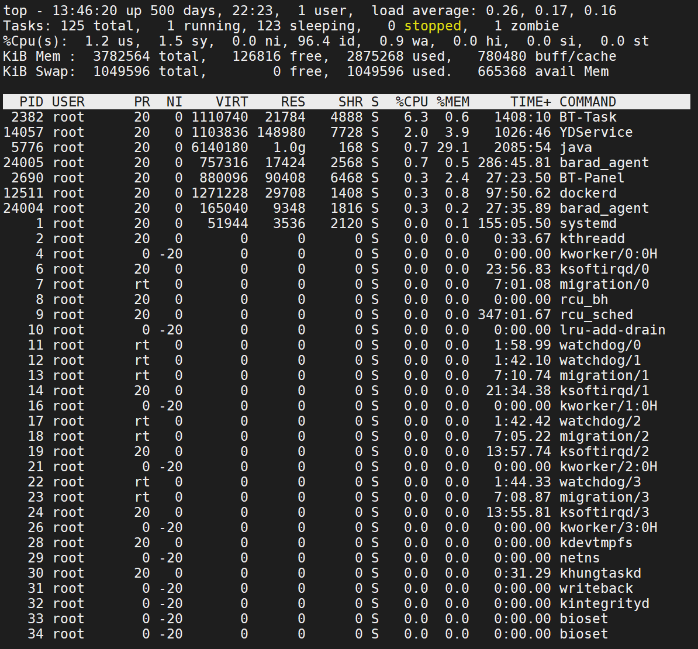
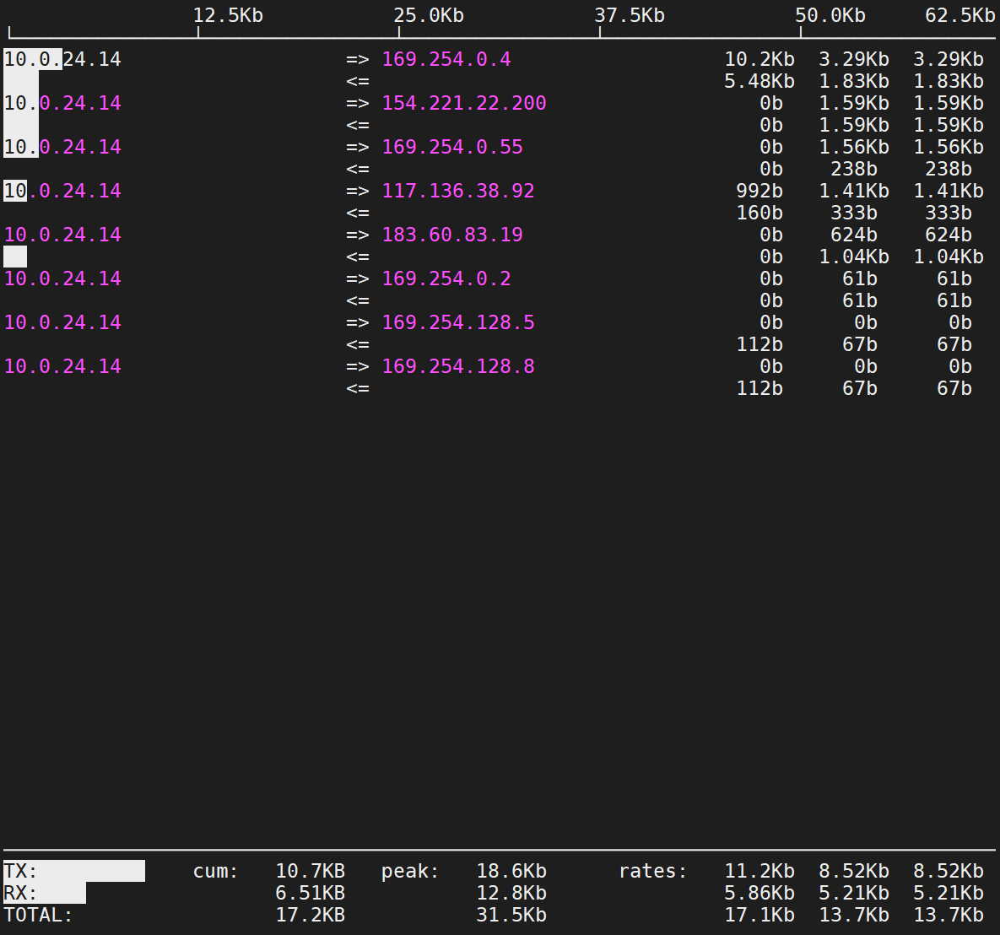

# 1. QPS（吞吐量）
每秒钟能够处理的请求数量
单位时间内处理的请求量：`QPS = 并发量/响应时间`

举个例子，假设你收集到了一分钟内系统处理的请求数量为600个，那么系统的QPS可以通过以下计算得到：

`QPS = 600 requests / 60 seconds = 10 requests per second`

## 1.2 标签服务和校验服务
- 单个实例 `=` 10个线程 `/` 平均0.02 `=` 每秒访问上限500次
- 多个实例 `=` 单个实例 `×` 4 `=` 每秒访问上限2000
- 一天的总访问量 `=` 86400000（一天）
- QPS：2000（每秒）

- 常规情况下 每秒也就是200-1000的吞吐量
- 常规情况下 一天也就是1000w-4000w的吞吐量

# 2. 数据脱敏和安全性问题

1. 前缀树项目只有我写过并且复现的核心算法、我设计的架构和机制。并未涉及各种与公司的安全性。
2. 数据提供者项目，一开始的设计原稿和架构设计图就是我2022年写在github上的，并且也不涉及数据安全问题。

# 3. 如何预估系统的瓶颈
CPU 使用率、内存占用、网络流量、磁盘 IO等指标，异常或者持续高位的情况下，都可能是系统瓶颈的表现。

## 3.1 CPU
CPU使用率正常在70%左右，如果持续90%左右，可能是CPU瓶颈。
`代码问题。递归调用、死循环、并发运行了大量线程`
`大量磁盘I/O操作`

1. `load average` 系统负载，即任务队列的平均长度。是指1分钟、5分钟、15分钟前到现在的平均值。（数除以逻辑CPU的数量，结果高于5的时候就表明系统在超负荷运转了。）
2. `Tasks: 125 total` 是指125个进程在运行。 `zombie`是僵尸数量
3. `Cpu(s):  1.2%us` 用户空间占用CPU的百分比。 `96.4%id` 空闲CPU的百分比。 `0.9%wa` 等待I/O的CPU时间百分比。 
4. `Mem:   4045416k total` 总内存。 `  396748k used` 已使用的内存。 `  3648668k free` 空闲内存。 `  102828k buffers` 缓存的内存。
5. `Swap:  2097144k total` 交换空间。 `  0k used` 已使用的交换空间。 `  2097144k free` 空闲的交换空间。 `  242456k cached` 缓存的交换空间。

6. `PID` 进程ID。 `USER` 进程所有者（User）。 `PR` 优先级。 `NI` nice值。 `VIRT` 虚拟内存。VIRT=SWAP+RES `RES` 物理内存。 `SHR` 共享内存。 `S` 进程状态。(D=不可中断的睡眠状态 R=运行 S=睡眠 T=跟踪/停止 Z=僵尸进程) `%CPU` CPU占用率。 `%MEM` 内存占用率。 `TIME+` 运行时间。 `COMMAND` 命令。

### 3.1.1 CPU和同吞吐量
在压力测试中：

吞吐量低、CPU占用率低。可能是因为出现了锁等待、并发任务出现了同步处理。

吞吐量低、CPU占用率高。可能是因为出现了CPU密集型的任务，比如复杂算法、压缩/解压、序列化/反序列化等。

吞吐量高、CPU占用率高。可能是服务端处理能力强。如果怕冲垮服务端，可以通过限流、熔断等手段来控制。

## 3.2 内存
在压力测试中，随着压测的请求增加，内存使用量也会增加，如果压测结束后一段时间，内存使用量没有下降，可能是内存泄漏。（此时就可以进行对场景下的代码进行定位优化）

## 3.3 磁盘IO
容量瓶颈：使用df -h命令查看磁盘容量，如果磁盘容量快满了，可能是磁盘容量瓶颈。

性能瓶颈：使用iostat命令查看磁盘性能，如果磁盘的平均等待时间超过了10ms，可能是磁盘性能瓶颈。比如：`iostat -x 1 10`

## 3.4 网络宽带
理论上网络宽带的真实传输速率只有网卡显示的8分之一。比如iftop命令可以查看网络流量。

`=>`发送流量。`<=`接收流量。
`TX` 发送流量。 `RX` 接收流量。 `TOTAL` 总流量。
`cum` 开始命令至今的累计流量。 `peak` 峰值流量。 `rates` 速率（2s、10s、40s 的平均流量值）。

## 3.5 数据库服务器
开启慢查询日志和死锁日志、当前连接数据量、最大连接数量

## 3.6 APP服务端
JVM堆栈、线程池等

# 4. 我的项目中如何处理的高并发场景？
校验和标签公共服务集群中：
- Nginx负载均衡，到多个实例中

三通结构化服务中，业务结构化中（还有flink自定义算子拼接中）（在动态规划中有一类叫傻缓存中，为了检索非规则类型数据）
- 使用Redis缓存，减少数据库的访问压力
- 自定义缓存结构，减少内存占用

- 数据库查询优化，索引优化

- 异步处理，减少同步等待

比如最高人名检察院-大数据法律监督平台中（由于政府设备资源有限）
- 访问限流，熔断等

# 5.如何设计一个高可用的系统？
1. 冗余备份：多个实例，多个数据中心
2. 故障转移：Nginx负载均衡
3. 程序监控
4. 数据备份和恢复
5. 软件更新和回滚（扩展）

# 6. 如何知道你服务的QPS？
1. 通过日志分析
2. 通过压力测试
3. 通过访问量统计
4. 通过数据库查询

# 7.你的项目中是否使用过分布式事务？

分布式事务:不同数据库的数据一致性

# 8. 你的项目中是使用过分库分表？分了多少个库，多少个表？