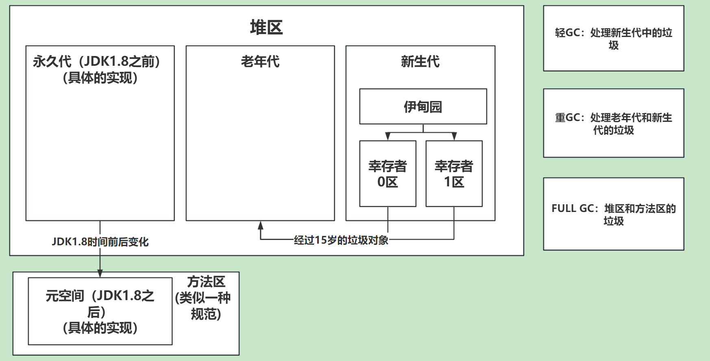

# 1. JVM内存模型


程序计数器：每个线程有一个专属的程序计数器，用来存储指令地址，和执行下一条指令。

栈区：每个线程有一个专属的栈区，用来存储基本类型、方法参数、对象引用（并不是对象本身）。

本地方法栈：每个线程有一个专属的本地方法栈，用来存储本地方法。

堆区：线程共享的，用来存储对象。

方法区：线程共享的，用来存储类信息、常量、静态变量等。

# 2. 堆区内存模型

堆区有 新生代、老年代、永久代（JDK1.8之前）/元空间（JDK1.8之后）。



# 3. 分代垃圾回收器-全GC过程


- 标记复制算法：将存活的对象复制到另一块内存中，然后清除已经使用的内存。
- 标记清除算法：标记出要回收的对象，然后统一回收。
- 标记整理算法：将存活的对象移动到一端，然后清除已经使用的内存。

# 4. 垃圾收集（标记）算法（如何进行标记垃圾？的算法）

- 引用计数算法：给对象添加一个引用计数器，每当有一个地方引用它时，计数器+1；当引用失效时，计数器-1；任何时刻计数器为0的对象就是不可能再被使用的。
- 可达性分析算法：GC Roots的对象作为起始点，向下搜索，当一个对象到GC Roots没有任何引用链相连时，则证明此对象是不可用的。

## 4.1 引用计数器的缺点

- 无法解决对象之间的循环引用问题。（python中使用了引用计数器+标记清除算法）

## 4.2 可以作为CG Roots的对象

- 栈中引用的对象
- 类静态属性引用的对象
- 常量引用的对象
- Native方法引用的对象

# 5. 分区垃圾回收器G1


## 5.1 为什么出现G1垃圾回收器？

传统分代模型中会出现工作线程暂停不可预测的问题。也就是`STOP THE WORLD`。
而分区模型可以预测FULL GC的时间，从而控制STW的时间。

## 5.2 G1垃圾回收器内存模型

G1将堆区划分成多个Region区块，大小都为2的N次幂。
并且G1保留了新生代和老年代的概念。但是他们不是固定，可以动态分配。

比如：伊甸园区块、幸存者区块、老年代区块、H大对象区块。

## 5.3 G1中的垃圾回收算法

简单的来说 在两个区块之间进行标记复制算法。在一个区块内部进行标记整理算法。

# 6. 双亲委派机制？


## 6.1 双亲委派机制的好处

（有价值顺序）防止底层的类库被篡改。

# 7. 内存泄漏 、内存溢出？

- 内存溢出：程序申请的内存超过了JVM的最大内存限制。
- 内存泄漏：程序申请的内存无法被正常释放。

# 8. Java对象的内存模型

- 对象头：锁状态、GC状态、hashcode、对象类型指针。（MarkWord、指向类的指针、数组长度）
- 实例数据：对象的属性。
- 对齐填充：占位符，保证对象的大小为8的倍数。

# 9. 实战问题

## 9.1 什么情况下会出现Full GC，怎么解决？

- 堆区占用内存达到了阈值
- 老年代占用内存达到了阈值
- 元空间占用内存达到了阈值

如何避免（解决）：

- 增大堆区内存、调整比例
- 优化代码

## 9.2 频繁Full GC怎么办？

- 可能存在大对象，（比如SQL查询未做分页）
- 内存泄漏，无法被回收

# 10. JVM调优实战
1. 预调优
2. 优化JVM环境（慢、卡）
3. JVM运行中出现的问题（OOM）
这里针对的是3，允许中的问题
## 10.1 在Wind中的公共服务OOM


```shell
# 查看堆内存各区域的使用率以及GC情况
jstat -gcutil -h20 pid 1000
# 查看堆内存中的存活对象，并按空间排序
jmap -histo pid | head -n20
# dump堆内存文件
jmap -dump:format=b,file=heap pid
```


## 9.3 线上服务CPU占用过高怎么排查？

1. top出进程资源占用
2. top -Hp 进程ID 查看线程资源占用
3. jstack 进程ID 查看线程堆栈信息
4. 对比线程ID和CPU占用和业务，找到问题线程

## 9.4 线上服务内存占用过高怎么排查？

1. 先观察垃圾回收的情况
jstat -gc PID 1000 查看GC次数
jmap -histo PID | head -20 查看堆内存占用空间最大的前20个对象类型

2. 导出堆内存文件快照
jmap -dump:live,format=b,file=/home/myheapdump.hprof PID dump堆内存信息到文件。

3. visualVM对dump文件进行离线分析

# 9.5 有没有处理过内存泄漏问题？是如何定位的？ <font color="red">(了解)</font>
内存泄漏是内在病源，外在病症表现可能有：

OutOfMemoryError
严重 内存泄漏 往往伴随频繁的 Full GC ，所以分析排查内存泄漏问题首先还得从查看 Full GC 入手。主要有以下操作步骤：

使用 jps 查看运行的 Java 进程 ID
使用 top -p [pid] 查看进程使用 CPU 和 MEM 的情况
使用 top -Hp [pid] 查看进程下的所有线程占 CPU 和 MEM 的情况
将线程 ID 转换为 16 进制： printf "%x\n" [pid] ，输出的值就是线程栈信息中的 nid 。
例如： printf "%x\n" 29471 ，换行输出 731f 。
抓取线程栈： jstack 29452 > 29452.txt ，可以多抓几次做个对比。
在线程栈信息中找到对应线程号的 16 进制值，如下是 731f 线程的信息。线程栈分析可使用 Visualvm 插件 TDA 。
"Service Thread" #7 daemon prio=9 os_prio=0 tid=0x00007fbe2c164000 nid=0x731f runnable [0x0000000000000000] java.lang.Thread.State: RUNNABLE
使用 jstat -gcutil [pid] 5000 10 每隔 5 秒输出 GC 信息，输出 10 次，查看 YGC 和 Full GC 次数。通常会出现 YGC 不增加或增加缓慢，而 Full GC 增加很快。
或使用 jstat -gccause [pid] 5000 ，同样是输出 GC 摘要信息。
或使用 jmap -heap [pid] 查看堆的摘要信息，关注老年代内存使用是否达到阀值，若达到阀值就会执行 Full GC。
如果发现 Full GC 次数太多，就很大概率存在内存泄漏了
使用 jmap -histo:live [pid] 输出每个类的对象数量，内存大小(字节单位)及全限定类名。
生成 dump 文件，借助工具分析哪 个对象非常多，基本就能定位到问题在那了
使用 jmap 生成 dump 文件：
# jmap -dump:live,format=b,file=29471.dump 29471 Dumping heap to /root/dump ... Heap dump file created
dump 文件分析
可以使用 jhat 命令分析： jhat -port 8000 29471.dump ，浏览器访问 jhat 服务，端口是 8000。
通常使用图形化工具分析，如 JDK 自带的 jvisualvm ，从菜单 > 文件 > 装入 dump 文件。
或使用第三方式具分析的，如 JProfiler 也是个图形化工具， GCViewer 工具。Eclipse 或以使用 MAT 工具查看。或使用在线分析平台 GCEasy 。
**注意：**如果 dump 文件较大的话，分析会占比较大的内存。

在 dump 文析结果中查找存在大量的对象，再查对其的引用。
基本上就可以定位到代码层的逻辑了。

