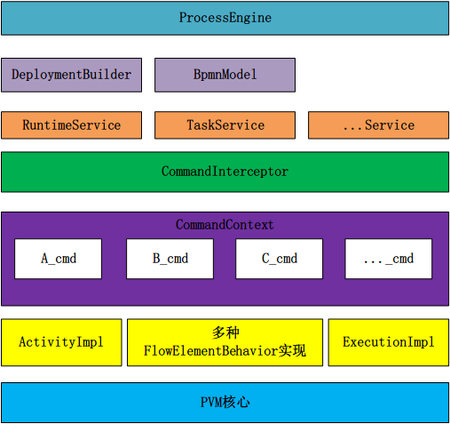
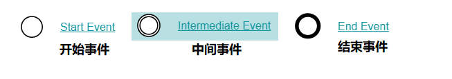

# 一、工作流介绍
- 工作流是什么？

- 抽象概念：

  - 业务流程
  - 工作流引擎
  - 工作流实例
  - 工作流任务
  - 工作流定义
  - 工作流部署
  - 工作流变量
  - 工作流历史
  - 工作流表单
  - 工作流引擎配置
  - 工作流引擎服务
  - 工作流引擎管理
  - 工作流引擎仓库
  - 工作流引擎运行时
  - 工作流引擎任务
  - 工作流引擎查询
  - 工作流引擎身份
  - 工作流引擎管理
  - 工作流引擎历史
  - 工作流引擎表单
  - 工作流引擎事件
  - 工作流引擎引擎
  - 工作流引擎决策
  - 工作流引擎决策表
  - 工作流引擎决策服务
  - 工作流引擎决策服务

- 现实举例：

## 	1.1 适用行业

## 	1.2 具体应用

# 二、Activiti介绍

## 	2.1 Activiti简介

- BPM
- BPMN

## 	2.2 Activiti架构
​		Activiti采用了一个分层架构完成自底向上的包装

# 三、Activiti使用

## 	3.1 Springboot基础整合

## 	3.2 Springboot自动建表

## 	3.3 表结构介绍
| **表分类**   | **表名**              | **解释**                                           |
| ------------ | --------------------- | -------------------------------------------------- |
| 一般数据     |                       |                                                    |
|              | [ACT_GE_BYTEARRAY]    | 通用的流程定义和流程资源                           |
|              | [ACT_GE_PROPERTY]     | 系统相关属性                                       |
| 流程历史记录 |                       |                                                    |
|              | [ACT_HI_ACTINST]      | 历史的流程实例                                     |
|              | [ACT_HI_ATTACHMENT]   | 历史的流程附件                                     |
|              | [ACT_HI_COMMENT]      | 历史的说明性信息                                   |
|              | [ACT_HI_DETAIL]       | 历史的流程运行中的细节信息                         |
|              | [ACT_HI_IDENTITYLINK] | 历史的流程运行过程中用户关系                       |
|              | [ACT_HI_PROCINST]     | 历史的流程实例                                     |
|              | [ACT_HI_TASKINST]     | 历史的任务实例                                     |
|              | [ACT_HI_VARINST]      | 历史的流程运行中的变量信息                         |
| 流程定义表   |                       |                                                    |
|              | [ACT_RE_DEPLOYMENT]   | 部署单元信息                                       |
|              | [ACT_RE_MODEL]        | 模型信息                                           |
|              | [ACT_RE_PROCDEF]      | 已部署的流程定义                                   |
| 运行实例表   |                       |                                                    |
|              | [ACT_RU_EVENT_SUBSCR] | 运行时事件                                         |
|              | [ACT_RU_EXECUTION]    | 运行时流程执行实例                                 |
|              | [ACT_RU_IDENTITYLINK] | 运行时用户关系信息，存储任务节点与参与者的相关信息 |
|              | [ACT_RU_JOB]          | 运行时作业                                         |
|              | [ACT_RU_TASK]         | 运行时任务                                         |
|              | [ACT_RU_VARIABLE]     | 运行时变量表                                       |

## 	3.4 关系类图

IdentityService，FormService两个Serivce都已经删除
## 	3.5 工作流引擎使用

# 四、Activiti BPMN建模

## 	4.1 什么是BPMN

## 	4.2 BPMN基础元素
<h2>事件 Event</h2>

<h2>活动 Activity</h2>
活动是任务的通用术语，一个活动对应的就是一个任务

<h2>网关 Gateway</h2>
网关用来处理决策

<h3>排他网关 (x) </h3>
——只有一条路径会被选择。流程执行到该网关时，按照输出流的顺序逐个计算，当条件的计算结果为true时，继续执行当前网关的输出流；

​    如果多条线路计算结果都是 true，则会执行第一个值为 true 的线路。如果所有网关计算结果没有true，则引擎会抛出异常。

​    排他网关需要和条件顺序流结合使用，default 属性指定默认顺序流，当所有的条件不满足时会执行默认顺序流。

<h3>并行网关 (+)</h3>
——所有路径会被同时选择

​    拆分 —— 并行执行所有输出顺序流，为每一条顺序流创建一个并行执行线路。

​    合并 —— 所有从并行网关拆分并执行完成的线路均在此等候，直到所有的线路都执行完成才继续向下执行。

<h3>包容网关 (+) </h3>

—— 可以同时执行多条线路，也可以在网关上设置条件

​    拆分 —— 计算每条线路上的表达式，当表达式计算结果为true时，创建一个并行线路并继续执行

​    合并 —— 所有从并行网关拆分并执行完成的线路均在此等候，直到所有的线路都执行完成才继续向下执行。

<h3>事件网关 (+) </h3>

—— 专门为中间捕获事件设置的，允许设置多个输出流指向多个不同的中间捕获事件。当流程执行到事件网关后，流程处于等待状态，需要等待抛出事件才能将等待状态转换为活动状态。

<h2>流向 Flow</h2>

## 	4.3 BPMN高级元素

## 	4.4 BPMN-File 简单案例

## 	4.5 图形化输出

# 五、Activiti API

## 	5.1 启动流程实例

## 	5.2 查询流程实例

## 	5.3 流程任务处理

## 	5.4 流程定义信息查询

## 	5.5 流程删除

## 	5.6 流程资源下载

## 	5.7 流程历史信息的查看

# 六、Activiti 高级功能（API）

## 	6.1 挂起与激活流程

## 	6.2 单个流程实例挂起与激活

## 	6.3 分配任务负责人

## 	6.4 查询任务负责人的待办任务

## 	6.5 办理任务

## 	6.6 流程变量 ☆

# 七、组任务

# 八、网管

# 九、Activiti 与 Springboot 简单整合实例（傻瓜式）

# 十、Activiti 与 springboot 版本对照表 （JDK8友好）
| Activiti版本 | SpringBoot要求最低版本 | SpringCloud要求最低版本 |
|:----------:|:----------------:|:-----------------:|
|  7.1.0.M4  |  2.1.6.RELEASE   |   Greenwich.SR2   |
|  7.1.0.M5  |  2.1.10.RELEASE  |   Greenwich.SR3   |
|  7.1.0.M6  |  2.1.12.RELEASE  |   Greenwich.SR5   |

现在中央仓库中更新到了7.1.0.M6版本。但是最新版本是8.0.0，但是这个版本还没有发布到中央仓库中，所以我们只能使用7.1.0.M6版本。
除非使用官网pom地址

