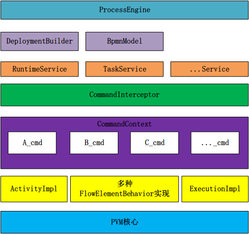

# 一、工作流介绍
- 工作流是什么？

- 抽象概念：

- 现实举例：

## 	1.1 适用行业

## 	1.2 具体应用

# 二、Activiti介绍

## 	2.1 Activiti简介

- BPM
- BPMN

## 	2.2 Activiti架构
​		Activiti采用了一个分层架构完成自底向上的包装

# 三、Activiti使用

## 	3.1 Springboot基础整合

## 	3.2 Springboot自动建表

## 	3.3 表结构介绍

## 	3.4 关系类图

## 	3.5 工作流引擎使用

# 四、Activiti BPMN建模

## 	4.1 什么是BPMN

## 	4.2 BPMN基础元素

## 	4.3 BPMN高级元素

## 	4.4 BPMN-File 简单案例

## 	4.5 图形化输出

# 五、Activiti API

- 流程定义：

## 	5.1 启动流程实例

## 	5.2 查询流程实例

## 	5.3 流程任务处理

## 	5.4 流程定义信息查询

## 	5.5 流程删除

## 	5.6 流程资源下载

## 	5.7 流程历史信息的查看

# 六、Activiti 高级功能（API）

## 	6.1 挂起与激活流程

## 	6.2 单个流程实例挂起与激活

## 	6.3 分配任务负责人

## 	6.4 查询任务负责人的待办任务

## 	6.5 办理任务

## 	6.6 流程变量 ☆

# 七、组任务

# 八、网管

# 九、Activiti 与 Springboot 简单整合实例（傻瓜式）