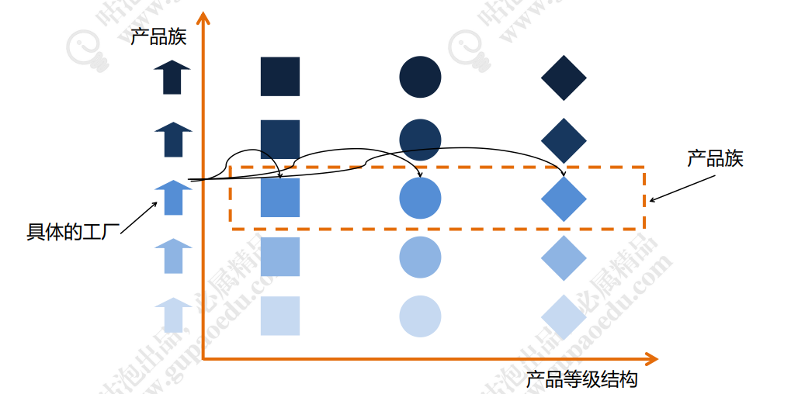

# 一、选择抽象工厂

1.  ⬇ 在 不扩展产品等级结构 的情况下，抽象工厂是易于扩展的符合 开闭原则 。如果 扩展产品等级结构 ，抽象工厂需要从抽象工厂到具体工厂全体调整，很明显不符合 开闭原则 。

2.  ⬇  一定会增加系统的抽象性和理解难度

3.  ⬆  增加新的产品族很方便，无须修改已有系统，符合开闭原则

4.  ⬆  隔离了具体类的生成，使得客户端并不需要知道什么被创建

### 适用场景：

- 一个系统不应当依赖于产品类实例如何被创建、组合和表达的细节
-  系统中有多于一个的产品族，但每次只使用其中某一产品族
-  属于同一个产品族的产品将在一起使用
-  产品等级结构稳定，在设计完成之后不会向系统中增加新的产品等级结构或者删除已有的产品等级结构

# 二、工厂方法

1.  ⬇  增加系统复杂度和理解难度

2.  ⬇  适合单一产品等级结构的工厂设计，产品族可以扩展
   
3.  ⬆  隔离了具体类的生成，使得客户端并不需要知道什么被创建

4.  ⬆  在系统中加入新产品时，完全符合开闭原则

# 三、简单工厂

1.  ⬇  工厂类集中了所有产品的创建逻辑，职责过重，一旦不能正常工作，整个系统都要受到影响，违反单一职责原则

2.  ⬇  增加系统中类的个数（引入了新的工厂类），增加了系统的复杂度和理解难度

3.  ⬇  系统扩展困难，一旦添加新产品不得不修改工厂逻辑，违反开闭原则

4.  ⬇  由于使用了静态工厂方法，造成工厂角色无法形成基于继承的等级结构，工厂类不能得到很好地扩展

5.  ⬆  实现了对象创建和使用的分离

6.  ⬆  客户端无须知道所创建的具体产品类的类名，只需要知道具体产品类所对应的参数即可

7.  ⬆  可以在不修改任何客户端代码的情况下更换和增加新的具体产品类，在一定程度上提高了系统的灵活性

# 产品 产品等级结构 产品族概念

## 产品
1. 模板类为一个具体产品
2. 抽象对象做为产品
3. 具体产品是我们对抽象产品的实现

以生活中的产品关系举例：

1. 汽车发动机是一个产品
2. Benz汽车发动机-xxx是具体产品
3. 各种各样的汽车发动机具体产品-都遵循汽车发动机这个产品

# 产品等级
1. 不同的生产厂家会生产多个产品
2. 同一个生产厂家的不同的产品之间就是产品的等级

# 产品族
1. 同一个生产厂家的多个产品的一系列，可以称为产品族