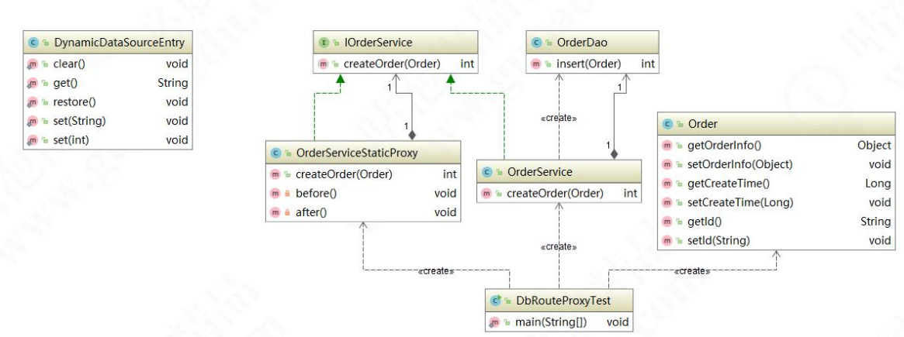
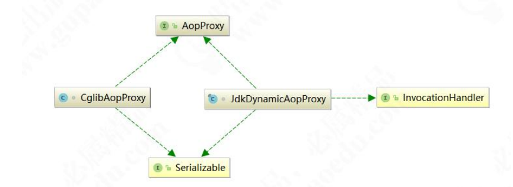

# 代理模式 JDK无限的可能，创建星河

SpringAOP 是用代理模式实现的

<h1><span style="color:yellowgreen"> ⬇ </span></h1> 

# 静态代理模式

静态代理是一种代理模式，它是在程序运行前就已经存在代理类的字节码文件，代理类和委托类的关系在运行前就确定了。在代理类中，我们需要维护一个委托类的引用，代理类和委托类都要实现同一个接口，这样代理类才能够对委托类进行代理。在代理类的方法中，我们可以在调用委托类的方法前后加入一些自己的逻辑，以实现不同的功能需求。静态代理的缺点是代理类和委托类实现同一个接口，如果接口中新增加了方法，代理类和委托类都要进行修改。
比如Father类会代理Son类，增加方法动作。
<h1><span style="color:yellowgreen"> ⬇ </span></h1> 

# 简单代理模式

将上述功能抽象出来变成，以下的通用静态代理方式

<h1><span style="color:yellowgreen"> ⬇ </span></h1> 

# 使用静态代理分库



<h1><span style="color:yellowgreen"> ⬇ </span></h1> 

# 动态代理

动态代理和静态对比基本思路是一致的，只不过动态代理功能更加强大，随着业务的扩
展适应性更强。如果还以找对象为例，使用动态代理相当于是能够适应复杂的业务场景。
不仅仅只是父亲给儿子找对象，如果找对象这项业务发展成了一个产业，进而出现了媒
婆、婚介所等这样的形式。那么，此时用静态代理成本就更大了，需要一个更加通用的
解决方案，要满足任何单身人士找对象的需求。我们升级一下代码，先来看 JDK 实现方
式：

<h1><span style="color:yellowgreen"> ⬇ </span></h1> 

# JDK动态代理的实现原理

- 1、拿到被代理类的引用，并且获取它的所有的接口(反射获取)
- 2、JDK Proxy类重新生成一个新的类，实现了被代理类所有接口的方法。
- 3、动态生成Java代码，把增强逻辑加入到新生成代码中
- 4、编译生成新的Java代码的class文件。
- 5、加载并重新运行新的class，得到类就是全新类

gpproxy 手写JDK动态代理

# CGlib

调 用 过 程 ： 代 理 对 象 调 用 this.findLove() 方 法 -> 调 用 拦 截 器
->methodProxy.invokeSuper->CGLIB$findLove$0->被代理对象 findLove()方法。
此时，我们发现拦截器 MethodInterceptor 中就是由 MethodProxy 的 invokeSuper
方法调用代理方法的，MethodProxy 非常关键，我们分析一下它具体做了什么

# CGLib 和 JDK 动态代理对比

1.JDK 动态代理是实现了被代理对象的接口，CGLib 是继承了被代理对象。
2.JDK 和 CGLib 都是在运行期生成字节码，JDK 是直接写 Class 字节码，CGLib 使用 ASM
框架写 Class 字节码，Cglib 代理实现更复杂，生成代理类比 JDK 效率低。
3.JDK 调用代理方法，是通过反射机制调用，CGLib 是通过 FastClass 机制直接调用方法，
CGLib 执行效率更高

# Spring 中的动态代理

代理模式与 Spring
代理模式在 Spring 源码中的应用
先看 ProxyFactoryBean 核心的方法就是 getObject()方法，我们来看一下源码：

```
    public Object getObject() throws BeansException {
        initializeAdvisorChain();
        if (isSingleton()) {
            return getSingletonInstance();
        }
        else {
            if (this.targetName == null) {
            logger.warn("Using non-singleton proxies with singleton targets is often undesirable. " +
            "Enable prototype proxies by setting the 'targetName' property.");
        }
            return newPrototypeInstance();
        }
    }
```

在 getObject()方法中，主要调用 getSingletonInstance()和 newPrototypeInstance()；
在 Spring 的配置中，如果不做任何设置，那么 Spring 代理生成的 Bean 都是单例对象。
如果修改 scope 则每次创建一个新的原型对象。newPrototypeInstance()里面的逻辑比
较复杂，我们后面的课程再做深入研究，这里我们先做简单的了解。
Spring 利用动态代理实现 AOP 有两个非常重要的类，一个是 JdkDynamicAopProxy 类
和 CglibAopProxy 类，来看一下类图：


### Spring 中的代理选择原则

1、当 Bean 有实现接口时，Spring 就会用 JDK 的动态代理
2、当 Bean 没有实现接口时，Spring 选择 CGLib。
3、Spring 可以通过配置强制使用 CGLib，只需在 Spring 的配置文件中加入如下代码：
```<aop:aspectj-autoproxy proxy-target-class="true"/>```

# 静态代理和动态的本质区别
- 1、静态代理只能通过手动完成代理操作，如果被代理类增加新的方法，代理类需要同步 新增，违背开闭原则。
- 2、动态代理采用在运行时动态生成代码的方式，取消了对被代理类的扩展限制，遵循开 闭原则。
- 3、若动态代理要对目标类的增强逻辑扩展，结合策略模式，只需要新增策略类便可完成， 无需修改代理类的代码。 

# 代理模式的优缺点
## 使用代理模式具有以下几个优点：
- 1、代理模式能将代理对象与真实被调用的目标对象分离。
- 2、一定程度上降低了系统的耦合度，扩展性好。
- 3、可以起到保护目标对象的作用。
- 4、可以对目标对象的功能增强。
## 代理模式也是有缺点的：
- 1、代理模式会造成系统设计中类的数量增加。
- 2、在客户端和目标对象增加一个代理对象，会造成请求处理速度变慢。
- 3、增加了系统的复杂度。