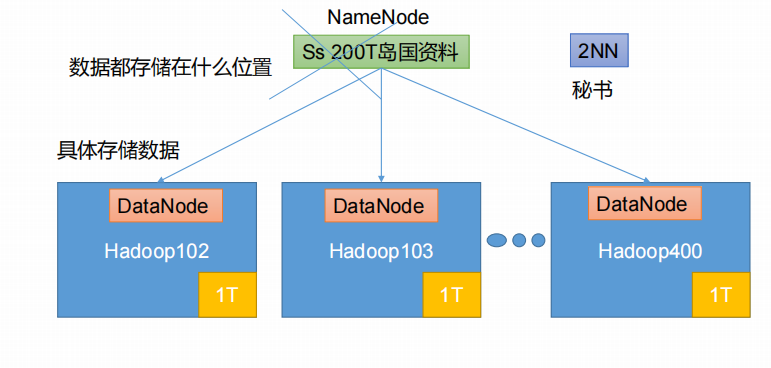
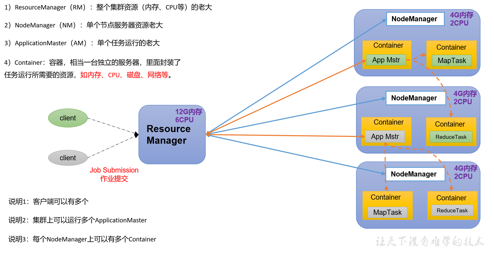
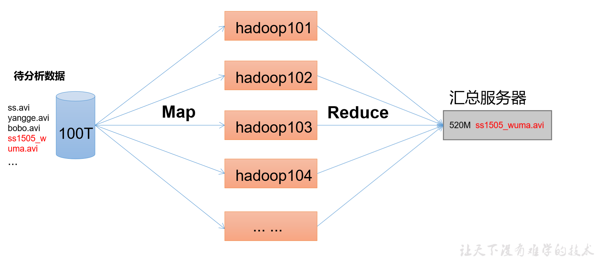
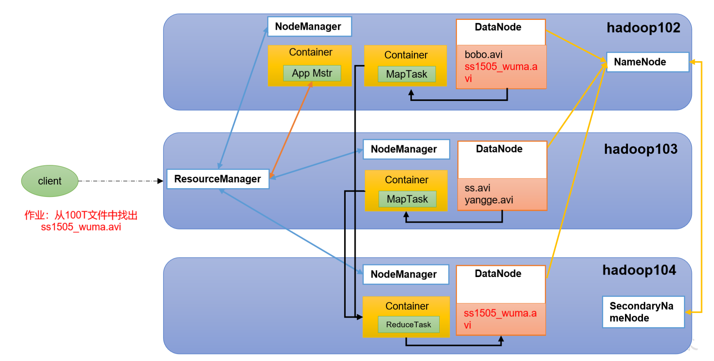
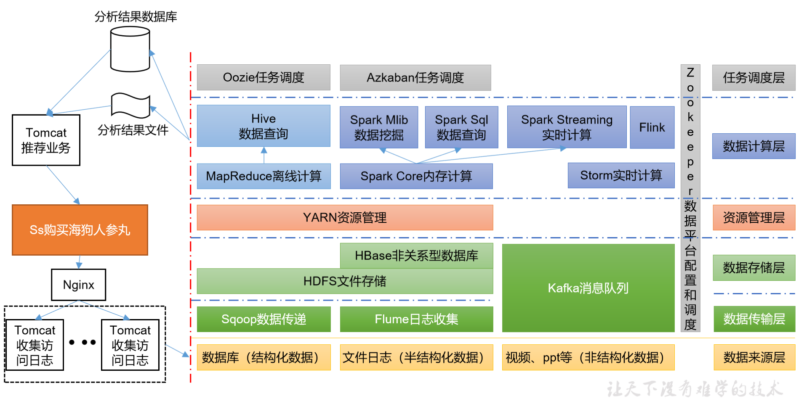
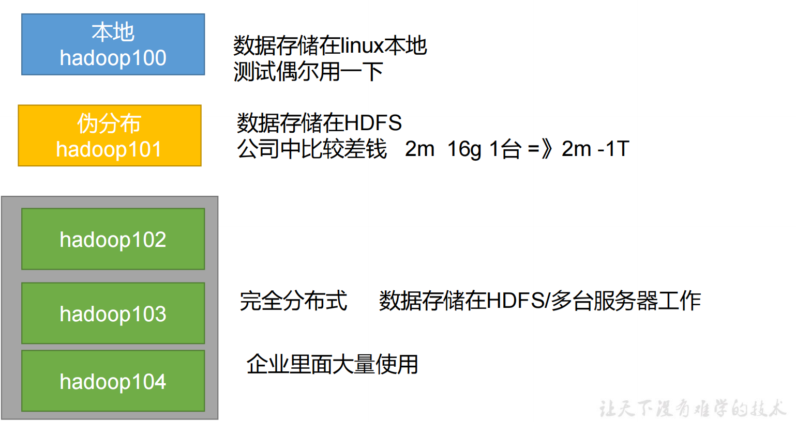
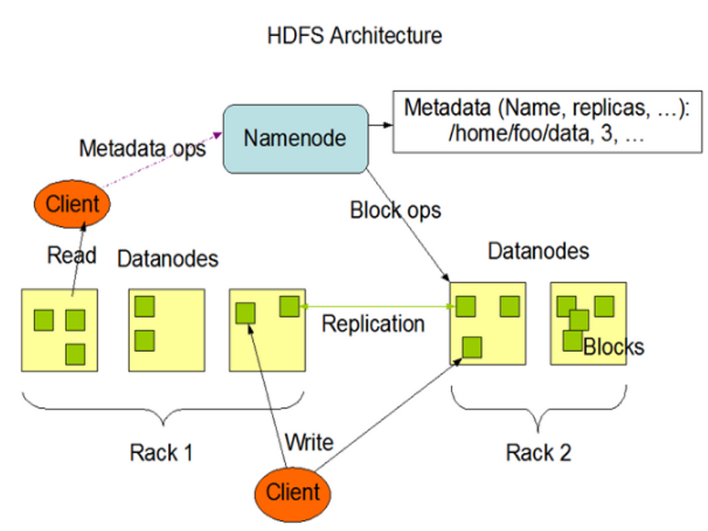
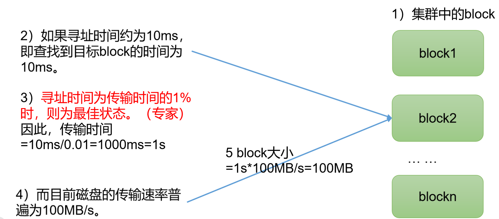
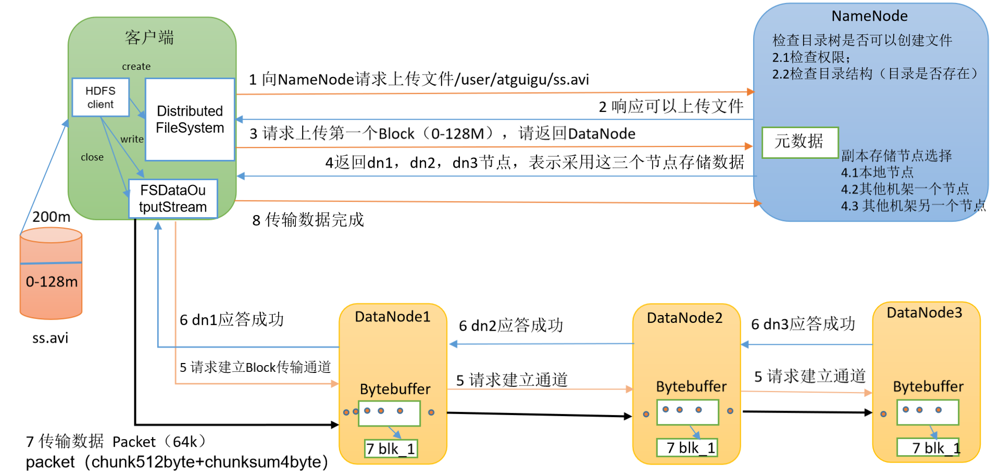

# Hadoop优势
- 高可靠性：Hadoop底层维护多个数据副本，即使某个节点出现故障，也不会影响数据的使用。
- 高扩展性：Hadoop是在可用的计算机集群间分配数据并完成计算任务，因此，只要有更多的机器加入到集群中，就能够获得更高的存储空间和更高的计算能力。
- 高效性：Hadoop能够在短时间内处理大量的数据。
- 高容错性：Hadoop能够自动保存数据的多个副本，并且能够自动将失败的任务重新分配。

# Hadoop 组成（面试）
- Hadoop Common：提供了分布式系统的基本功能，包括了一个分布式文件系统（HDFS）和一个分布式计算框架（MapReduce）。
- Hadoop YARN：作业调度和集群资源管理的框架。
- Hadoop MapReduce：分布式计算框架。
- Hadoop HDFS：分布式文件系统。

# HDFS
分布式文件系统。

1. NameNode ：存储文件系统的元数据，包括文件目录树、文件的属性和每个文件的块列表及块所在的DataNode等信息。
2. DataNode ：存储文件的实际数据块，每个DataNode会定期向NameNode发送心跳信号，汇报本身的存储容量和运行状态。
3. Secondary NameNode ：每隔一段对NameNode元数据备份。

# YARN
YARN是一个资源调度和管理的框架，它的核心是ResourceManager和NodeManager。

1. ResourceManager ：负责整个系统的资源管理和分配。
2. NodeManager ：负责单个节点上的资源和任务管理。
3. ApplicationMaster ：负责单个应用程序的管理，包括任务的调度、监控、容错等。
4. Container ：是YARN中的资源抽象，封装了某个节点上的多维度资源，如内存、CPU、磁盘、网络等。

# MapReduce
MapReduce是一个分布式计算框架，它的核心思想是将计算过程分为两个阶段：Map阶段和Reduce阶段。

1. Map阶段：将输入数据切分成若干个数据块，然后由多个Map任务并行处理。
2. Reduce阶段：将Map阶段的输出结果进行合并，得到最终的输出结果。

# HDFS、YARN、MapReduce的关系

# 大数据技术生态圈

推荐项目系统

# Hadoop 运行模式
- 伪分布式模式：Hadoop伪分布式模式是Hadoop的一种运行模式，它在单机上模拟Hadoop集群的运行环境，用于开发和测试。
- 本地模式：Hadoop本地模式是Hadoop的一种运行模式，它不需要启动Hadoop集群，而是在单机上模拟Hadoop集群的运行环境，用于开发和测试。
- 完全分布式模式：Hadoop完全分布式模式是Hadoop的一种运行模式，它需要启动Hadoop集群，用于生产环境。

# HDFS
HDFS是Hadoop分布式文件系统，它是Hadoop的核心组件之一，用于存储海量数据。

## 组成架构

1. NameNode ：管理者
- 管理HDFS的命名空间
- 管理数据块到DataNode的映射
- 配置副本的决策
- 处理客户端的读写请求
2. DataNode ：存储者
- 存储实际的数据块
- 执行数据块的读写操作
3. Client ：客户端
- 文件切分
- 与NameNode交互
- 与DataNode交互
4. Secondary NameNode ：辅助NameNode
- 辅助NameNode，分担NameNode的工作
- 紧急情况下，可辅助恢复NameNode

## HDFS文件块大小 （面试）
1. HDFS上的文件式分块存储的，HDFS文件块大小默认为128M，可以通过参数dfs.blocksize进行配置。
2. 一般认为寻址时间为传输时间的1%时，则为最佳状态。

## 为什么块的大小不能设置太小和太大？（面试）
1. 太大，会从磁盘传输数据的时间明显大于定位这个快初始位置所需的时间。
2. 太小，会增加寻址时间，程序一直在找块的开始位置。
HDFS块的大小主要取决于磁盘传输速率

## HDFS的读写流程（面试）

1. 客户端向NameNode发起读写请求。
2. NameNode返回数据块所在的DataNode节点。
3. 客户端直接与DataNode节点进行数据的读写操作。
