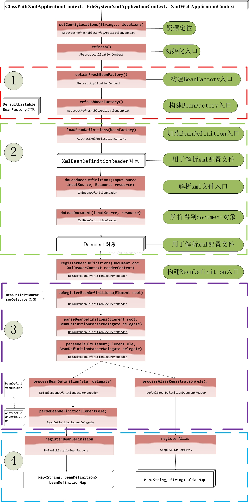

# 谁定义了bean的生命周期
实现InitializingBean Or DisposableBean接口，分别实现afterPropertiesSet()和destroy()方法，完成bean的初始化和销毁
实现BeanPostProcessor接口，分别实现postProcessBeforeInitialization()和postProcessAfterInitialization()方法，完成bean的初始化前后的处理工作

```
执行步骤：
postProcessBeforeInitialization（）
↓
afterPropertiesSet（）
↓
postProcessAfterInitialization（）
↓
destroy（）
```

# IOC初始化 IOC启动阶段
1. Resource定位过程：这个过程是指定位BeanDefinition的资源，也就是配置文件（如xml）的位置，并将其封装成Resource对象。Resource对象是Spring用来抽象不同形式的BeanDefinition的接口。比如BeanDefinitionReader(加载、Parse解析)
2. BeanDefinition的载入：这个过程是将Resource定位到的信息，转换成IoC容器内部的数据结构，也就是BeanDefinition对象。BeanDefinition对象是用来描述Bean实例的属性，如类名，构造器参数，依赖的bean等。BeanDefinition生成
3. BeanDefinition的注册：这个过程是将载入过程中得到的BeanDefinition对象注册到IoC容器中。注册过程是通过BeanDefinitionRegistry接口的实现来完成的。在IoC容器内部，BeanDefinition对象被存储在一个HashMap中。BeanDefinitionRegistry注册




# Spring-IOC是什么
Spring-IOC是Spring框架的核心，是一个容器，它负责实例化、定位、配置应用程序中的对象及建立这些对象间的依赖。

## IOC是什么
- 控制反转，指的是将对象的控制权交给Spring容器，由Spring来控制对象的生命周期和对象间的关系，而不是由对象自己控制。
（原来是自己去new开辟空间等创建，自己通过close等方法进行销毁。）
- 自己控制对象缺点：使得代码耦合度高，不易于维护，不易于测试。
- IOC容器控制对象优点：使得代码耦合度低，易于维护，易于测试。

## DI是什么
依赖注入，指的是由Spring容器在运行期间，动态地将某种依赖关系注入到对象之中。

# 依赖注入 DI的三种方式
1. 构造器注入:通过构造器传入依赖对象。
2. Setter方法注入:通过Setter方法传入依赖对象。
3. 接口注入:通过接口的Setter方法传入依赖对象。

# Spring-AOP是什么
Spring-AOP是Spring框架的一个重要组成部分，它提供了面向切面的编程，通过预编译方式和运行期动态代理实现程序功能的统一维护的技术。
（比如HandlerInterceptor实现之后，就是通过动态代理，从调用接口实时的获得handler对象，而这个拦截器的接口就是切面）

## OOP
面向对象编程，允许开发者定义纵向关系，但并不适用于定义横向的关系，会导致大量代码的重复，而不利于各个模块的重用。

## AOP
面向切面编程，是对OOP的补充，它允许开发者定义横向关系，将系统中的关注点分离出来形成一个独立的模块，这个模块被称为切面，它的作用是与业务逻辑无关的，但是又为业务逻辑模块所共同调用。
“切面”（Aspect）可用于权限认证、日志、事务处理。

## AOP实现方式
AOP实现的关键在于 代理模式，AOP代理主要分为静态代理和动态代理。静态代理的代表为AspectJ；动态代理则以Spring AOP为代表。

（1）AspectJ是静态代理，也称为编译时增强，AOP框架会在编译阶段生成AOP代理类，并将AspectJ(切面)织入到Java字节码中，运行的时候就是增强之后的AOP对象。

（2）Spring AOP使用的动态代理，所谓的动态代理就是说AOP框架不会去修改字节码，而是每次运行时在内存中临时为方法生成一个AOP对象，这个AOP对象包含了目标对象的全部方法，并且在特定的切点做了增强处理，并回调原对象的方法。

（3）静态代理与动态代理区别在于生成AOP代理对象的时机不同，相对来说AspectJ的静态代理方式具有更好的性能，但是AspectJ需要特定的编译器进行处理，而Spring AOP则无需特定的编译器处理。


### 动JDK动态代理和CGLIB动态代理 JDK动态代理和CGLIB动态代理
① JDK动态代理只提供接口的代理，不支持类的代理，要求被代理类实现接口。JDK动态代理的核心是InvocationHandler接口和Proxy类，在获取代理对象时，使用Proxy类来动态创建目标类的代理类（即最终真正的代理类，这个类继承自Proxy并实现了我们定义的接口），当代理对象调用真实对象的方法时， InvocationHandler 通过invoke()方法反射来调用目标类中的代码，动态地将横切逻辑和业务编织在一起；

InvocationHandler 的 invoke(Object  proxy,Method  method,Object[] args)：proxy是最终生成的代理对象;  method 是被代理目标实例的某个具体方法;  args 是被代理目标实例某个方法的具体入参, 在方法反射调用时使用。

② 如果被代理类没有实现接口，那么Spring AOP会选择使用CGLIB来动态代理目标类。CGLIB（Code Generation Library），是一个代码生成的类库，可以在运行时动态的生成指定类的一个子类对象，并覆盖其中特定方法并添加增强代码，从而实现AOP。CGLIB是通过继承的方式做的动态代理，因此如果某个类被标记为final，那么它是无法使用CGLIB做动态代理的。

# IOC 和 AOP 的联系和区别
IoC让相互协作的组件保持松散的耦合，而AOP编程允许你把遍布于应用各层的功能分离出来形成可重用的功能组件。


