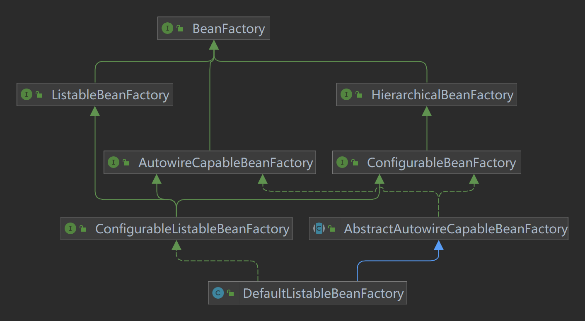
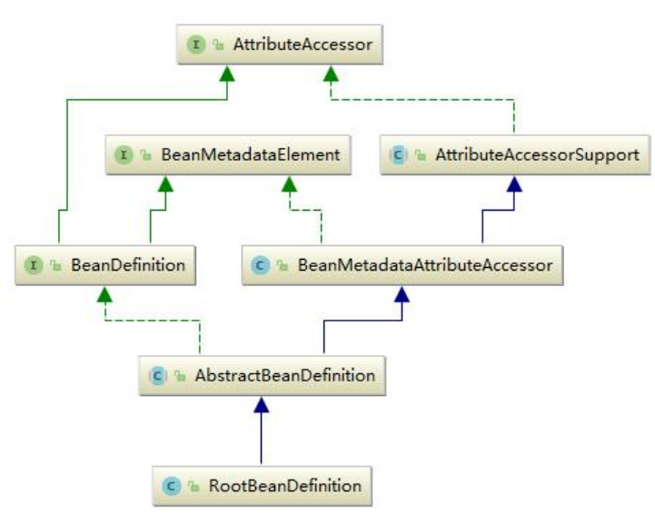
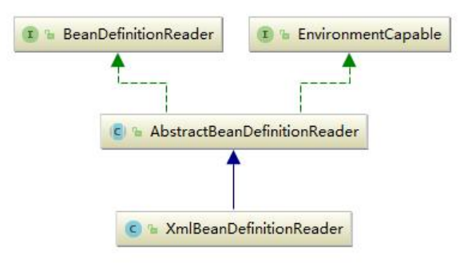
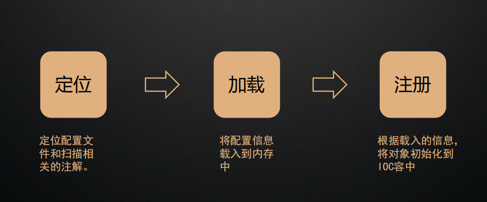
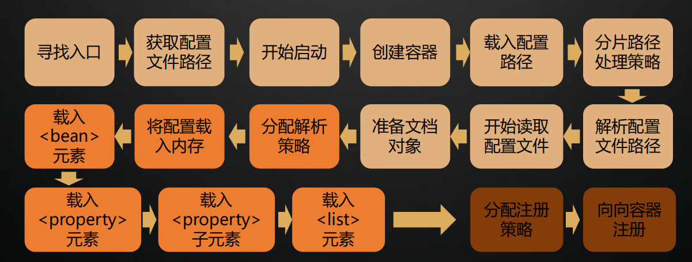

# 如何统一配置文件的标准？

# 0. Bean的生命周期

1. 实例化：为Bean分配内存空间，调用构造器或工厂方法创建Bean对象；
2. 属性赋值：将当前类依赖的Bean属性，进行注入和装配，可以通过XML配置，注解或Java配置来指定属性值；
3.

初始化：执行各种通知，如BeanPostProcessor的前置和后置方法，执行初始化的前置方法，如@PostConstruct注解或InitializingBean接口的afterPropertiesSet()
方法，执行初始化方法，如init-method属性或@PostConstruct注解或@Bean注解的initMethod属性指定的方法，执行初始化的后置方法，如@PreDestroy注解或DisposableBean接口的destroy()
方法；

4. 销毁：执行各种通知，如DestructionAwareBeanPostProcessor的postProcessBeforeDestruction()
   方法，执行销毁方法，如destroy-method属性或@PreDestroy注解或@Bean注解的destroyMethod属性指定的方法。

BeanDefinition

# 1. IOC

## 1.1 BeanDefinition 定义容器

SpringIOC 容器管理了我们定义的各种 Bean 对象及其相互的关系，Bean 对象在 Spring 实现中是
以 BeanDefinition 来描述的，其继承体系如下： Spring 核心容器类图
Spring Bean 的创建是典型的工厂模式，这一系列的 Bean 工厂，也即 IOC 容器为开发者管理对象
间的依赖关系提供了很多便利和基础服务，在 Spring 中有许多的 IOC 容器的实现供用户选择和使用，
其相互关系如下：

其中 BeanFactory 作为最顶层的一个接口类，它定义了 IOC 容器的基本功能规范，BeanFactory 有三
个重要的子类：ListableBeanFactory、HierarchicalBeanFactory 和 AutowireCapableBeanFactory。
但是从类图中我们可以发现最终的默认实现类是 DefaultListableBeanFactory，它实现了所有的接口。
那为何要定义这么多层次的接口呢？查阅这些接口的源码和说明发现，每个接口都有它使用的场合，它
主要是为了区分在 Spring 内部在操作过程中对象的传递和转化过程时，对对象的数据访问所做的限制。
例如 ListableBeanFactory 接口表示这些 Bean 是可列表化的，而 HierarchicalBeanFactory 表示的是
这些 Bean 是有继承关系的，也就是每个 Bean 有可能有父 Bean。AutowireCapableBeanFactory 接
口定义 Bean 的自动装配规则。这三个接口共同定义了 Bean 的集合、Bean 之间的关系、以及 Bean 行
为。最基本的 IOC 容器接口 BeanFactory，来看一下它的源码：

```java
public interface BeanFactory {
    //对 FactoryBean 的转义定义，因为如果使用 bean 的名字检索 FactoryBean 得到的对象是工厂生成的对象，
    //如果需要得到工厂本身，需要转义
    String FACTORY_BEAN_PREFIX = "&";

    //根据 bean 的名字，获取在 IOC 容器中得到 bean 实例
    Object getBean(String name) throws BeansException;

    //根据 bean 的名字和 Class 类型来得到 bean 实例，增加了类型安全验证机制。
    <T> T getBean(String name, @Nullable Class<T> requiredType) throws BeansException;

    Object getBean(String name, Object... args) throws BeansException;

    <T> T getBean(Class<T> requiredType) throws BeansException;

    <T> T getBean(Class<T> requiredType, Object... args) throws BeansException;

    //提供对 bean 的检索，看看是否在 IOC 容器有这个名字的 bean
    boolean containsBean(String name);

    //根据 bean 名字得到 bean 实例，并同时判断这个 bean 是不是单例
    boolean isSingleton(String name) throws NoSuchBeanDefinitionException;

    boolean isPrototype(String name) throws NoSuchBeanDefinitionException;

    boolean isTypeMatch(String name, ResolvableType typeToMatch) throws
            NoSuchBeanDefinitionException;

    boolean isTypeMatch(String name, @Nullable Class<?> typeToMatch) throws
            NoSuchBeanDefinitionException;

    //得到 bean 实例的 Class 类型
    @Nullable
    Class<?> getType(String name) throws NoSuchBeanDefinitionException;

    //得到 bean 的别名，如果根据别名检索，那么其原名也会被检索出来
    String[] getAliases(String name);
}
```

在 BeanFactory 里只对 IOC 容器的基本行为作了定义，根本不关心你的 Bean 是如何定义怎样加载的。
正如我们只关心工厂里得到什么的产品对象，至于工厂是怎么生产这些对象的，这个基本的接口不关心。
而要知道工厂是如何产生对象的，我们需要看具体的 IOC 容器实现，Spring 提供了许多 IOC 容器
的 实 现 。 比 如 GenericApplicationContext ， ClasspathXmlApplicationContext 等 。
ApplicationContext 是 Spring 提供的一个高级的 IOC 容器，它除了能够提供 IOC 容器的基本功能
外，还为用户提供了以下的附加服务。从 ApplicationContext 接口的实现，我们看出其特点：
1、支持信息源，可以实现国际化。（实现 MessageSource 接口）
2、访问资源。(实现 ResourcePatternResolver 接口，后面章节会讲到)
3、支持应用事件。(实现 ApplicationEventPublisher 接口)

## 1.2 BeanDefinition 存储配置信息

SpringIOC 容器管理了我们定义的各种 Bean 对象及其相互的关系，Bean 对象在 Spring 实现中是
以 BeanDefinition 来描述的，其继承体系如下：


## 1.3 BeanDefinitionReader 读取配置信息

Bean 的解析过程非常复杂，功能被分的很细，因为这里需要被扩展的地方很多，必须保证有足够的灵
活性，以应对可能的变化。Bean 的解析主要就是对 Spring 配置文件的解析。这个解析过程主要通过
BeanDefintionReader 来完成，最后看看 Spring 中 BeanDefintionReader 的类结构图：


## 1.4 Spring IOC 初始化三部曲

1.

Resource定位过程：这个过程是指定位BeanDefinition的资源，也就是配置文件（如xml）的位置，并将其封装成Resource对象。Resource对象是Spring用来抽象不同形式的BeanDefinition的接口，比如ClassPathResource,
FileSystemResource等。

2.

BeanDefinition的载入：这个过程是将Resource定位到的信息，转换成IoC容器内部的数据结构，也就是BeanDefinition对象。BeanDefinition对象是用来描述Bean实例的属性，如类名，构造器参数，依赖的bean等。

3.

BeanDefinition的注册：这个过程是将载入过程中得到的BeanDefinition对象注册到IoC容器中。注册过程是通过BeanDefinitionRegistry接口的实现来完成的。在IoC容器内部，BeanDefinition对象被存储在一个HashMap中。


