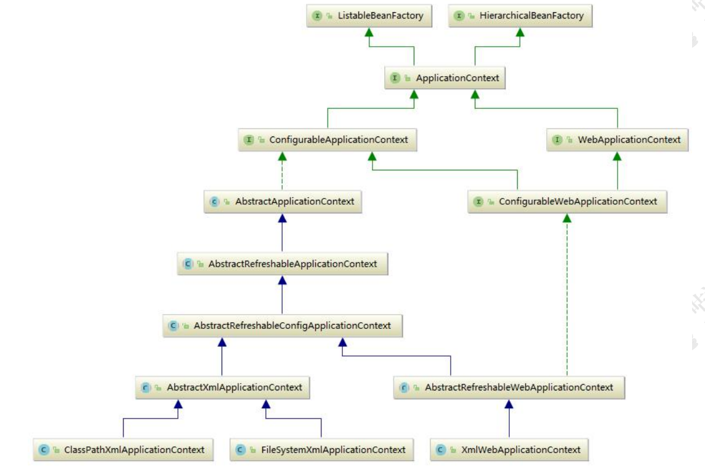
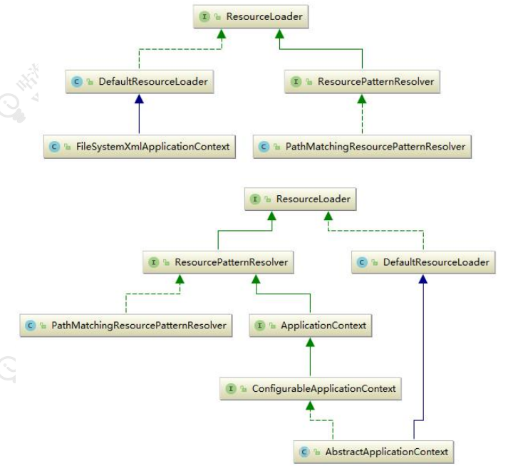

# 如何统一配置文件的标准？

# 0. Bean的生命周期

1. 实例化：为Bean分配内存空间，调用构造器或工厂方法创建Bean对象；
2. 属性赋值：将当前类依赖的Bean属性，进行注入和装配，可以通过XML配置，注解或Java配置来指定属性值；
3.

初始化：执行各种通知，如BeanPostProcessor的前置和后置方法，执行初始化的前置方法，如@PostConstruct注解或InitializingBean接口的afterPropertiesSet()
方法，执行初始化方法，如init-method属性或@PostConstruct注解或@Bean注解的initMethod属性指定的方法，执行初始化的后置方法，如@PreDestroy注解或DisposableBean接口的destroy()
方法；

4. 销毁：执行各种通知，如DestructionAwareBeanPostProcessor的postProcessBeforeDestruction()
   方法，执行销毁方法，如destroy-method属性或@PreDestroy注解或@Bean注解的destroyMethod属性指定的方法。

BeanDefinition

# 1. IOC

## 1.1 BeanDefinition 定义容器

SpringIOC 容器管理了我们定义的各种 Bean 对象及其相互的关系，Bean 对象在 Spring 实现中是
以 BeanDefinition 来描述的，其继承体系如下： Spring 核心容器类图
Spring Bean 的创建是典型的工厂模式，这一系列的 Bean 工厂，也即 IOC 容器为开发者管理对象
间的依赖关系提供了很多便利和基础服务，在 Spring 中有许多的 IOC 容器的实现供用户选择和使用，
其相互关系如下：

其中 BeanFactory 作为最顶层的一个接口类，它定义了 IOC 容器的基本功能规范，BeanFactory 有三
个重要的子类：ListableBeanFactory、HierarchicalBeanFactory 和 AutowireCapableBeanFactory。
但是从类图中我们可以发现最终的默认实现类是 DefaultListableBeanFactory，它实现了所有的接口。
那为何要定义这么多层次的接口呢？查阅这些接口的源码和说明发现，每个接口都有它使用的场合，它
主要是为了区分在 Spring 内部在操作过程中对象的传递和转化过程时，对对象的数据访问所做的限制。
例如 ListableBeanFactory 接口表示这些 Bean 是可列表化的，而 HierarchicalBeanFactory 表示的是
这些 Bean 是有继承关系的，也就是每个 Bean 有可能有父 Bean。AutowireCapableBeanFactory 接
口定义 Bean 的自动装配规则。这三个接口共同定义了 Bean 的集合、Bean 之间的关系、以及 Bean 行
为。最基本的 IOC 容器接口 BeanFactory，来看一下它的源码：

```java
public interface BeanFactory {
    //对 FactoryBean 的转义定义，因为如果使用 bean 的名字检索 FactoryBean 得到的对象是工厂生成的对象，
    //如果需要得到工厂本身，需要转义
    String FACTORY_BEAN_PREFIX = "&";

    //根据 bean 的名字，获取在 IOC 容器中得到 bean 实例
    Object getBean(String name) throws BeansException;

    //根据 bean 的名字和 Class 类型来得到 bean 实例，增加了类型安全验证机制。
    <T> T getBean(String name, @Nullable Class<T> requiredType) throws BeansException;

    Object getBean(String name, Object... args) throws BeansException;

    <T> T getBean(Class<T> requiredType) throws BeansException;

    <T> T getBean(Class<T> requiredType, Object... args) throws BeansException;

    //提供对 bean 的检索，看看是否在 IOC 容器有这个名字的 bean
    boolean containsBean(String name);

    //根据 bean 名字得到 bean 实例，并同时判断这个 bean 是不是单例
    boolean isSingleton(String name) throws NoSuchBeanDefinitionException;

    boolean isPrototype(String name) throws NoSuchBeanDefinitionException;

    boolean isTypeMatch(String name, ResolvableType typeToMatch) throws
            NoSuchBeanDefinitionException;

    boolean isTypeMatch(String name, @Nullable Class<?> typeToMatch) throws
            NoSuchBeanDefinitionException;

    //得到 bean 实例的 Class 类型
    @Nullable
    Class<?> getType(String name) throws NoSuchBeanDefinitionException;

    //得到 bean 的别名，如果根据别名检索，那么其原名也会被检索出来
    String[] getAliases(String name);
}
```

在 BeanFactory 里只对 IOC 容器的基本行为作了定义，根本不关心你的 Bean 是如何定义怎样加载的。
正如我们只关心工厂里得到什么的产品对象，至于工厂是怎么生产这些对象的，这个基本的接口不关心。
而要知道工厂是如何产生对象的，我们需要看具体的 IOC 容器实现，Spring 提供了许多 IOC 容器
的 实 现 。 比 如 GenericApplicationContext ， ClasspathXmlApplicationContext 等 。
ApplicationContext 是 Spring 提供的一个高级的 IOC 容器，它除了能够提供 IOC 容器的基本功能
外，还为用户提供了以下的附加服务。从 ApplicationContext 接口的实现，我们看出其特点：
1、支持信息源，可以实现国际化。（实现 MessageSource 接口）
2、访问资源。(实现 ResourcePatternResolver 接口，后面章节会讲到)
3、支持应用事件。(实现 ApplicationEventPublisher 接口)

## 1.2 BeanDefinition 存储配置信息

SpringIOC 容器管理了我们定义的各种 Bean 对象及其相互的关系，Bean 对象在 Spring 实现中是
以 BeanDefinition 来描述的，其继承体系如下：


## 1.3 BeanDefinitionReader 读取配置信息

Bean 的解析过程非常复杂，功能被分的很细，因为这里需要被扩展的地方很多，必须保证有足够的灵
活性，以应对可能的变化。Bean 的解析主要就是对 Spring 配置文件的解析。这个解析过程主要通过
BeanDefintionReader 来完成，最后看看 Spring 中 BeanDefintionReader 的类结构图：


## 1.4 Spring IOC 初始化三部曲

1.

Resource定位过程：这个过程是指定位BeanDefinition的资源，也就是配置文件（如xml）的位置，并将其封装成Resource对象。Resource对象是Spring用来抽象不同形式的BeanDefinition的接口，比如ClassPathResource,
FileSystemResource等。

2.

BeanDefinition的载入：这个过程是将Resource定位到的信息，转换成IoC容器内部的数据结构，也就是BeanDefinition对象。BeanDefinition对象是用来描述Bean实例的属性，如类名，构造器参数，依赖的bean等。

3.

BeanDefinition的注册：这个过程是将载入过程中得到的BeanDefinition对象注册到IoC容器中。注册过程是通过BeanDefinitionRegistry接口的实现来完成的。在IoC容器内部，BeanDefinition对象被存储在一个HashMap中。


## 1.5web ioc容器初始化(BeanDefinition的载入和注册)

### 1.5.1 DispatcherServlet

DispatcherServlet在初始化过程中会调用它的父类FrameworkServlet的initServletBean()
方法，这个方法会调用initWebApplicationContext()
方法来创建和初始化Web应用程序上下文。这个过程属于BeanDefinition的载入和注册阶段，因为它会加载配置文件，解析Bean定义，注册到IoC容器中。

```java
public class HttpServletBean {
    //...
    public final void init() throws ServletException {
        //...
        this.initServletBean();
    }
}
```

```java
public class FrameworkServlet {
    protected final void initServletBean() throws ServletException {
        //...

        this.webApplicationContext = this.initWebApplicationContext();

        //...
    }

    protected WebApplicationContext initWebApplicationContext() {
        //...
        this.onRefresh(wac);
        //...
    }

}
```

```java
public class DispatcherServlet {
    protected void onRefresh(ApplicationContext context) {
        this.initStrategies(context);
    }


    protected void initStrategies(ApplicationContext context) {
        this.initMultipartResolver(context);
        this.initLocaleResolver(context);
        this.initThemeResolver(context);
        this.initHandlerMappings(context);
        this.initHandlerAdapters(context);
        this.initHandlerExceptionResolvers(context);
        this.initRequestToViewNameTranslator(context);
        this.initViewResolvers(context);
        this.initFlashMapManager(context);
    }
}
```

## 1.6 基于 Xml的IOC容器的初始化


首先使用ClassPathXmlApplicationContext加载配置

### 1.6.1 入口

```java

@SpringBootApplication
public class JMW {

    private static ApplicationContext applicationContext;

    public static void main(String[] args) {
//        applicationContext = SpringApplication.run(JMW.class, args);
        //TODO 1.入口
        applicationContext = new ClassPathXmlApplicationContext("application.xml");

    }
}

```

### 1.6.2 获得配置路径

```java
public class ClassPathXmlApplicationContext {
    public ClassPathXmlApplicationContext(String configLocation) throws BeansException {
        this(new String[]{configLocation}, true, (ApplicationContext) null);
    }

    public ClassPathXmlApplicationContext(String[] configLocations, boolean refresh, @Nullable
    ApplicationContext parent) throws BeansException {
        super(parent);
        this.setConfigLocations(configLocations);
        if (refresh) {
            //TODO 3.1 开始启动
            this.refresh();
        }
    }
}
```

```java
public abstract class AbstractApplicationContext extends DefaultResourceLoader
        implements ConfigurableApplicationContext {
    //静态初始化块，在整个容器创建过程中只执行一次
    static {
//为了避免应用程序在 Web logic8.1 关闭时出现类加载异常加载问题，加载 IOC 容
//器关闭事件(ContextClosedEvent)类
        ContextClosedEvent.class.getName();
    }

    public AbstractApplicationContext() {
        this.resourcePatternResolver = getResourcePatternResolver();
    }

    public AbstractApplicationContext(@Nullable ApplicationContext parent) {
        this();
        setParent(parent);
    }

    //获取一个 Spring Source 的加载器用于读入 Spring Bean 配置信息
    protected ResourcePatternResolver getResourcePatternResolver() {
//AbstractApplicationContext 继承 DefaultResourceLoader，因此也是一个资源加载器
//Spring 资源加载器，其 getResource(String location)方法用于载入资源
        //TODO 2 创建 Spring 资源加载器 + setConfigLocations() 方法进行执行
        return new PathMatchingResourcePatternResolver(this);
    }
//...
}
```

### 1.6.3 开始启动 refresh()

SpringIOC 容器对 Bean 配置资源的载入是从 refresh()函数开始的，refresh()是一个模板方法，规定了
IOC 容 器 的 启 动 流 程 ， 有 些 逻 辑 要 交 给 其 子 类 去 实 现 。 它 对 Bean 配 置 资 源 进 行 载 入
ClassPathXmlApplicationContext 通过调用其父类 AbstractApplicationContext 的 refresh()函数启
动整个 IOC 容器对 Bean 定义的载入过程

```java
public class AbstractApplicationContext {
    @Override
    public void refresh() throws BeansException, IllegalStateException {
        synchronized (this.startupShutdownMonitor) {
            // Prepare this context for refreshing.
            //1、调用容器准备刷新的方法，获取容器的当时时间，同时给容器设置同步标识
            prepareRefresh();
            // Tell the subclass to refresh the internal bean factory.
            //2、告诉子类启动 refreshBeanFactory()方法，Bean 定义资源文件的载入从
            //子类的 refreshBeanFactory()方法启动
            ConfigurableListableBeanFactory beanFactory = obtainFreshBeanFactory();
            // Prepare the bean factory for use in this context.
            //3、为 BeanFactory 配置容器特性，例如类加载器、事件处理器等
            prepareBeanFactory(beanFactory);
            try {
                // Allows post-processing of the bean factory in context subclasses.
                //4、为容器的某些子类指定特殊的 BeanPost 事件处理器
                postProcessBeanFactory(beanFactory);
                // Invoke factory processors registered as beans in the context.
                //5、调用所有注册的 BeanFactoryPostProcessor 的 Bean
                invokeBeanFactoryPostProcessors(beanFactory);
                // Register bean processors that intercept bean creation.
                //6、为 BeanFactory 注册 BeanPost 事件处理器.
                //BeanPostProcessor 是 Bean 后置处理器，用于监听容器触发的事件
                registerBeanPostProcessors(beanFactory);
                // Initialize message source for this context.
                //7、初始化信息源，和国际化相关.
                initMessageSource();
                // Initialize event multicaster for this context.
                //8、初始化容器事件传播器.
                initApplicationEventMulticaster();
                // Initialize other special beans in specific context subclasses.
                //9、调用子类的某些特殊 Bean 初始化方法
                onRefresh();
                // Check for listener beans and register them.
                //10、为事件传播器注册事件监听器. 
                registerListeners();
                // Instantiate all remaining (non-lazy-init) singletons.
                //11、初始化所有剩余的单例 Bean
                finishBeanFactoryInitialization(beanFactory);
                // Last step: publish corresponding event.
                //12、初始化容器的生命周期事件处理器，并发布容器的生命周期事件
                finishRefresh();
            } catch (BeansException ex) {
                if (logger.isWarnEnabled()) {
                    logger.warn("Exception encountered during context initialization - " +
                            "cancelling refresh attempt: " + ex);
                }
                // Destroy already created singletons to avoid dangling resources.
                //13、销毁已创建的 Bean
                destroyBeans();
                // Reset 'active' flag.
                //14、取消 refresh 操作，重置容器的同步标识.
                cancelRefresh(ex);
                // Propagate exception to caller.
                throw ex;
            } finally {
                // Reset common introspection caches in Spring's core, since we
                // might not ever need metadata for singleton beans anymore...
                //15、重设公共缓存
                resetCommonCaches();
            }
        }
    }
}
```

refresh()方法主要为 IOC 容器 Bean 的生命周期管理提供条件，Spring IOC 容器载入 Bean 配置信息
从 其 子 类 容 器 的 refreshBeanFactory() 方 法 启 动 ， 所 以 整 个 refresh() 中
“ConfigurableListableBeanFactory beanFactory = obtainFreshBeanFactory();”这句以后代码的
都是注册容器的信息源和生命周期事件，我们前面说的载入就是从这句代码开始启动。
refresh()方法的主要作用是：在创建 IOC 容器前，如果已经有容器存在，则需要把已有的容器销毁和
关闭，以保证在 refresh 之后使用的是新建立起来的 IOC 容器。它类似于对 IOC 容器的重启，在新建立
好的容器中对容器进行初始化，对 Bean 配置资源进行载入。

### 1.6.4 创建容器

obtainFreshBeanFactory()方法调用子类容器的 refreshBeanFactory()方法，启动容器载入 Bean 配置信息的过程

```java
public class AbstractApplicationContext {
    protected ConfigurableListableBeanFactory obtainFreshBeanFactory() {
        //这里使用了委派设计模式，父类定义了抽象的 refreshBeanFactory()方法，具体实现调用子类容器的 refreshBeanFactory()方法
        this.refreshBeanFactory();
        return this.getBeanFactory();
    }
}
```

AbstractApplicationContext 类中只抽象定义了 refreshBeanFactory()方法，容器真正调用的是
其子类 AbstractRefreshableApplicationContext 实现的 refreshBeanFactory()方法

```java
public abstract class AbstractRefreshableApplicationContext extends AbstractApplicationContext {
    protected final void refreshBeanFactory() throws BeansException {
        //如果已经有容器，销毁容器中的 bean，关闭容器
        if (hasBeanFactory()) {
            destroyBeans();
            closeBeanFactory();
        }
        try {
            //创建 IOC 容器N TODO 4. 创建ioc容器
            DefaultListableBeanFactory beanFactory = this.createBeanFactory();
            beanFactory.setSerializationId(this.getId());
            //对 IOC 容器进行定制化，如设置启动参数，开启注解的自动装配等
            this.customizeBeanFactory(beanFactory);
            //调用载入 Bean 定义的方法，主要这里又使用了一个委派模式，在当前类中只定义了抽象的 loadBeanDefinitions 方法，具体
            //的实现调用子类容器
            //TODO 5.载入配置路径
            this.loadBeanDefinitions(beanFactory);
            this.beanFactory = beanFactory;
        } catch (IOException ex) {
            throw new ApplicationContextException("I/O error parsing bean definition source for " + getDisplayName(), ex);
        }
    }
}
```

在这个方法中，先判断 BeanFactory 是否存在，如果存在则先销毁 beans 并关闭 beanFactory，接着
创建 DefaultListableBeanFactory，并调用 loadBeanDefinitions(beanFactory)装载 bean 定义。

### 1.6.5 载入配置路径

BeanDefinition

```java
    public abstract class AbstractXmlApplicationContext extends AbstractRefreshableConfigApplicationContext {

    //实现父类抽象的载入 Bean 定义方法
    //TODO 5.1 载入配置路径
    @Override
    protected void loadBeanDefinitions(DefaultListableBeanFactory beanFactory) throws BeansException, IOException {
        //创建 XmlBeanDefinitionReader，即创建 Bean 读取器，并通过回调设置到容器中去，容器使用该读取器读取 Bean 配置资源
        //TODO 6. 分配路径处理策略
        XmlBeanDefinitionReader beanDefinitionReader = new XmlBeanDefinitionReader(beanFactory);
        //为 Bean 读取器设置 Spring 资源加载器，AbstractXmlApplicationContext 的
        //祖先父类 AbstractApplicationContext 继承 DefaultResourceLoader，因此，容器本身也是一个资源加载器
        beanDefinitionReader.setEnvironment(this.getEnvironment());
        beanDefinitionReader.setResourceLoader(this);
        //为 Bean 读取器设置 SAX xml 解析器
        beanDefinitionReader.setEntityResolver(new ResourceEntityResolver(this));
        //当 Bean 读取器读取 Bean 定义的 Xml 资源文件时，启用 Xml 的校验机制
        initBeanDefinitionReader(beanDefinitionReader);
        //Bean 读取器真正实现加载的方法
        loadBeanDefinitions(beanDefinitionReader);
    }

    protected void initBeanDefinitionReader(XmlBeanDefinitionReader reader) {
        reader.setValidating(this.validating);
    }

    //Xml Bean 读取器加载 Bean 配置资源
    protected void loadBeanDefinitions(XmlBeanDefinitionReader reader) throws BeansException, IOException {
        //获取 Bean 配置资源的定位
        Resource[] configResources = getConfigResources();
        if (configResources != null) {
            //Xml Bean 读取器调用其父类 AbstractBeanDefinitionReader 读取定位的 Bean 配置资源
            reader.loadBeanDefinitions(configResources);
        }
        // 如果子类中获取的 Bean 配置资源定位为空，则获取 ClassPathXmlApplicationContext
        // 构造方法中 setConfigLocations 方法设置的资源
        String[] configLocations = getConfigLocations();
        if (configLocations != null) {
            //Xml Bean 读取器调用其父类 AbstractBeanDefinitionReader 读取定位
            //的 Bean 配置资源
            reader.loadBeanDefinitions(configLocations);
        }
    }

    //这里又使用了一个委托模式，调用子类的获取 Bean 配置资源定位的方法
    //该方法在 ClassPathXmlApplicationContext 中进行实现，对于我们
    //举例分析源码的 ClassPathXmlApplicationContext 没有使用该方法
    @Nullable
    protected Resource[] getConfigResources() {
        return null;
    }
}
```

以 XmlBean 读取器的其中一种策略 XmlBeanDefinitionReader 为例。XmlBeanDefinitionReader 调
用其父类AbstractBeanDefinitionReader的 reader.loadBeanDefinitions()方法读取Bean配置资源。
由于我们使用 ClassPathXmlApplicationContext 作为例子分析，因此 getConfigResources 的返回值
为 null，因此程序执行 reader.loadBeanDefinitions(configLocations)分支

### 1.6.6 分配路径处理策略

在 XmlBeanDefinitionReader 的抽象父类 AbstractBeanDefinitionReader 中定义了载入过程。
AbstractBeanDefinitionReader 的 loadBeanDefinitions()方法源码如下：

```java
public abstract class AbstractBeanDefinitionReader implements BeanDefinitionReader, EnvironmentCapable {
    //重载方法，调用下面的 loadBeanDefinitions(String, Set<Resource>);方法
    @Override
    public int loadBeanDefinitions(String location) throws BeanDefinitionStoreException {
        return loadBeanDefinitions(location, null);
    }

    public int loadBeanDefinitions(String location, @Nullable Set<Resource> actualResources) throws
            BeanDefinitionStoreException {
        //获取在 IOC 容器初始化过程中设置的资源加载器
        ResourceLoader resourceLoader = getResourceLoader();
        if (resourceLoader == null) {
            throw new BeanDefinitionStoreException(
                    "Cannot import bean definitions from location [" + location + "]: no ResourceLoader available");
        }
        if (resourceLoader instanceof ResourcePatternResolver) {
            // Resource pattern matching available.
            try {
                //将指定位置的 Bean 配置信息解析为 Spring IOC 容器封装的资源
                //加载多个指定位置的 Bean 配置信息
                Resource[] resources = ((ResourcePatternResolver) resourceLoader).getResources(location);
                //委派调用其子类 XmlBeanDefinitionReader 的方法，实现加载功能
                int loadCount = loadBeanDefinitions(resources);
                if (actualResources != null) {
                    for (Resource resource : resources) {
                        actualResources.add(resource);
                    }
                }
                if (logger.isDebugEnabled()) {
                    logger.debug("Loaded " + loadCount + " bean definitions from location pattern [" + location + "]");
                }
                return loadCount;
            } catch (IOException ex) {
                throw new BeanDefinitionStoreException(
                        "Could not resolve bean definition resource pattern [" + location + "]", ex);
            }
        } else {
            // Can only load single resources by absolute URL.
            //将指定位置的 Bean 配置信息解析为 Spring IOC 容器封装的资源
            //加载单个指定位置的 Bean 配置信息
            Resource resource = resourceLoader.getResource(location);
            //委派调用其子类 XmlBeanDefinitionReader 的方法，实现加载功能
            int loadCount = loadBeanDefinitions(resource);
            if (actualResources != null) {
                actualResources.add(resource);
            }
            if (logger.isDebugEnabled()) {
                logger.debug("Loaded " + loadCount + " bean definitions from location [" + location + "]");
            }
            return loadCount;
        }
    }

    //重载方法，调用 loadBeanDefinitions(String);
    @Override
    public int loadBeanDefinitions(String... locations) throws BeanDefinitionStoreException {
        Assert.notNull(locations, "Location array must not be null");
        int counter = 0;
        for (String location : locations) {
            counter += loadBeanDefinitions(location);
        }
        return counter;
    }
}
```
AbstractRefreshableConfigApplicationContext 的 loadBeanDefinitions(Resource...resources) 方
法实际上是调用 AbstractBeanDefinitionReader 的 loadBeanDefinitions()方法。
从对 AbstractBeanDefinitionReader 的 loadBeanDefinitions()方法源码分析可以看出该方法就做了
两件事：
首先，调用资源加载器的获取资源方法 resourceLoader.getResource(location)，获取到要加载的资源。
其次，真正执行加载功能是其子类 XmlBeanDefinitionReader 的 loadBeanDefinitions()方法。在
loadBeanDefinitions()方法中调用了 AbstractApplicationContext 的 getResources()方法，跟进去之
后发现 getResources()方法其实定义在 ResourcePatternResolver 中，此时，我们有必要来看一下
ResourcePatternResolver 的全类图



从上面可以看到 ResourceLoader 与 ApplicationContext 的继承关系，可以看出其实际调用的是
DefaultResourceLoader 中 的 getSource() 方 法 定 位 Resource ， 因 为
ClassPathXmlApplicationContext 本身就是 DefaultResourceLoader 的实现类，所以此时又回到了
ClassPathXmlApplicationContext 中来。

