# 🏗️ G1 垃圾回收器
## 第一阶段：核心架构（底层怎么设计的？）

### 1. Region：化整为零的网格化管理

传统的回收器（如 CMS）将内存划分为连续的、巨大的年轻代和老年代。而 G1 将整个堆拆分成了约 2048(目标值，不是一定是)个 大小相等的独立单元，称为 Region。

- 大小：通常为 1MB（最小确实是 1MB）、2MB、4MB ... 最高可达 32MB（JDK 18+ 支持更大）。
- 逻辑角色：每个 Region 并没有固定的身份。它今天可能是 Eden 区，回收后明天可能变成 Old 区。

堆内存布局示意图

| Eden     | Old      | Survivor | Old      | Eden     |
|----------|----------|----------|----------|----------|
| Old      | Humongous| H-Cont   | Eden     | Survivor |
| Free     | Old      | Eden     | Free     | Old      |
| Survivor | Free     | Humongous| Old      | Free     |

- E (Eden)：年轻代。
- S (Survivor)：幸存区。
- O (Old)：老年代。
- H (Humongous)：巨型对象区。当一个对象超过 Region 大小的 50% 时，它直接进入 H 区。如果一个对象极大，它会占用多个连续的 H 区。

### 2. RSet (Remembered Set)：解决跨代引用的“地图”

这是 G1 最精妙也最复杂的底层设计。

痛点：在回收年轻代（Young GC）时，如果老年代的对象引用了年轻代的对象，为了找到这个存活对象，难道要扫描整个老年代吗？那太慢了。

方案：G1 为每一个 Region 都配备了一个 RSet。

记录内容：RSet 记录了“谁引用了我”（Points-into）。

工作机制：当老年代对象 A 引用年轻代对象 B 时，G1 会通过 Write Barrier（写屏障） 技术，在 RSet 中记录下这个引用关系。

有了 RSet 的好处：
在 Young GC 时，我只需要扫描 年轻代 Region + 它们的 RSet 即可。RSet 就像一份精确的索引，告诉 G1：“老年代里有哪几个位置引用了我们，直接去那看就行，别扫描全场”。

### 3. CSet (Collection Set)：待收割的“清单”

CSet 是本次 GC 准备回收的 Region 集合。

Young GC 时：CSet 只包含所有的年轻代 Region。

Mixed GC 时：CSet 包含所有的年轻代 Region + 部分收益最高的老年代 Region。

G1 会根据你设定的 -XX:MaxGCPauseMillis（预期停顿时间），计算出在限定时间内能清理多少个 Region，然后把最值得清理（垃圾最多）的 Region 放入 CSet。

由于 G1有很多结构是用来管理的，所以小内存的服务并不适合，因为他的`Region的内部元数据`、`RSet`就会占用100MB-300MB

1. Region 分区模型：为什么不再需要“连续”的空间？好比打扫一个大礼堂，你必须一次性扫完，非常耗时，Region划分了区域，现在只需要清扫需要清理的区域即可。

2. RSet (Remembered Set)：G1 解决跨代引用（关键！面试必考）的核心机制？制作一个引用字典，可以快速寻找老年代有没有引用年轻代的对象。

3. CSet (Collection Set)：回收的目标清单?Young GC回收CSet中所有的年轻代Region。Mixed GC回收CSet中所有年轻代 Region + 部分老年代 Region。核心算法：挑选出性价比最高的 Region 放入 CSet。

## 第二阶段：运作过程（它是如何工作的？）

Young GC 流程：STW（Stop-The-World）期间发生了什么。

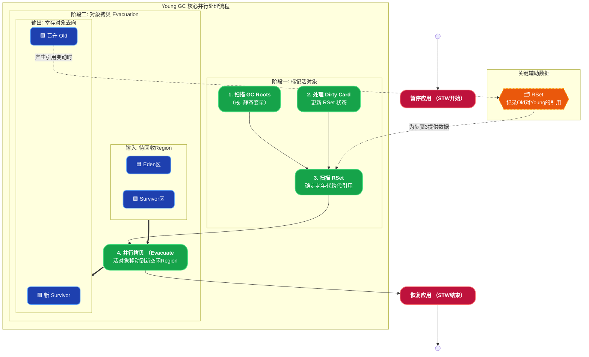

并发标记周期 (Concurrent Marking)：

G1 的并发标记 **不停止用户线程**，核心武器就是 **SATB（Snapshot-At-The-Beginning）**。

- **原理**：标记开始那一瞬间，给整个堆拍一个“逻辑快照”。之后用户线程无论怎么改引用，SATB 都能通过**写屏障**把“被覆盖的旧引用”记录下来。
- 标记线程后面会额外处理这些“旧引用”，确保不会漏标任何在快照时刻存活的对象。
- 优点：用户线程几乎无感知，只在写引用时多一个极轻量的屏障操作。

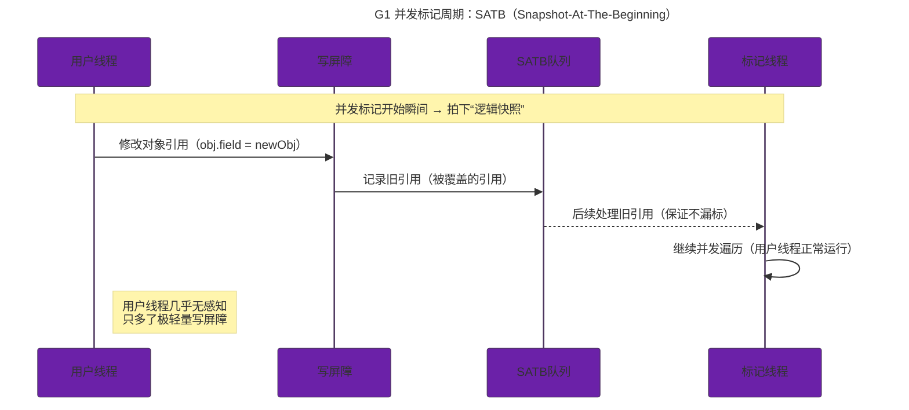

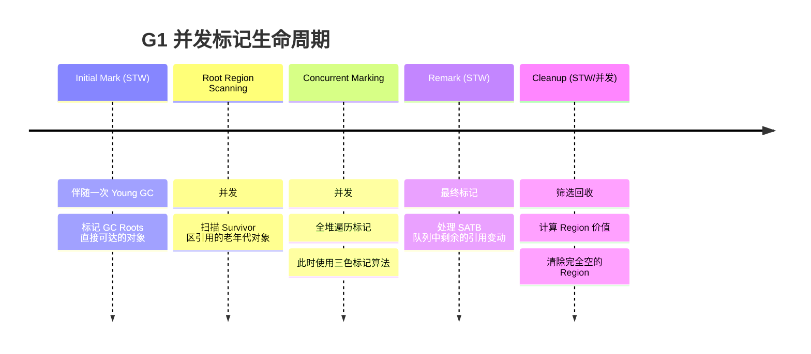

SATB (Snapshot-At-The-Beginning)：如何保证在不停程序的情况下标记对象。

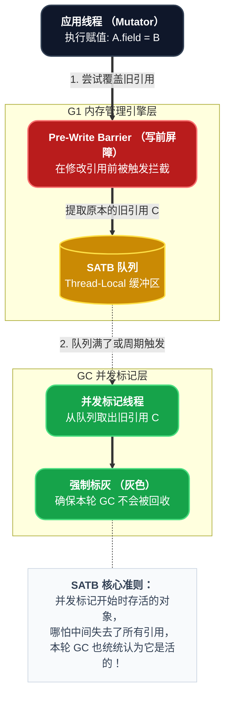

三色标记算法：理解漏标、错标的底层逻辑。

G1（以及大部分并发标记 GC）把对象分成三种颜色：

- **白色**：未被访问过（可能垃圾）。
- **灰色**：已被标记，但它的子对象还没处理完。
- **黑色**：已标记，且所有子对象都处理完了。

**并发风险**：

- **错标**（把垃圾标成存活）：无害，只是多回收一点点。
- **漏标**（把存活对象标成垃圾）：致命！会导致对象被错误回收。

**漏标发生场景**：黑色对象在并发期间新增了对白色对象的引用，而标记线程已经认为这个黑色对象“处理完了”，没再去看它 → 白色对象永远不会被标记。

**SATB 的解决办法**：通过写屏障把“被覆盖的旧引用”记录下来，保证快照时刻的存活对象一个都不会漏。

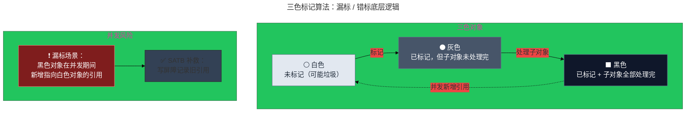

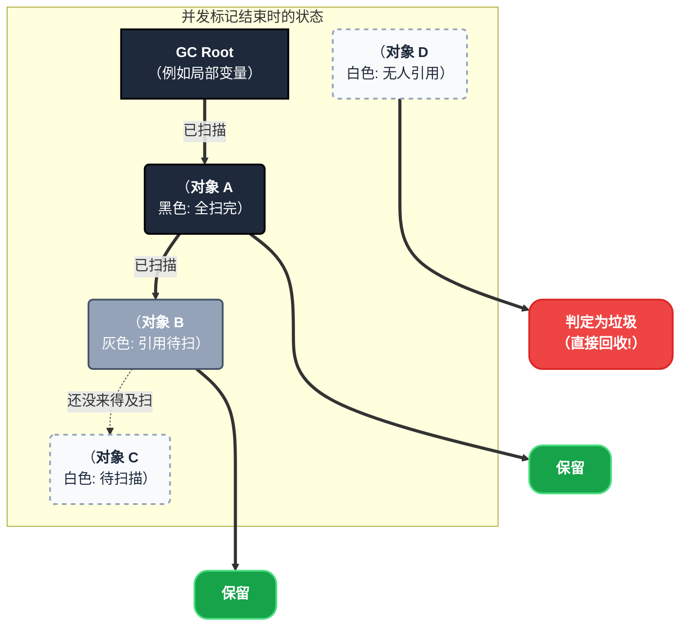

Mixed GC (混合回收)：G1 真正强大的地方，如何动态平衡回收收益。

- 它不只回收 Young 区，还会挑选部分老年代 Region。
- G1 会计算每个老年代 Region 的“回收收益”（垃圾越多、存活对象越少 → 收益越高）。
- 按照收益从高到低排序，挑选一批“最值得回收”的 Region，和 Young 区一起回收。
- 每次 Mixed GC 只回收一部分老年代，保证单次暂停时间可控。
- 直到老年代回收到目标比例，才停止 Mixed 阶段。

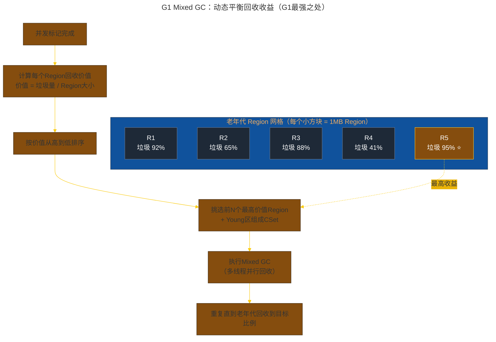

Full GC 的退化：什么情况下 G1 会退化成单线程收缩？

- Evacuation Failure（转移失败）：Mixed/Young GC 时没有足够 to-space。
- 并发标记期间分配速度过快，导致 marking 还没结束就 OOM。
- Humongous 对象分配失败。
- 老年代碎片严重，无法找到连续空间。

一旦触发，G1 会立即停止所有并发工作，切换成单线程 Full GC（和 Serial Old 一样），暂停时间可能从几十 ms 暴增到几秒甚至几十秒 —— 这就是生产事故的元凶。

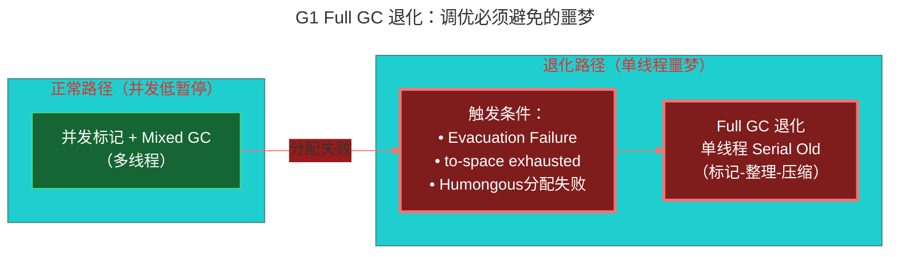

## 第三阶段：核心算法与特性（为什么快？）
Pause Prediction Model：基于衰减均值（Decaying Average）的停顿时间预测模型。（Mixed GC (混合回收) 的 CSet 选择阶段）

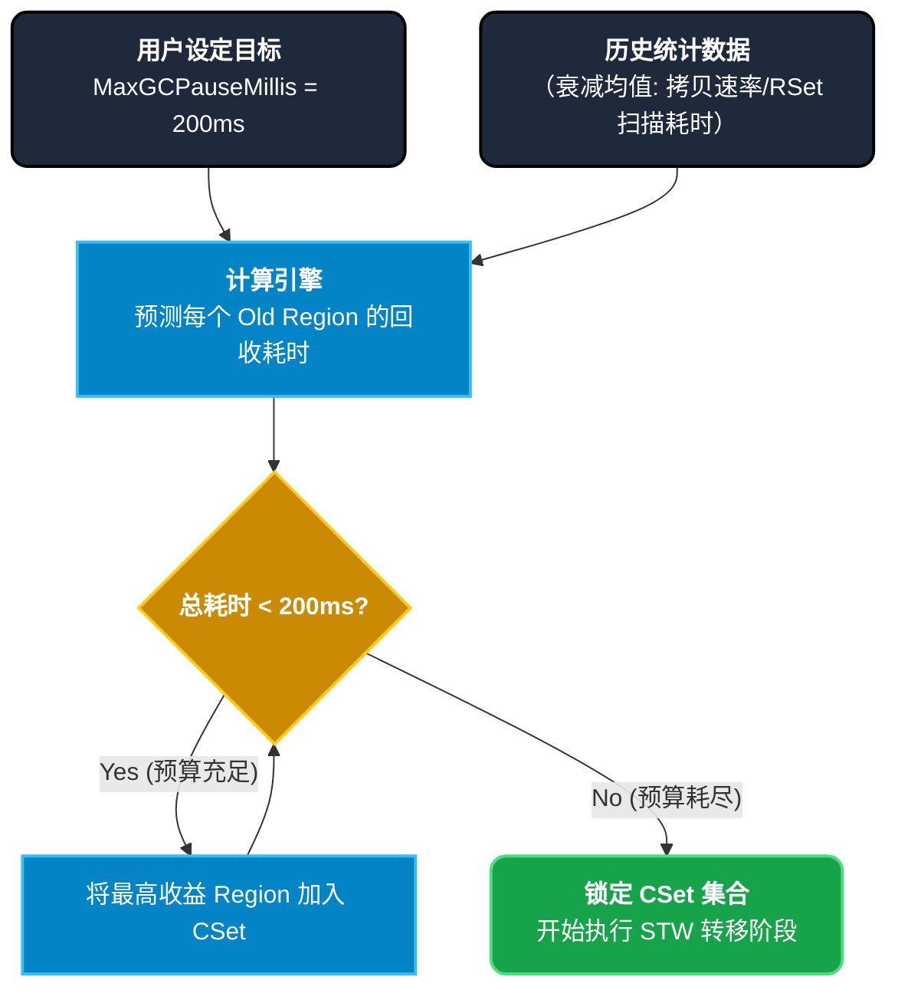

Region 的 Copying 算法 (复制整理) ：为什么 G1 几乎没有碎片化问题。

**Young GC** 和 **Mixed GC** 转移阶段

为什么 JDK 9 以后 G1 淘汰了 CMS？CMS 最大的败笔是“标记-清除（Mark-Sweep）”算法，会留下满地坑坑洼洼的内存碎片，最后只能被迫 STW 进行全堆整理（极其漫长）。

- **G1 的解法**：G1 的回收动作，本质上就是一次**“搬家”**。
- 它把 CSet 里的所有目标 Region 里的存活对象，**并行拷贝**到一个或多个全新的、空白的 Region 中。对象在新 Region 里紧凑排列，拷贝完成后，原来的旧 Region 直接“格式化”清空，回归自由。
- **结果**：永远不会产生空间碎片。

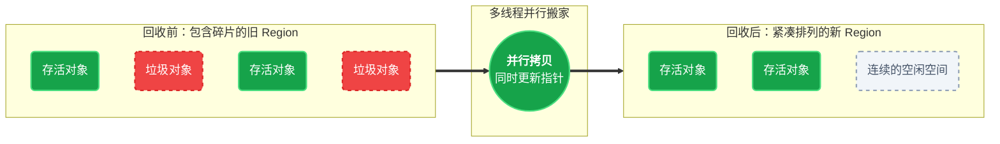

TAMS (Top-at-Mark-Start)：并发标记期间的内存分配指针。

并发标记非常耗时，在这个过程中，应用线程（Mutator）还在源源不断地创建**新对象**。

- **痛点**：GC 线程正在苦哈哈地顺着 GC Roots 往下标记旧对象，突然应用线程在某个 Region 里塞进来了 100 个新对象。GC 线程需要掉头去扫这 100 个新对象吗？如果不扫，它们会被当成垃圾清掉吗？
- **G1 的解法（TAMS）**：每个 Region 都有两个指针，叫做 `Prev TAMS` 和 `Next TAMS`。在并发标记开始的那一瞬间，G1 把当前的内存分配水位线（Top 指针）记录在 TAMS 里。
- **规则**：**在并发标记期间，所有分配在 TAMS 指针之上的新对象，G1 连看都不看，直接默认它们是活的（隐式存活，标记为黑色）！** 这极大地减轻了并发标记的负担。

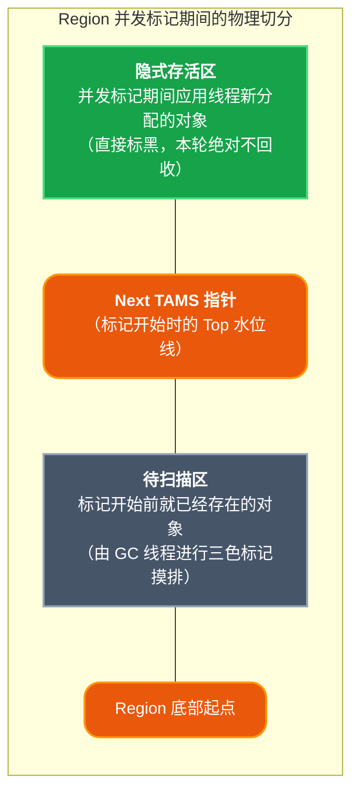

## 第四阶段：实战调优（线上怎么排查？）
官方甚至建议：**除了 `-Xmx` 和 `-XX:MaxGCPauseMillis`，尽量不要乱加其他参数**，以免干扰 G1 的自动预测模型。

常见场景调优：

### 1. 噩梦一：Evacuation Failure (转移失败)

**🔥 临床表现：** 在 GC 日志中看到类似 `[gc] ... to-space exhausted` 或是突然的耗时毛刺。

**🧠 底层原因：** 我们在聊“复制算法”时说过，G1 在 Young GC 或 Mixed GC 时，会把存活对象往新的 Region 里搬。**但是！如果在搬运的过程中，发现没有任何空的 Region 可以用了**，就会发生转移失败。此时 G1 会被迫停止并行拷贝，转而求助于极度缓慢的 Full GC 机制（或者代价很高的串行处理）。

**💊 调优处方：**

1. **增大备用内存**：调大 `-XX:G1ReservePercent`（默认 10%）。这是 G1 专门预留出来用于应对这种“搬家没地方住”情况的空闲内存。可以尝试调到 15% 或 20%。
2. **尽早启动并发标记**：调低 `-XX:InitiatingHeapOccupancyPercent`（简称 IHOP，默认 45）。让 Mixed GC 早点发生，早点腾出老年代的空间。
3. **终极武器**：如果单纯是突发流量太大，直接加钱，调大总堆内存 `-Xmx`。

### 2. 噩梦二：Humongous Allocation (巨型对象泛滥)

**🔥 临床表现：** GC 日志里频繁出现 `Pause Young (Concurrent Start) (G1 Humongous Allocation)`，且频率极高。

**🧠 底层原因：** 我们在第一阶段聊过，超过 Region 大小 50% 的对象就是巨型对象。如果你的 `G1HeapRegionSize` 是 2MB，那么只要代码里 `new byte[1MB + 1Byte]`，它就会直接越过年轻代，砸进老年代的连续 H 区里。

- **痛点**：大量短命的巨型数组会导致老年代迅速被填满，疯狂触发并发标记周期甚至 Full GC。

**💊 调优处方：**

1. **直接调大 Region Size**：使用 `-XX:G1HeapRegionSize=N`（N 必须是 2 的幂次方，如 4M, 8M, 16M）。把 Region 调大，让原来的“巨型对象”降级成普通对象，乖乖在年轻代（Eden）里分配并随着 Young GC 快速消亡。
2. **代码审查**：排查代码中是否在循环里不断创建超大的 `byte[]` 或 `String`，尽量改为对象池复用。

### 3. 噩梦三：Concurrent Mode Failure (并发模式失效导致 Full GC)

**🔥 临床表现：** 应用突然卡死几秒甚至几十秒。GC 日志惊现红色的 `Pause Full (Allocation Failure)`。

**🧠 底层原因：** 应用线程产生垃圾的速度，**远远超过了** G1 并发标记和混合回收的速度。这就好比扫地阿姨正在慢慢扫地（并发标记），但屋里的人疯狂乱扔垃圾，垃圾堆满到了天花板，阿姨只能怒吼一声“所有人都给我停下！”（STW 的 Full GC 单线程大清扫）。

**💊 调优处方：**

1. **增加并发标记线程数**：调大 `-XX:ConcGCThreads`（注意不是 `ParallelGCThreads`）。多派几个阿姨去并发标记，加快找出垃圾的速度。
2. **提早启动并发标记**：同样是降低 IHOP（`-XX:InitiatingHeapOccupancyPercent`），比如从 45 降到 35，防患于未然。

## 第五阶段：横向对比（知己知彼）
## Gemini 说

终于来到了最后一块拼图：**横向对比**。

在 2026 年的 JVM 领域，只懂一个垃圾回收器是不够的。面试官和架构师更看重的是你的**技术选型能力**：知道它们各自的命门在哪里，才能在不同的业务场景下对症下药。

我们主要对比两组最经典的宿敌：**G1 vs CMS（时代的交替）**，以及 **G1 vs ZGC（未来的对决）**。

------

### 1. G1 vs CMS：为什么 JDK 9 要狠心抛弃 CMS？

CMS（Concurrent Mark Sweep）曾是老年代低延迟回收的王者，但最终在 JDK 9 被标记废弃，JDK 14 被彻底移除。它之所以跌落神坛，核心死因只有一个：**内存碎片与不可控的 Full GC**。

#### 时代的交替对比图

**🥊 核心胜负手：**

- **清理方式**：CMS 是“挑垃圾丢掉”（留下空洞）；G1 是“把有用的东西搬走，剩下的全炸掉”（没有空洞）。
- **停顿控制**：CMS 只能祈祷内存碎片别太快爆发；G1 可以通过 `-XX:MaxGCPauseMillis` 给你确定的承诺。

------

### 2. G1 vs ZGC：在 2026 年，项目该怎么选？

ZGC（Z Garbage Collector）是目前 JVM 垃圾回收的终极杀器。如果说 G1 把停顿时间控制在了“百毫秒级”，那么 **ZGC 直接把停顿时间压到了“亚毫秒级（< 1ms）”**，而且不受堆内存大小（甚至 TB 级别）的影响。

**为什么 ZGC 这么神？** 因为 G1 在对象搬家（Evacuation）时，必须 STW 暂停用户线程；而 ZGC 利用了**染色指针（Colored Pointers）和读屏障（Load Barrier）黑科技，做到了连对象搬家都能和用户线程并发执行**！

**🥊 总结对比：** 

| 特性                | G1                          | ZGC                            |
| ------------------- | --------------------------- | ------------------------------ |
| **核心优势**        | 吞吐量与延迟的完美平衡      | 极致的低延迟（< 1ms）          |
| **最大痛点**        | 维护巨大的 RSet 耗费内存    | 并发运行抢占 CPU 导致吞吐下降  |
| **转移阶段 (搬家)** | **STW (暂停用户线程)**      | **并发执行 (边跑边搬)**        |
| **适用场景**        | 90% 的主流 Web 后端、微服务 | 核心交易系统、超大内存大数据库 |

