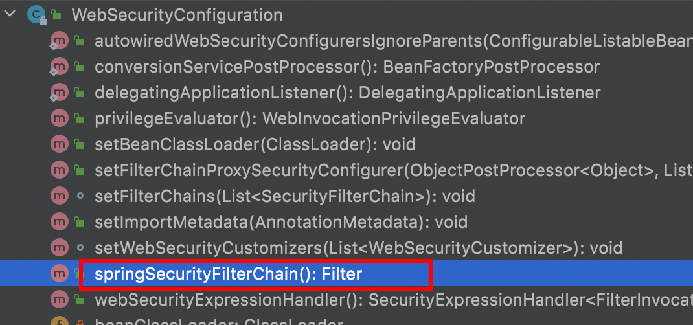
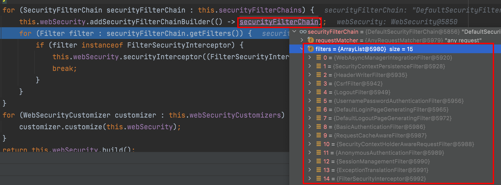

### Security Filters

那么在 Spring Security 中给我们提供那些过滤器? 默认情况下那些过滤器会被加载呢？

| 过滤器                                          | 过滤器作用                                               | 默认是否加载 |
| ----------------------------------------------- | -------------------------------------------------------- | ------------ |
| ChannelProcessingFilter                         | 过滤请求协议 HTTP 、HTTPS                                | NO           |
| `WebAsyncManagerIntegrationFilter`              | 将 WebAsyncManger 与 SpringSecurity 上下文进行集成       | YES          |
| `SecurityContextPersistenceFilter`              | 在处理请求之前,将安全信息加载到 SecurityContextHolder 中 | YES          |
| `HeaderWriterFilter`                            | 处理头信息加入响应中                                     | YES          |
| CorsFilter                                      | 处理跨域问题                                             | NO           |
| `CsrfFilter`                                    | 处理 CSRF 攻击                                           | YES          |
| `LogoutFilter`                                  | 处理注销登录                                             | YES          |
| OAuth2AuthorizationRequestRedirectFilter        | 处理 OAuth2 认证重定向                                   | NO           |
| Saml2WebSsoAuthenticationRequestFilter          | 处理 SAML 认证                                           | NO           |
| X509AuthenticationFilter                        | 处理 X509 认证                                           | NO           |
| AbstractPreAuthenticatedProcessingFilter        | 处理预认证问题                                           | NO           |
| CasAuthenticationFilter                         | 处理 CAS 单点登录                                        | NO           |
| `OAuth2LoginAuthenticationFilter`               | 处理 OAuth2 认证                                         | NO           |
| Saml2WebSsoAuthenticationFilter                 | 处理 SAML 认证                                           | NO           |
| `UsernamePasswordAuthenticationFilter`          | 处理表单登录                                             | YES          |
| OpenIDAuthenticationFilter                      | 处理 OpenID 认证                                         | NO           |
| `DefaultLoginPageGeneratingFilter`              | 配置默认登录页面                                         | YES          |
| `DefaultLogoutPageGeneratingFilter`             | 配置默认注销页面                                         | YES          |
| ConcurrentSessionFilter                         | 处理 Session 有效期                                      | NO           |
| DigestAuthenticationFilter                      | 处理 HTTP 摘要认证                                       | NO           |
| BearerTokenAuthenticationFilter                 | 处理 OAuth2 认证的 Access Token                          | NO           |
| `BasicAuthenticationFilter`                     | 处理 HttpBasic 登录                                      | YES          |
| `RequestCacheAwareFilter`                       | 处理请求缓存                                             | YES          |
| `SecurityContextHolder AwareRequestFilter` | 包装原始请求                                             | YES          |
| JaasApiIntegrationFilter                        | 处理 JAAS 认证                                           | NO           |
| `RememberMeAuthenticationFilter`                | 处理 RememberMe 登录                                     | NO           |
| `AnonymousAuthenticationFilter`                 | 配置匿名认证                                             | YES          |
| `OAuth2AuthorizationCodeGrantFilter`            | 处理OAuth2认证中授权码                                   | NO           |
| `SessionManagementFilter`                       | 处理 session 并发问题                                    | YES          |
| `ExceptionTranslationFilter`                    | 处理认证/授权中的异常                                    | YES          |
| `FilterSecurityInterceptor`                     | 处理授权相关                                             | YES          |
| SwitchUserFilter                                | 处理账户切换                                             | NO           |

可以看出，Spring Security 提供了 30 多个过滤器。默认情况下Spring Boot 在对 Spring Security 进入自动化配置时，会创建一个名为 SpringSecurityFilerChain 的过滤器，并注入到 Spring 容器中，这个过滤器将负责所有的安全管理，包括用户认证、授权、重定向到登录页面等。具体可以参考WebSecurityConfiguration的源码:

