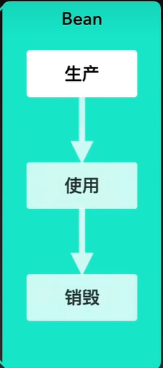
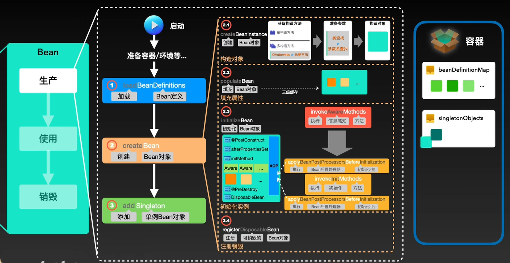
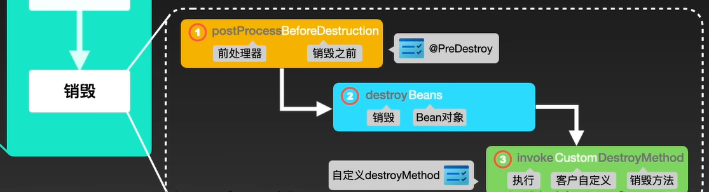

# **Spring Bean的生命周期** (面试)

# 1. 三大阶段：
1. 生产
2. 使用
3. 销毁

## 1.1 生产
1. **IOC容器（容器初始化、启动流程） (面试) **
   1. Resource定位
   2. BeanDefinition载入
   3. BeanDefinition注册
2. 读取bean配置文件 LoadBeanDefinitions 加载自定义的bean 
3. 创建bean实例 createBean
   1. 构造对象 通过构造器，获取到对应对象，通过反射创建对象
   2. 填充属性 populateBean,通过三级缓存获取到bean的属性，通过反射设置属性
   3. 初始化实例 调用Aware接口，调用BeanPostProcessor的前置方法，调用初始化方法，调用BeanPostProcessor的后置方法(bean初始化前后处理器) ，AbstractAutoProxyCreator进行AOP代理
   4. 注册销毁
4. 放入单例池中 addSingleton

## 1.2 使用
从单例池中获取bean实例 getSingleton

## 1.3 销毁
1.处理器销毁前的方法 @PreDestroy
2.销毁实例 destroyBeans
3.处理器销毁后的方法 destroyMethod