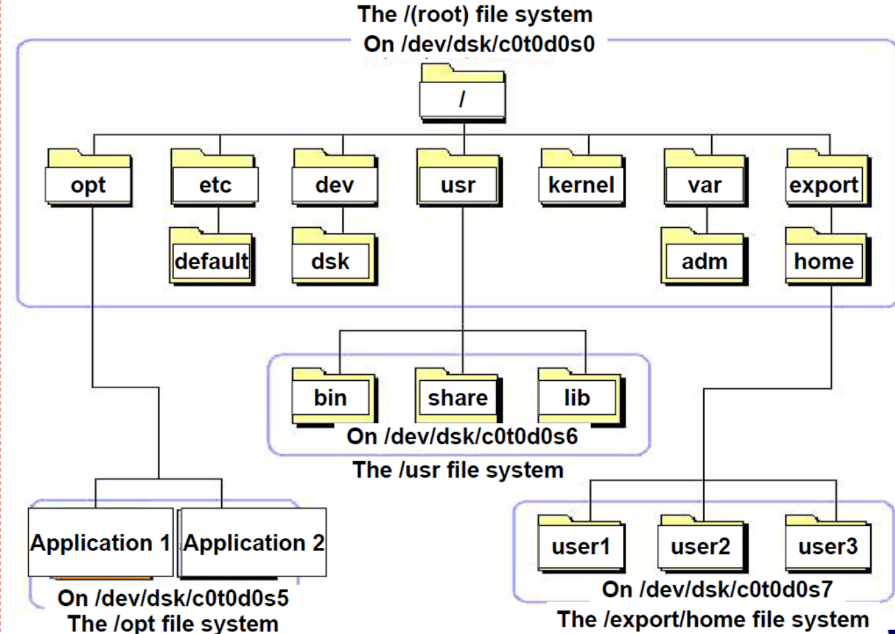

# 1. 系统中常见的目录及作用

| 目录 | 作用 |
| --- | --- |
| / | 根目录，所有目录的父目录 |
| /bin | 包含普通用户和系统管理员可以共享的各种通用程序 |
| /boot | 包含系统引导程序GRUB及其配置文件、linux内核文件vmlinuz和磁盘内存映像文件initrd.img等重要引导文件 |
| /dev | 包含系统支持的所有设备文件 |
| /etc | 包含系统管理和维护方面的所有配置文件 |
| /home | 包含所有普通用户的家目录 |
| /lost+found | 用于存储fsck命令在检测与修复文件系统时删除的文件和目录 |
| /media | 包含移动存储介质的挂载点 |
| /mnt | 包含所有自定义的文件系统的挂载点，可以挂载任何文件系统 |
| /opt | 应用程序等附加软件的安装目录 |
| /proc | 虚拟文件目录，系统关闭时为空目录，系统运行时进程文件系统根目录，其中的部分文件系统分别对应当前正在运行的进程，可用于访问当前进程的地 址空间 |
| /root | 超级用户root的家目录 |
| /sbin | 超级用户管理员的常用工具、如管理和维护、系统引导和恢复命令集合 |
| /srv | 分担了var目录的一些功能，保存了一些网络服务所需的数据文件 |
| /tmp | 临时文件目录，用于存储系统运行过程生成的临时文件 |
| /usr | 既可以作为根目录下的一个子目录，其中保存系统提供的各种共享数据（用户命令、库函数、头文件、文档等），又可以作为一个单独的文件系统，可 以认为是对根目录的一个递归目录，使得文件系统具有更大的灵活性 |
| /var | 该目录和usr 类似，首先是根目录下的子目录，也可以作为单独的文件系统，用于存储各种可变长的数据文件（如日志文件）、暂存文件或待处理的 临时文件 |
| /sys | 和proc一样是虚拟目录，系统各种设备配置信息的根目录 |

